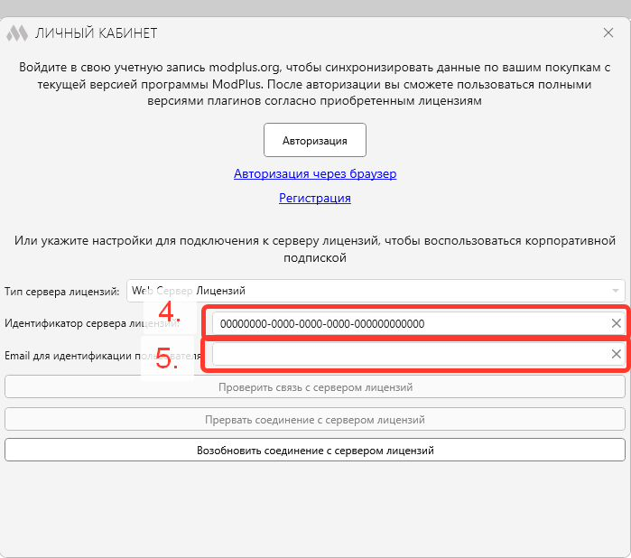
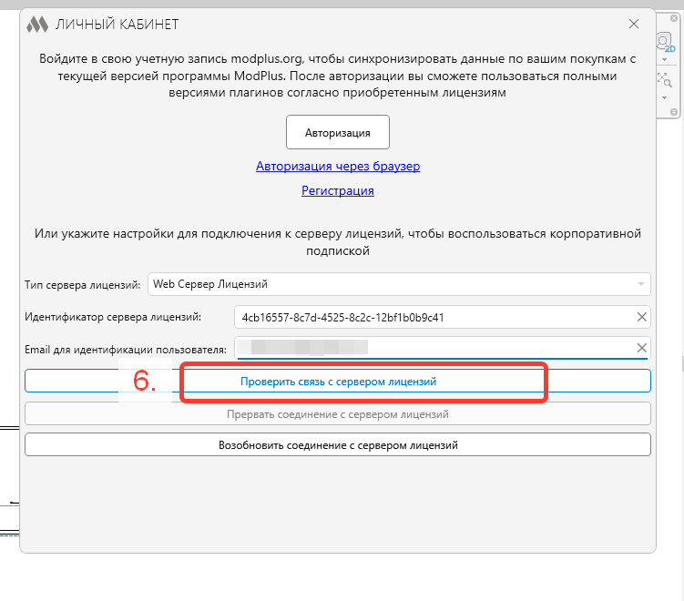
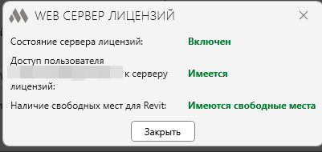

## Установка и подключение лицензии

Установить с Nextcloud:

`C:\Nextcloud\Гарда - ТИМ – отдел\98_ПО\ModPlus`

Открываем Revit:

1. Выбираем вкладку ModPlus

2. Нажимаем личный кабинет

   {width=1447px height=398px}

3. В появившемся окне из всплывающего списка выбираем WEB Сервер Лицензий

   {width=888px height=673px}

Далее заполняем **поле 4**

Идентификатор сервера лицензий в нашем случае вставляем:

`4cb16557-8c7d-4525-8c2c-12bf1b0b9c41`

И заполняем **поле 5** E-mail для идентификации (E-mail рабочей почты)

{width=699px height=618px}

Нажимаем проверить соединение

{width=751px height=660px}

Далее нажимаем - «Возобновить соединение с сервером лицензий»

Все пункты должны иметь зеленый статус (если нет сообщить на почту [`v.stalkovskiy@gardapro.ru`](mailto:v.stalkovskiy@gardapro.ru))

{width=401px height=190px}