<note type="danger">

п.8 Критически важен для корректной работы.

</note>

## Установка

1\. Скачайте с помощью **«Установка ПО»**

2\. После установки Настольного клиента NCloud, откроется окно входа, нажимаем “Войти в Nextcloud”

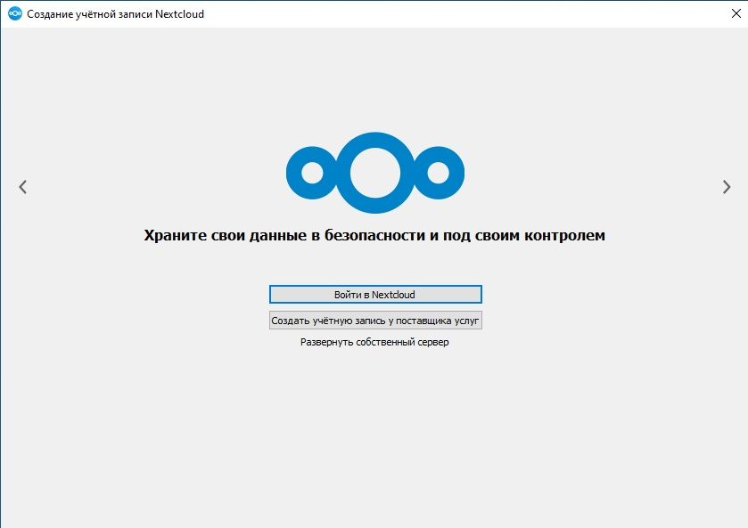{width=839px height=593px}

3\. В поле Адрес сервера введите `https://ncloud.avilex.ru/`

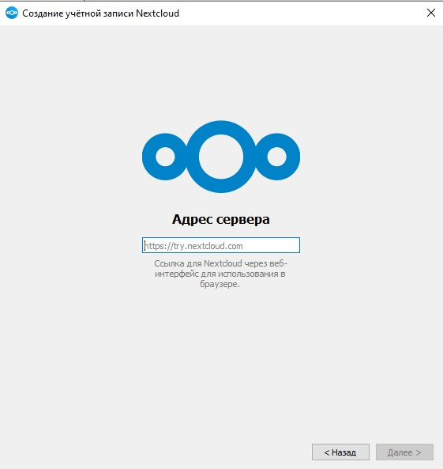{width=561px height=593px}

4\. После ввода адреса сервера Вам будет предложено перейти в браузер и подтвердить вход в свою учетную запись

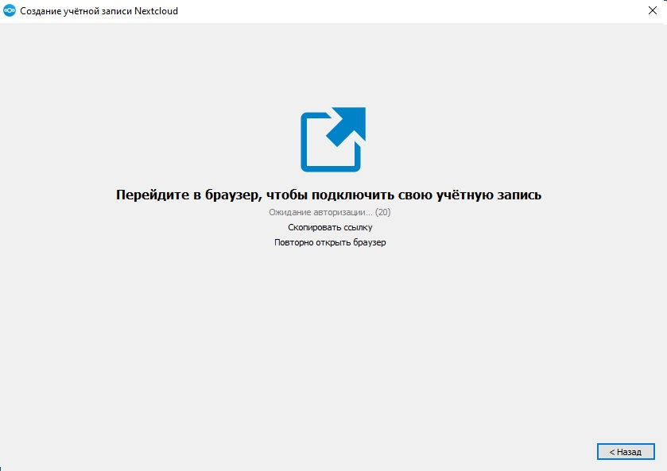{width=839px height=593px}

5\. Нажмите “Войти”

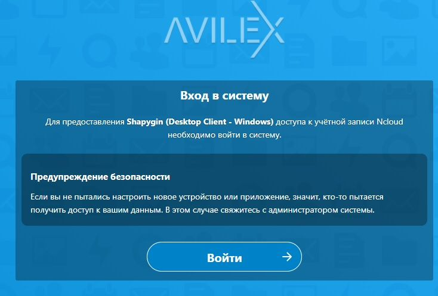{width=734px height=497px}

6\. На этапе доступа к аккаунту нажмите “Разрешить доступ”

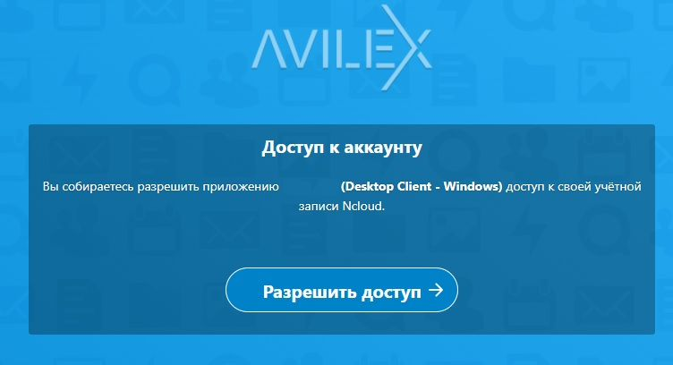{width=752px height=408px}

7\. При успешном подключении будет отображено "Приложение-клиент подключено". Закройте окно в браузере и перейдите в Настольный клиент NCloud

{width=734px height=362px}

8\. Выберите интересующий вас тип синхронизации и путь в локальную папку(`C:\Nextcloud`). После нажмите "Подключиться"

<note>

ВАЖНО!!!

1. Создайте папку `Nextcloud` на диске С

2. Укажите путь синхронизации файлов в локальную папку `C:\Nextcloud`

</note>

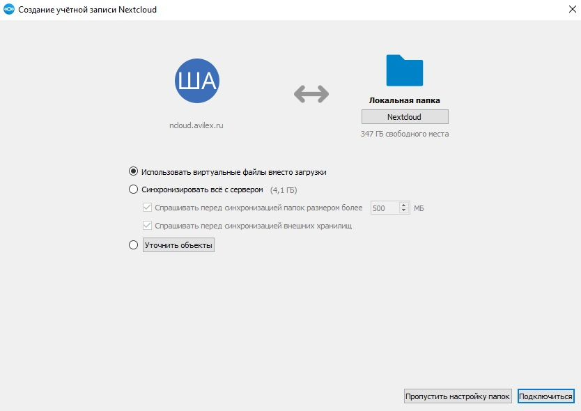{width=834px height=590px}

После подключения - в окне системного трея появится значок Настольного клиента NCloud, и начнется этап синхронизации папок.

По завершении синхронизации можно приступить к работе с файлами через Настольный клиент NCloud

<note type="info">

[Подробная инструкция по работе с Nextcloud](https://wiki.avilex.ru/ru/%D0%98%D0%BD%D1%81%D1%82%D1%80%D1%83%D0%BA%D1%86%D0%B8%D0%B8/NCLOUD)

</note>

## Обновление пути в локальную папку

1\. Запусти Nextcloud 

<image src="./nextcloud-8.jpeg" crop="0,0,100,100" scale="385px" width="874px" height="1010px" float="center"/>

2\. Нажмите на иконку своего профиля (стрелка вниз) и выберите пункт **„Настройки“**.

<image src="./nextcloud-9.jpeg" crop="0,0,100,100" scale="401px" width="857px" height="1016px" float="center"/>

3\. Нажмите на свой профиль и далее на **«…»**.

<image src="./nextcloud-10.jpeg" crop="0,0,100,100" scale="608px" width="1471px" height="833px" float="center"/>

4\. Выберите «**Приостановить синхронизацию**» 

<image src="./nextcloud-11.jpeg" crop="0,0,100,100" scale="400px" width="593px" height="416px" float="center"/>

5\. Далее «**Отключить синхронизацию**»

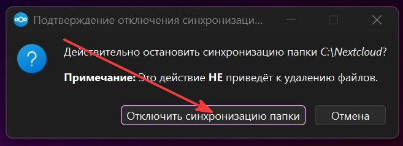{width=657px height=239px}

6\. Нажмите «**Добавить папку для синхронизации …**»

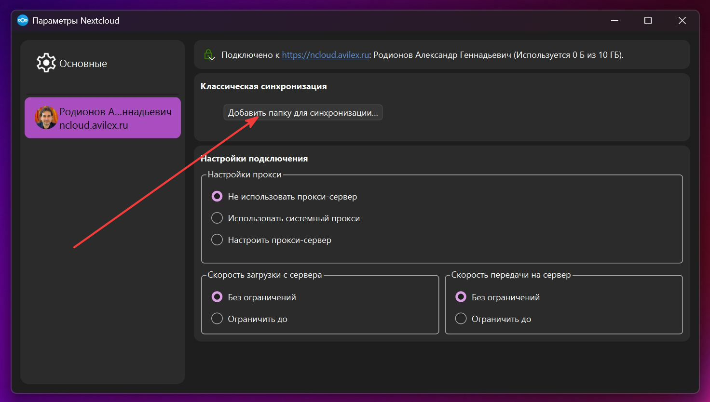{width=1472px height=834px}

7\. Выберите интересующий вас тип синхронизации и путь в локальную папку(`C:\Nextcloud`). После нажмите "Подключиться"

<note>

ВАЖНО!!!

1. Создайте папку `Nextcloud` на диске С

2. Укажите путь синхронизации файлов в локальную папку `C:\Nextcloud`

</note>

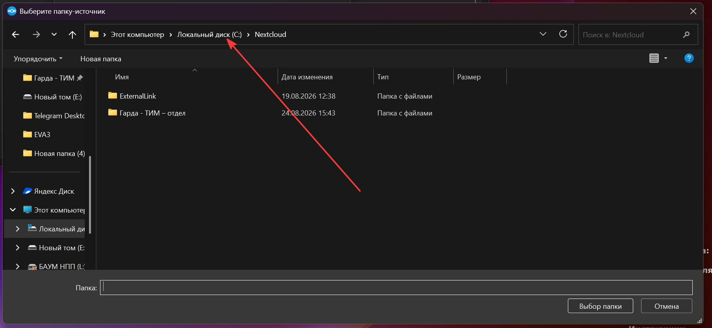{width=1808px height=835px}

8\. Нажмите на **Nextcloud**. Потом «**Далее**»

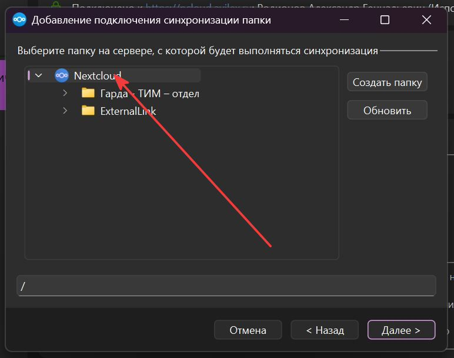{width=772px height=608px}

8\. Нажмите на «**Добавить подключение для синхронизации**»

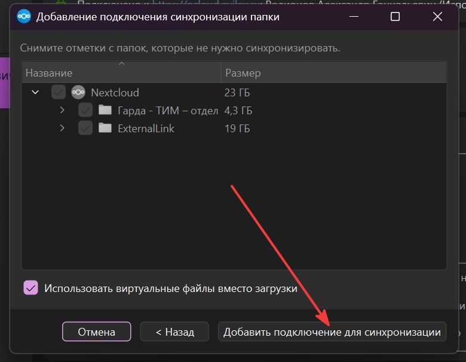{width=780px height=605px}

Готово. 

Если у вас возникли трудности на настройки пути то напишите [a.rodionov@gardapro.ru](mailto:a.rodionov@gardapro.ru)