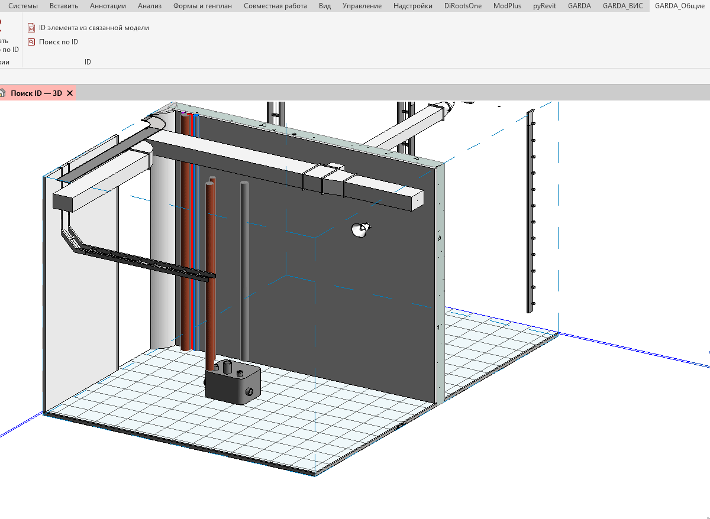

Плагин служит для получения элемента из связанной модели

## Где находится

Плагин расположен на вкладке «**GARDA_Общие**», в панели «**ID**»

<image src="./id-elementa-iz-svyazannoy-modeli.jpeg" crop="0,0,100,100" scale="248px" width="245px" height="91px" float="center"/>

## Как пользоваться

Получение ID из связанной модели возможно двумя способами:

1. Заранее выбрать элемент из связанной модели (прожимая Tab) и нажать кнопку плагина:

{width=1200px height=878px}

1. Нажать на кнопку плагина и выбрать элемент связанной модели:

   {width=1322px height=840px}

## Итог

-  В обоих случаях выводится окно с информацией об элементе, при нажатии по ID, его значение копируется в буфер обмена.