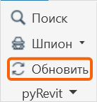

Корпоративные плагины Revit распространяются через Nextcloud.

После первоначальной настройки обновления плагинов будут автоматически загружаться на ваш компьютер.

## 1\. Необходимое ПО

Перед началом работы на компьютере должны быть установлены:

-  Autodesk Revit;

-  pyRevit. Установить в приложении **«Установка ПО»**;

<note>

Можно устанавливать только при закрытии всех Revit

</note>

-  [Nextcloud Desktop Client.](./../programmy/nextcloud)

Если какое-либо из приложений отсутствует в приложении «Установка ПО», обратитесь в ИТ-службу.

## 2\. Подключение корпоративных плагинов в pyRevit

Запустите **Revit**.

Перейдите на вкладку:

**pyRevit -> Настройки**

<image src="./korporativnye-plaginy-pyrevit.jpeg" crop="0,0,100,100" scale="138px" width="137px" height="144px" float="center"/>

<image src="./korporativnye-plaginy-pyrevit-2.jpeg" crop="0,0,100,100" scale="495px" width="877px" height="286px" float="center"/>


Нажмите «**Добавить папку»** и выберите папку «**ОБЩИЕ»**, так же дополнительно выберите папку принадлежащую вашему разделу **(АР, КР, ВИС)**, **внутри которой находится** `.extension`. 

После нажмите «**Сохранить и перезапустить**».

<image src="./korporativnye-plaginy-pyrevit-6.jpeg" crop="0,0,100,100" scale="514px" width="1047px" height="1191px" float="center"/>

Пример:

```
C:\Nextcloud\Гарда - ТИМ – отдел\04_Плагины\Garda-BIM\ОБЩИЕ
```

```
C:\Nextcloud\Гарда - ТИМ – отдел\04_Плагины\Garda-BIM\ВИС
```

```
C:\Nextcloud\Гарда - ТИМ – отдел\04_Плагины\Garda-BIM\АР
```

**Важно**

Нужно указывать без <highlight color="orange">.extension</highlight> :

<note type="info">

✅ C:\\Nextcloud\\Гарда - ТИМ – отдел\\04_Плагины\\Garda-BIM\\ОБЩИЕ

</note>

а не:

<note type="danger">

❌ C:\\Nextcloud\\Гарда - ТИМ – отдел\\04_Плагины\\Garda-BIM\\ОБЩИЕ\\ОБЩ.extension

</note>

## 3\. Применение настроек

После добавления пути:

1. Сохраните настройки pyRevit.

2. Нажмите **pyRevit -> Обновить**.

{width=138px height=144px}

## 4\. Проверка подключения

После обновления должны появиться вкладки «GARDA_ОБЩИЙ» и другие. 

При отсутствие вкладок необходимо убедитесь, что:

-  Nextcloud запущен;

-  синхронизация завершена без ошибок;

-  папка с плагинами существует локально;

-  внутри неё присутствует папка с расширением `.extension`;

-  путь к родительской папке добавлен в **Каталоги пользовательских расширений** pyRevit;

-  после добавления пути выполнен **Обновить**.

Пример правильной структуры:

```
Nextcloud
└── Гарда - ТИМ – отдел
    └── 04_Плагины
		└── Garda-BIM   				← этот путь подключаем в pyRevit
        	│
        	└── Garda BIM.extension
           	 	│
           	 	├── CorporateTools.tab
           	 	│   ├── BIM.panel
           	 	│   ├── COORD.panel
           	 	│   └── ...
           	 	│
           	 	├── lib
           	 	└── ...
```

Папки пользовательских расширений являются штатным механизмом pyRevit.

## 5\. Обновление корпоративных плагинов

Самостоятельно обновлять плагины **не требуется**.

Обновления публикуются централизованно и автоматически поступают в корпоративную папку Nextcloud.

Nextcloud Desktop автоматически синхронизирует изменения между сервером и локальным компьютером.

Если была обновлена существующая команда, новая версия будет загружена через Nextcloud автоматически.

Если был анонс:

-  добавлены новые кнопки;

-  удалены кнопки;

-  добавлены новые панели;

-  изменена структура вкладки pyRevit,

необходимо выполнить:

**pyRevit -> Обновить**

или перезапустить Revit.

## 6\. Запрещённые действия

Не следует:

-  изменять файлы внутри корпоративной папки плагинов;

-  переименовывать папку `.extension`;

-  перемещать корпоративную папку после её подключения в pyRevit;

-  удалять отдельные файлы или кнопки из расширения;

-  отключать синхронизацию папки в Nextcloud;

-  включать режим хранения файлов только в облаке.

Все изменения корпоративных плагинов выполняются централизованно.

## 7\. Если плагины пропали

В первую очередь необходимо проверить:

1. Запущен ли **Nextcloud Desktop Client**.

2. Нет ли ошибок синхронизации **Nextcloud**.

3. Существует ли локальная папка с плагинами.

   ```
   C:\Nextcloud\Гарда - ТИМ – отдел\04_Плагины\Garda-BIM\
   ```

4. Находится ли внутри неё папка `.extension`.

5. Сохранён ли путь в:

   **pyRevit -> Настройки -> Каталоги пользовательских расширений**

6. Выполнить:

   **pyRevit -> Обновить**

Если после этого корпоративная вкладка не появилась, обратитесь к BIM-координатору или в ИТ-службу.