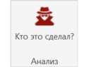
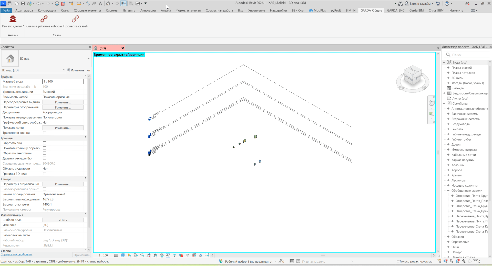

Плагин показывает информацию об авторах и истории изменения выбранных элементов в рабочей модели Revit.

С его помощью можно быстро определить:

-  кто создал элемент;

-  кто последним изменял элемент;

-  у кого элемент находится во владении в данный момент.

## Где находится

Плагин расположен на вкладке **GARDA_Общие**, панели **Анализ**.

{width=126px height=95px}

## Как пользоваться

1. Запустите плагин **«История изменений элементов»**.

2. Выберите в модели один или несколько элементов, которые необходимо проверить.

3. После завершения выбора нажмите **«Готово»**.

4. Результат проверки появится в окне pyRevit.

{width=1920px height=1039px}

## Что выводится в отчёте

Для каждого выбранного элемента отображается:

| Поле                  | Описание                                               |
|-----------------------|--------------------------------------------------------|
| **ID**                | ID элемента в Revit. По нему можно перейти к элементу  |
| **Категория**         | Категория выбранного элемента                          |
| **Имя**               | Имя элемента                                           |
| **Создал**            | Пользователь, который создал элемент                   |
| **Последний изменил** | Пользователь, который последним вносил изменения       |
| **Владелец**          | Пользователь, у которого элемент находится во владении |

## Важно

Информация об авторах берётся из истории совместной работы Revit.

Плагин предназначен для **совместных моделей (Worksharing)**. Для корректного отображения пользователей модель должна содержать историю совместной работы.

Поле **«Последний изменил»** позволяет определить пользователя, который последним изменял конкретный элемент, но не показывает перечень выполненных им изменений.