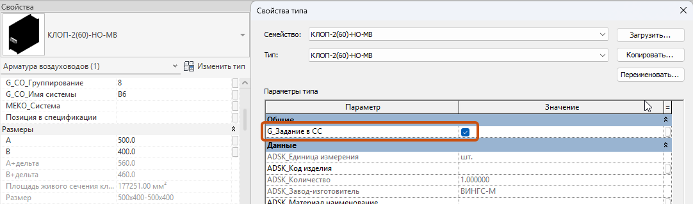
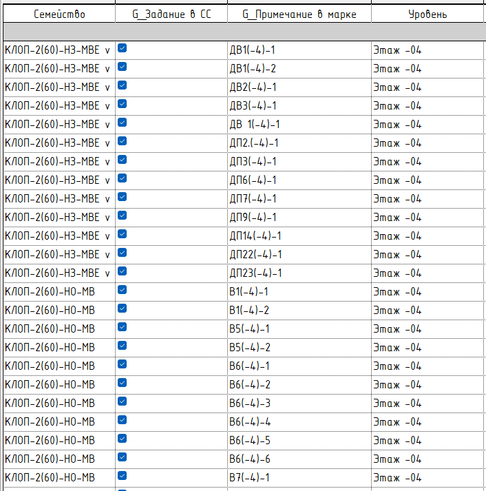
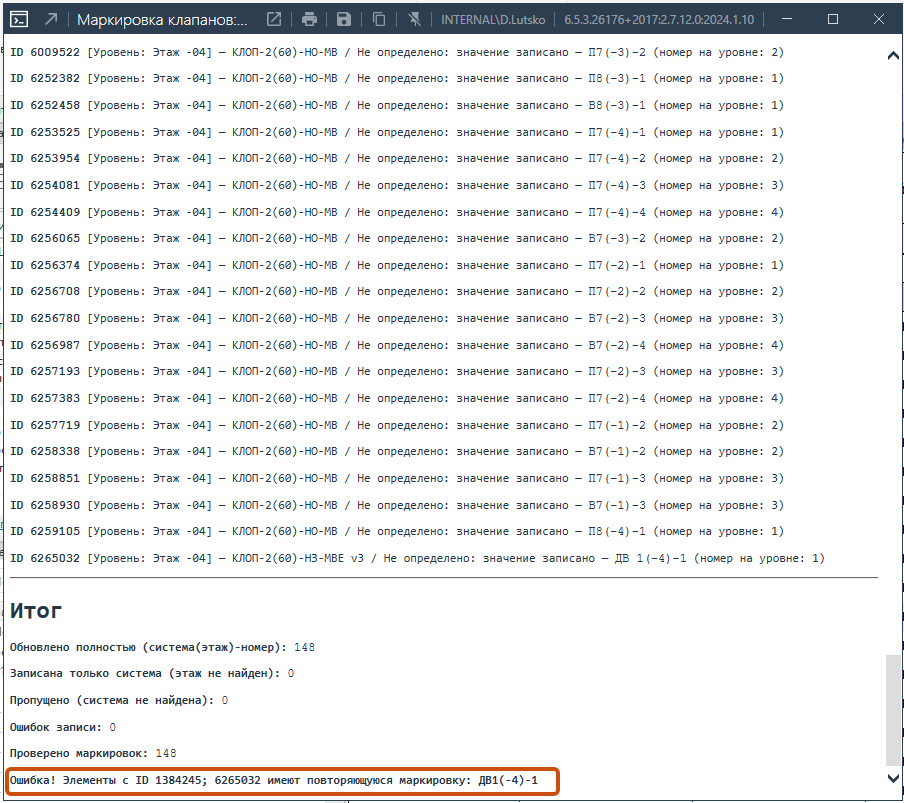

<note type="info">

Плагин предназначен для автоматизированного нумерования клапанов ОВ по принципу \<Имя системы(Номер этажа)-Номер в системе по порядку>.

</note>

<note>

**Важно**

 Для работы плагина, необходимо убедиться, что в проекте есть параметр проекта «**G_Задание в СС**», который назначен категории «**Арматура воздуховодов**» (по типу или по экземпляру).

</note>

## Где находится

Плагин расположен на вкладке «**GARDA_ВИС**», в панели «**ОВ**»

<image src="./numeraciya-klapanov-ov.webp" crop="0,0,100,100" scale="90px" width="87px" height="97px" float="center"/>

## Как пользоваться

Перед запуском плагина, заполните у всех семейств воздушных клапанов, которые планируете выдать как задание, параметр «**G_Задание в СС**». Для этого в самом семействе поставьте галочку в данном параметре

{width=1082px height=320px}

<note type="info">

Для остальных клапанов параметр можно не редактировать, т.к. по умолчанию значение параметра не равно «Да».

</note>

1. Запустить плагин

2. В появившемся окне выберем режим маркировки:

   {width=508px height=281px}

   1. Перезаписывает маркировку у всех ранее созданных и промаркированных клапанов

   2. Записывает маркировку только во вновь установленные клапаны.

3. Нажимаем «**Запуск**»

## Результат

После выполнения скрипта, всплывает окно с результатами обработки. В случае, если в модели по каким-то причинам есть два и более клапанов с одинаковой маркировкой, появится сообщение об ошибке.

{width=904px height=803px}

Маркировка запишется в общий параметр «**G_Примечание в марке**», который автоматически появится в проекте после первого запуска плагина.

{width=706px height=713px}