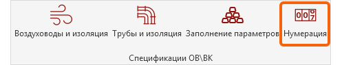
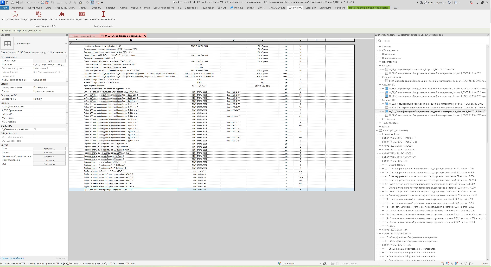

Плагин автоматически рассчитывает и заполняет параметр **«ADSK_Позиция»** по элементам открытой спецификации.

## Где находится

Плагин расположен на вкладке **GARDA_ВИС**, панели **Спецификации ОВ\\ВК**.

{width=497px height=95px}

## Как пользоваться

{width=3851px height=2099px}

<note>

**Важно**

Перед запуском откройте спецификацию, которую необходимо обработать.

Для корректной работы плагина в элементах должны быть заполнены следующие параметры:

-  **G_СО_Имя системы** и **G_СО_Группирование** -- заполняются автоматически с помощью плагина **«Заполнение параметров»**;

-  **ADSK_Наименование** и **ADSK_Марка** -- заполняются по данным из технических каталогов производителей.

</note>

1. Откройте спецификацию, по которой необходимо выполнить нумерацию.

2. Запустите плагин.

3. Подтвердите запуск.

4. Дождитесь завершения обработки.

<note type="info">

Обрабатываются только элементы, которые попадают в активную спецификацию с учётом её фильтров.

</note>

## Как формируется позиция

Элементы сортируются в фиксированном порядке:

1. **G_СО_Имя системы;**

2. **G_СО_Группирование;**

3. **ADSK_Наименование;**

4. **ADSK_Марка.**

После сортировки элементам последовательно присваиваются позиции:

`1`, `2`, `3`, `4`...

Если у нескольких элементов совпадают значения всех четырёх параметров, они получают одинаковую позицию.

### Вложенные элементы

Для вложенных семейств используется позиция родительского элемента.

Например:

-  родитель -- `15`;

-  первый вложенный элемент -- `15.1`;

-  второй -- `15.2`;

-  третий -- `15.3`.

Под позиции вложенных элементов формируются по `ADSK_Наименование`.

Одинаковые вложенные элементы у родителей с одинаковой основной позицией получают одинаковую под позицию.

## Особенности

-  Плагин работает только из открытой спецификации.

-  Из настроек спецификации учитываются только её фильтры.

-  Сортировка самой спецификации на результат не влияет.

-  Вложенные элементы не получают отдельную основную позицию.

-  Существующие значения `ADSK_Позиция` перезаписываются.