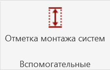
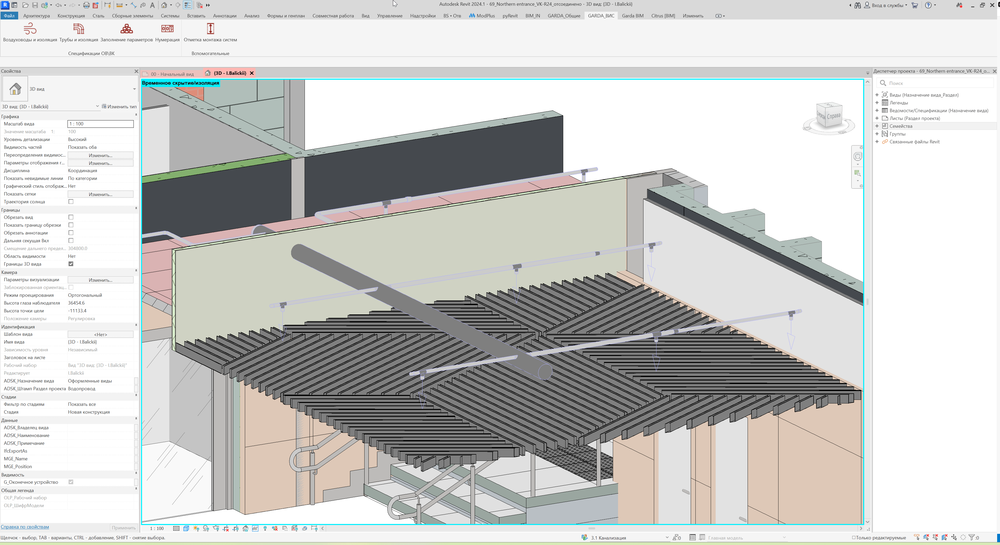

Плагин автоматически рассчитывает и заполняет параметр `G_Высота монтажа` для:

-  труб;

-  воздуховодов;

-  кабельных лотков.

## Где находится

Плагин расположен на вкладке GARDA_ВИС, панели Вспомогательные.

{width=225px height=144px}

## Как пользоваться

1. Запустите плагин `Отметка монтажа систем`.

2. Выберите режим:

   -  `Вся модель` -- обработать все поддерживаемые элементы;

   -  `Только выбранные элементы` -- после запуска выбрать нужные элементы вручную.

3. Нажмите `Запуск`.

4. Если выбран режим `Только выбранные элементы`:

   -  выберите трубы, воздуховоды или кабельные лотки;

   -  нажмите `Готово`.

5. Дождитесь завершения обработки.

{width=3851px height=2099px}

## Как рассчитывается значение

### Горизонтальные элементы

Записывается расстояние от нижней точки элемента до ближайшего перекрытия или пола снизу.

Учитываются перекрытия:

-  в текущей модели;

-  в Revit-связях.

### Вертикальные элементы

В `G_Высота монтажа` записывается длина элемента.

### Наклонные элементы

<note>

Не обрабатываются.

</note>

## Особенности

-  Если параметр `G_Высота монтажа` отсутствует, плагин создаст его автоматически.

-  Если рассчитанное значение не изменилось, параметр не перезаписывается.

-  После выполнения выводится краткий отчёт.

<note>

**Важно**

Если под центром горизонтального элемента находится проём, шахта или отсутствует перекрытие, высота может быть не определена.

</note>