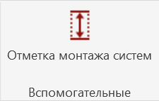

Плагин находится на вкладке GARDA_ВИС панель Вспомогательные

{width=225px height=144px}

Автоматически заполняет параметр `G_Высота монтажа` у инженерных элементов модели.

Поддерживаются:

-  трубы;

-  воздуховоды;

-  кабельные лотки.

<note>

Наклонные трубы, воздуховоды и кабельные лотки на данный момент не обрабатываются.

</note>

После завершения работы плагин выводит краткий отчёт:

-  сколько элементов найдено;

-  сколько горизонтальных и вертикальных элементов обработано;

-  сколько наклонных элементов пропущено;

-  сколько значений успешно записано;

-  были ли элементы, для которых не удалось определить высоту.