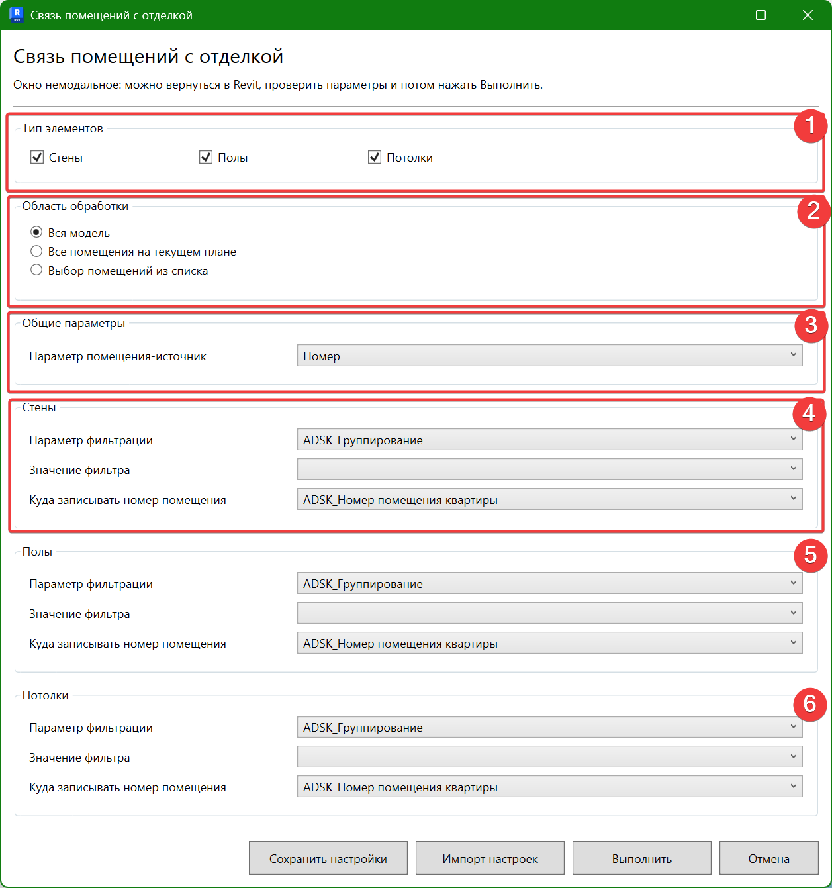

## Назначение инструмента

Плагин автоматически определяет, в каком помещении находятся конкретные элементы отделки (стены, полы, потолки), и записывает номер этого помещения в параметры элементов.

## Расположение

{width=611px height=142px}

Кнопка расположена на вкладке GARDA_АР, панели Работа с отделкой.

<note type="info">

Примечание: Окно плагина работает в фоновом режиме. Вы можете свободно переключаться на Revit, вращать 3D-вид, проверять параметры и работать с проектом, не закрывая окно настроек.

</note>

## **Инструкция по работе**

{width=1257px height=1341px}

1. **Тип элементов:** Отметьте галочками категории отделки, которые необходимо обработать (Стены, Полы, Потолки). В зависимости от вашего выбора в нижней части окна станут активны соответствующие блоки настроек (блоки 4, 5 или 6).

2. **Область обработки:** Укажите, какие помещения плагин должен проанализировать:

   -  **Вся модель** -- обрабатываются абсолютно все помещения в проекте.

   -  **Все помещения на текущем плане** -- плагин анализирует только помещения, попавшие на активный в данный момент вид.

   -  **Выбор помещений из списка** -- позволяет выбрать конкретные помещения вручную. *Подсказка: используйте клавишу **Shift** для выбора диапазона строк или **Ctrl** для выделения помещений вразброс.*

3. **Общие параметры:** Выберите исходный параметр помещения (например, *«Номер»*), значение которого плагин будет считывать и переносить в элементы отделки.

4. **Стены:** Настройка фильтрации и записи данных для категории «Стены»:

   -  *Параметр фильтрации* -- выберите параметр, по которому плагин отличит отделочные стены от конструктивных (например, *ADSK_Группирование*).

   -  *Значение фильтра* -- выберите конкретное значение из выпадающего списка, чтобы плагин взял в работу только нужные отделочные стены.

   -  *Куда записывать номер помещения* -- укажите целевой параметр экземпляра стены, в который запишется номер помещения.

5. **Полы:** Настройте параметры фильтрации, выбора значений и целевого параметра для элементов пола (настраивается аналогично блоку «Стены»).

6. **Потолки:** Настройте параметры фильтрации, выбора значений и целевого параметра для элементов потолка (настраивается аналогично блоку «Стены»).

## **Кнопки управления (в подвале окна):**

-  **Сохранить настройки / Импорт настроек** -- позволяют сохранить текущую конфигурацию фильтров в файл или загрузить ранее созданную, чтобы не настраивать параметры заново при каждом запуске.

-  **Выполнить** -- запуск процесса пакетной привязки отделки к помещениям.