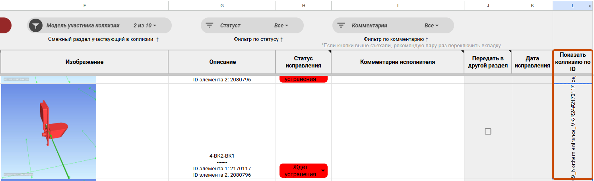

Плагин предназначен для отображения коллизии на вновь создаваемом подрезанном 3D-виде

## Где находится

Плагин расположен на вкладке «**GARDA_ОБщие**», в панели «**Коллизии**»

<image src="./poisk-kollizii-po-id.webp" crop="0,0,100,100" scale="106px" width="100px" height="95px" float="center"/>

## Как пользоваться

1. Скопировать в буфер обмера значение из **Таблицы увязки объекта** (столбец **L**):

2. {width=1494px height=456px}

3. Перейти в открытую модель Revit, нажать кнопку плагина.

   -  При нажатии на кнопку плагина создается временный 3D-вид, с настроенной подрезкой и цветовым отображением пересекаемых элементов (красный цвет - элемент из текущей модели, зеленый цвет - пересекающий элемент, серый цвет - все остальные элементы, не участвующие в коллизии):

<image src="./poisk-kollizii-po-id-2.webp" crop="0,0,100,100" scale="780px" width="1029px" height="729px" float="center"/>