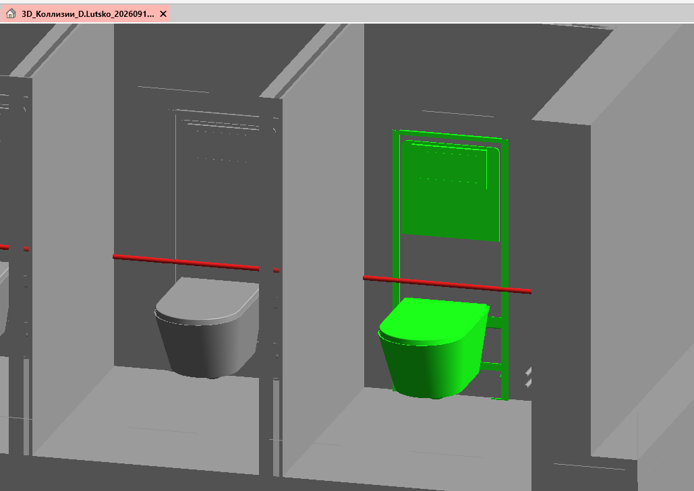

<note type="info">

Плагин предназначен для отображения коллизии на вновь создаваемом подрезанном 3D-виде

</note>

## Где находится

Плагин расположен на вкладке «**GARDA_ОБЩИЕ**», в панели «**Коллизии**»

<image src="./poisk-kollizii-po-id.webp" crop="0,0,100,100" scale="106px" width="100px" height="95px" float="center"/>

## Как пользоваться

<note>

**Важно**

Для работы плагина в буфере обмена должно быть содержимое вида \<**@Модель1#ID1\$Модель2#ID2**\>, где: **Модель1** -- имя текущей модели, **Модель2** -- имя модели, элементы которой пересекаются с первой, **ID1** и **ID2** - ID пересекаемых элементов.

</note>

При нажатии на кнопку плагина создается временный 3D-вид, с настроенной подрезкой и цветовым отображением пересекаемых элементов (красный цвет - элемент из текущей модели, зеленый цвет - пересекающий элемент, серый цвет - все остальные элементы, не участвующие в коллизии)

{width=695px height=604px}

Во время следующего запуска плагина создастся новый вид, старый 3D-вид удалится