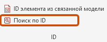
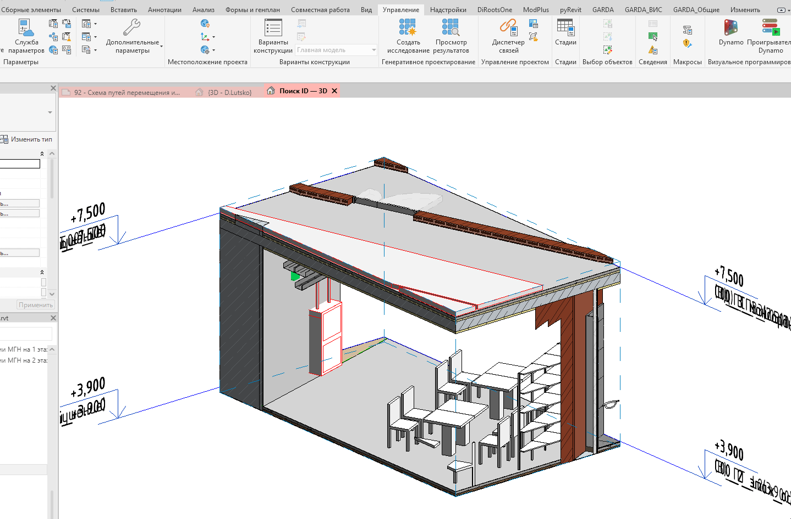

Плагин предназначен для поиска по ID и визуального выделения элемента.

## Где находится

Плагин расположен на вкладке «**GARDA_Общие**», в панели «**ID**»

{width=220px height=86px}

## Как пользоваться

1. Нажмите кнопку плагина;

2. Вставьте ID элемента, который необходимо найти;

3. Выберите, на каком виде показать элемент (**план существующего этажа** или **3D-вид**);

## Итог

При выборе плана существующего этажа для отображения элемента:

-  Выберите план этажа из списка

   {width=1506px height=788px}

<<<<<<< Updated upstream

-  Если элемент из текущей модели, он будет выделен

{width=1438px height=946px}
=======
При выборе 3D-вида для
>>>>>>> Stashed changes