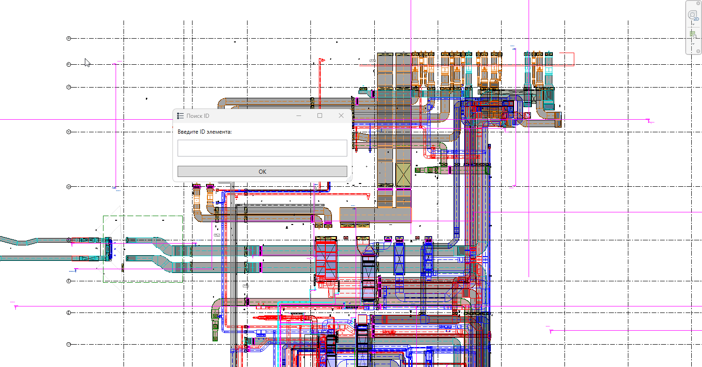

Плагин предназначен для поиска по ID и визуального выделения элемента.

## Где находится

Плагин расположен на вкладке «**GARDA_Общие**», в панели «**ID**»

{width=220px height=86px}

## Как пользоваться

1. Нажмите кнопку плагина

2. Вставьте ID элемента, который необходимо найти

3. Нажмите «ОК»

## Итог

Появится временный 3D-вид, на котором:

-  Если элемент принадлежит связанной модели, он будет подкрашен в зеленый цвет

{width=1429px height=981px}

-  Если элемент из текущей модели, он будет выделен

{width=1438px height=946px}