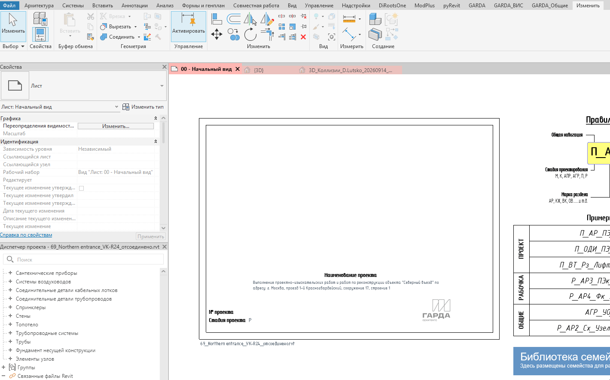

Плагин собирает и выводит отчёт по всем Revit‑связям в проекте для быстрой проверки состояния связей, аудита и быстрого выбора/копирования ID связанных моделей.

## Где находится

Плагин расположен на вкладке «**GARDA_Общие**», в панели «**Связи**»

{width=103px height=81px}

## Как пользоваться

{width=1420px height=885px}

## Итог

В появившемся отчете по каждой связанной модели содержится информация:

-  Закреплена ли связь;

-  Тип связи (Наложение/ прикрепление);

-  Количество экземпляров связи;

-  Название рабочего набора, в котором размещен экземпляр и тип связанной модели;

-  ID связанной модели.