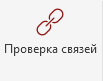

<note type="info">

Плагин служит для проверки состояния связанных моделей

</note>

## Где находится

Плагин расположен на вкладке «**GARDA_ОБЩИЕ**», в панели «**Связи**»

{width=103px height=81px}

## Как пользоваться

Дополнительных подготовлений не требуется. Запустите плагин