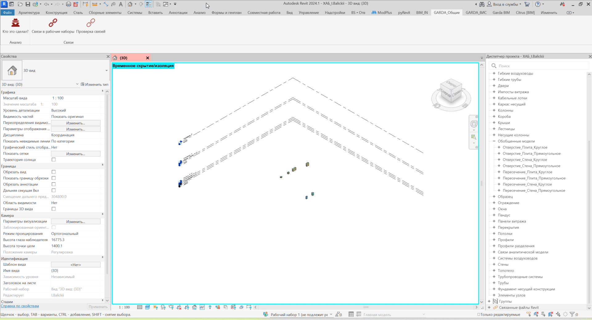

Плагин автоматически распределяет **Revit-связи по отдельным рабочим наборам** и закрепляет их от случайного перемещения.

Для каждой связи создаётся рабочий набор на основе имени подключённого RVT-файла.

## Где находится

Плагин расположен на вкладке **GARDA_Общие**, панели **Связи**.

{width=281px height=95px}

## Как пользоваться

1. Запустите плагин **«Рабочие наборы для связей»**.

2. Дополнительно выбирать элементы не требуется.

3. Плагин автоматически найдёт все Revit-связи в текущей модели.

4. Для каждой связи будет определён необходимый рабочий набор.

5. После завершения обработки появится отчёт с результатами.

{width=1920px height=1039px}

## Как формируется рабочий набор

Имя рабочего набора формируется по принципу:

`096_` + `Имя файла связи`

Например:

`АР_Модель.rvt`

будет помещена в рабочий набор:

`096_АР_Модель`

Расширение `.rvt` в имя рабочего набора не добавляется.

Если один файл связи размещён в проекте несколько раз, все его экземпляры будут помещены в один рабочий набор.

## Что делает плагин

Для каждой Revit-связи плагин:

1. Определяет имя подключённого RVT-файла.

2. Проверяет наличие соответствующего рабочего набора.

3. Если рабочего набора нет -- создаёт его.

4. Переносит экземпляр связи в нужный рабочий набор.

5. Закрепляет связь.

Если рабочий набор уже существует, новый рабочий набор не создаётся.

Если связь уже находится в нужном рабочем наборе или уже закреплена, плагин оставляет её без изменений.

## Результат работы

После выполнения выводится информация:

-  сколько Revit-связей найдено;

-  сколько рабочих наборов используется;

-  сколько новых рабочих наборов создано;

-  сколько связей перенесено;

-  сколько связей уже находилось в нужных рабочих наборах;

-  сколько связей закреплено;

-  сколько связей уже было закреплено;

-  возникли ли ошибки при обработке.

## Важно

Плагин работает только в **совместной модели Revit**, в которой включены рабочие наборы.

Если модель не является совместной, обработка не выполняется.

Плагин обрабатывает **все Revit-связи текущего проекта** -- предварительно выбирать связи вручную не требуется.

После выполнения связи автоматически закрепляются, чтобы снизить риск их случайного перемещения.