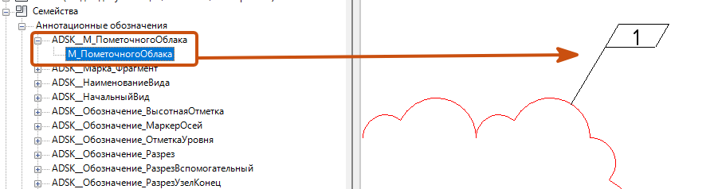

## 1\. Общие указания

<note type="info">

Для каждого альбома создается типоразмер семейства основной надписи «**Основная надпись**». Имя типоразмера семейства должно совпадать с параметром «**ADKS_Комплект**»  листов тома/раздела/альбома (Рисунок 1, 2).

</note>

<image src="./rabota-so-shtampom.jpeg" title="Рисунок 1" crop="0,0,100,100" scale="459px" width="459px" height="117px" float="center"/>

<image src="./rabota-so-shtampom-2.jpeg" title="Рисунок 2" crop="0,0,100,100" scale="461px" width="458px" height="123px" float="center"/>

## 2\. Заполнение штампа

## 2\.1. Информация о проекте

<image src="./rabota-so-shtampom-2.webp" title="Рисунок 3" crop="0,0,100,100" scale="1046px" width="1729px" height="786px" float="center"/>

1. Имя заказчика

   -  Перейдите по пути «**Управление**» - «**Информация о проекте**» и заполните параметр

   «**G_Штамп_Имя заказчика**»  (см. Рисунок 3).

2. Шифр проекта

   -  Перейдите по пути «**Управление**» - «**Информация о проекте**» и заполните параметр

   «**G_Штамп_Шифр проекта П**» / «**G_Штамп_Шифр проекта Р**»  в зависимости от стадии документации (см. Рисунок 3).

3. Отметка нуля проекта

   -  Перейдите по пути «**Управление**» - «**Информация о проекте**» и заполните параметр

   «**G_Штамп_Отметка нуля проекта**» (см. Рисунок 3).

4. Имя проекта

   -  Перейдите по пути «**Управление**» - «**Информация о проекте**» и заполните параметр

   «**G_Штамп_Имя проекта П**» / «**G_Штамп_Имя проекта Р**» в зависимости от стадии документации (см. Рисунок 3).

## 2\.2. Параметры типа основной надписи

<image src="./rabota-so-shtampom.webp" title="Рисунок 4" crop="0,0,100,100" scale="1051px" width="1698px" height="906px" float="center"/>

1. Роль/Фамилия/Подпись

   -  В параметрах типа основной надписи необходимо включить параметр «**Включить**

      **подписи**» и «**Подпись N по комплекту**», где N – порядковый номер строки от 1 до 6 и выбрать необходимый типоразмер с фамилией и ролью в проекте.

   -  Типоразмеры выбирать с префиксом «**Подпись\_**». В тех местах, где не должно быть участника проекта необходимо выбрать тип «**Нет подписи**». Подписи появятся на всех листах данного типа (см. Рисунок 4).

      <note type="info">

      В случае, если внутри альбома/тома/раздела есть лист/листы с отличающимся по составу участников проекта, то необходимо использовать параметры экземпляра основной надписи.

      </note>

2. Имя комплекта

   -  В параметрах типа основной надписи необходимо заполнить параметр «**Имя комплекта**

      **(тома)**» (см. Рисунок 4).

3. Стадия комплекта

   -  В параметрах типа основной надписи необходимо выбрать параметр «**Стадия П» / «Стадия Р» / «Стадия ТД**»  в зависимости от стадии документации (см. Рисунок 4).

4. Логотип

   -  В параметрах типа основной надписи необходимо выбрать из выпадающего списка лого необходимой организации. Если нужного лого нет - обратиться к BIM-координатору по своему объекту (см. Рисунок 4).

      ## 2\.3. Параметры экземпляра основной надписи

<image src="./rabota-so-shtampom-3.webp" title="Рисунок 5" crop="0,0,100,100" scale="1018px" width="1231px" height="817px" float="center"/>

1. Формат

   -  В параметрах экземпляра основной надписи есть возможность переключения формата

      листа и его кратность параметрами «**А**» и «**х**» (см. Рисунок 5).

2. Ориентация

   -  В параметрах экземпляра основной надписи есть возможность переключать ориентацию листа Книжный/Альбомный, путем установки галочки в параметре «**Книжный**». В случае если галочка в параметре «**Книжный**» снята, то значит используется альбомная ориентация (см. Рисунок 5).

3. Нестандартные размеры

   -  В параметрах экземпляра основной надписи есть возможность устанавливать

      нестандартные размеры листа. Для того чтобы установить нестандартные размеры листа необходимо поставить галочку в параметре «**Нестандартные размеры листа**» и указать нужные вам размеры в параметрах «**Нестандартная высота**» и «**Нестандартная ширина**» (см. Рисунок 5).

4. Роль/Фамилия/Подпись

   <note type="info">

   В случае, если внутри альбома/тома/раздела есть лист/листы с отличающимся по составу

   участников проекта, то необходимо использовать параметры экземпляра основной надписи.

   </note>

   -  Необходимо включить параметр «**Подпись N переопределить**» и «**Подпись N по листу**», где N – порядковый номер строки от 1 до 4 и выбрать необходимый типоразмер с фамилией и ролью в проекте.

   -  В тех местах, где не должно быть участника проекта необходимо выбрать тип «**Нет подписи**».

   -  Подписи появятся на одном листе, на котором вы изменили параметры экземпляра основной надписи (см. Рисунок 5).

   ## 2\.4. Параметры экземпляра листа

<image src="./rabota-so-shtampom-4.webp" title="Рисунок 6" crop="0,0,100,100" scale="1060px" width="1402px" height="686px" float="center"/>

1. Количество листов

   -  Заполняется в параметрах экземпляра листа - параметр «**G_Штамп_Количество**

      **листов**» (см. Рисунок 6).

2. Номер листа

   -  Заполняется в параметрах экземпляра листа - параметр «**Номер листа**» (см. Рисунок 6).

3. Имя листа

   -  Заполняется в параметрах экземпляра листа - параметр «**Имя листа**» (см. Рисунок 6).

4. Дата утверждения листа

   -  Заполняется в параметрах экземпляра листа - параметр «**Дата утверждения листа**» (см. Рисунок 6).

   -  Необходимо включить параметр типа основной надписи «**Видимость N даты по комплекту**», где N – порядковый номер строки от 1 до 6.

   -  Далее собрать спецификацию «**Список листов**».

   -  Добавить параметры: «**Дата утверждения листа**» и «**ADSK_Комплект**».

   -  Включить сортировку по «**ADSK_Комплект**» и снять галочку «**Для каждого экземпляра**».

   -  Заполнить параметр «**Дата утверждения листа**» для каждого комплекта чертежей (см. Рисунок 7).

      <note type="lab">

      Возможны иные сортировки. В шаблонах проектов предусмотрена спецификация листов, ее имя уточните у BIM –координатора вашего проекта.

      </note>

      <image src="./rabota-so-shtampom-5.webp" title="Рисунок 7" crop="0,0,100,100" scale="334px" width="331px" height="533px" float="center"/>

      

5. Комплект чертежей

   -  Заполняется в параметрах экземпляра листа – параметр «**ADSK_Комплект чертежей**» (см. Рисунок 6).

      <note type="lab">

      Значение параметра комплекта чертежей должно быть идентичными имени типа основной надписи данного комплекта. Если комплект чертежей «**СОТ**», то и имя типа основной надписи всех листов данного комплекта должно быть «**СОТ**».

      </note>

6. Стадия документации

   -  Заполняется в параметрах экземпляра листа – параметр «**G_Штамп_Стадия документации**» (см. Рисунок 6).

      ## 3\. Изменения в проекте

### 3\.1. Подготовка

-  Перейдите по пути «**Вид**» – «**Изменения**» и заполните информацию об изменении (см. Рисунок 8).

<image src="./rabota-so-shtampom-6.webp" title="Рисунок 8" crop="0,0,100,100" scale="678px" width="754px" height="123px" float="center"/>

<image src="./rabota-so-shtampom-7.webp" title="Рисунок 9" crop="0,0,100,100" scale="743px" width="1007px" height="785px" float="center"/>

1. В поле «**Дата**» укажите дату в формате «**ДД.ММ.ГГ**» (см. Рисунок 9);

2. В поле «**Описание**» укажите номер изменения в формате «**1**» или «**А1**» (см. Рисунок 9)

3. В поле «**Утверждено**» укажите номер документа изменения в формате «**500/20**»

   (см. Рисунок 9);

4. В поле «**Утвердил**» укажите вид изменения в формате «**Изм.**», «**Зам.**» или «**Искл.**» (см.

   Рисунок 9).

### 3\.2. Размещение

-  Разместите обозначение инструментом «**Пометочное облако**» во вкладке «**Аннотации**» - «**Пометочное облако**» (см. Рисунок 10).

<note type="info">

Размещение облаков можно выполнять как на листе, так и на виде. В обоих случаях, если облачко будет видно на листе – лист получит информацию об изменениях.

</note>

<image src="./rabota-so-shtampom-8.webp" title="Рисунок 10" crop="0,0,100,100" scale="551px" width="548px" height="128px" float="center"/>

<note type="tip">

В случае, если изменяется участок листа, разместите пометочное облако на

измененный участок (см. Рисунок 11).

</note>

<image src="./rabota-so-shtampom-9.webp" title="Рисунок 11" crop="0,0,100,100" scale="686px" width="1078px" height="725px" float="center"/>

В случае, если заменяется целый лист, воспользуйтесь функцией «**Изменить**» в параметрах экземпляра листа (см. Рисунок 12). Поставьте галочку возле нужного изменения, чтобы оно отобразилось в штампе (см. Рисунок 12).

<image src="./rabota-so-shtampom-10.webp" crop="0,0,100,100" scale="780px" width="1304px" height="628px" float="center"/>

`Рисунок 12`

Для того, чтобы присвоить пометочному облаку изменение, необходимо в параметрах экземпляра пометочного облака выбрать соответствующее изменение (см. Рисунок 13).

<image src="./rabota-so-shtampom-11.webp" title="Рисунок 13" crop="0,0,100,100" scale="703px" width="1145px" height="323px" float="center"/>

Для того, чтобы разместить подпись, необходимо выбрать семейство «**Подпись_ФамилияУчастникаПроект**а» типоразмер «**Только подпись**» и разместить его на лист (см. Рисунок 14).

<image src="./rabota-so-shtampom-13.webp" title="Рисунок 14" crop="0,0,100,100" scale="713px" width="1135px" height="510px" float="center"/>

Для того, чтобы указать количество участков, необходимо заполнить параметр «**G_Штамп_Количество участков Строка N**» (см. Рисунок 15).

<image src="./rabota-so-shtampom-12.webp" title="Рисунок 15" crop="0,0,100,100" scale="737px" width="1517px" height="373px" float="center"/>

При необходимости маркировки изменения на чертеже необходимо использовать семейство марки «ADSK__М_ПометочногоОблака» (выполнена по ГОСТ21-1101-2013) (см. Рисунок 16).

{width=906px height=238px}