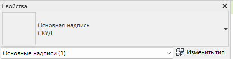
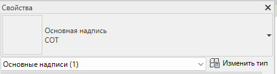

### Общие указания

### Для каждого альбома создается типоразмер семейства основной надписи «Основная надпись». Имя типоразмера семейства должно совпадать с параметром «ADKS_Комплект»  листов тома/раздела/альбома.

{width=459px height=117px}

Рисунок 1

{width=458px height=123px}

Рисунок 2

## Заполнение штампа

## 2\.1. Информация о проекте

<image src="./rabota-so-shtampom-3.jpeg" crop="0,0,100,100" scale="1125px" width="1729px" height="786px" float="center"/>

1\. Имя заказчика

Перейдите по пути «Управление» - «Информация о проекте» и заполните параметр

«G_Штамп_Имя заказчика»  (см. Рисунок 3).

2\. Шифр проекта

Перейдите по пути «Управление» - «Информация о проекте» и заполните параметр

«G_Штамп_Шифр проекта П» / «G_Штамп_Шифр проекта Р»  в зависимости от стадии документации (см. Рисунок 3).

3\. Отметка нуля проекта

Перейдите по пути «Управление» - «Информация о проекте» и заполните параметр

«G_Штамп_Отметка нуля проекта» (см. Рисунок 3).

4\. Имя проекта

Перейдите по пути «Управление» - «Информация о проекте» и заполните параметр

«G_Штамп_Имя проекта П» / «G_Штамп_Имя проекта Р» в зависимости от стадии документации (см. 

Рисунок 3).

### 2\.2. Параметры типа основной надписи

<image src="./rabota-so-shtampom.webp" crop="0,0,100,100" scale="1213px" width="1698px" height="906px" float="center"/>

2\.2.1. Роль/Фамилия/Подпись

В параметрах типа основной надписи необходимо включить параметр «Включить

подписи» и «Подпись N по комплекту», где N – порядковый номер строки от 1 до 6 и выбрать необходимый типоразмер с фамилией и ролью в проекте. Типоразмеры выбирать с префиксом «Подпись\_». В тех местах, где не должно быть участника проекта необходимо выбрать тип «Нет подписи». Подписи появятся на всех листах данного типа (см. Рисунок 4).

В случае, если внутри альбома/тома/раздела есть лист/листы с отличающимся по составу участниками проекта, то необходимо использовать параметры экземпляра основной надписи.

2\.2.2. Имя комплекта

В параметрах типа основной надписи необходимо заполнить параметр «Имя комплекта

(тома)» (см. Рисунок 4).

2\.2.3. Стадия комплекта

В параметрах типа основной надписи необходимо выбрать параметр «Стадия П» / «Стадия Р» / «Стадия ТД»  в зависимости от стадии документации (см. Рисунок 4).

2\.2.4. Логотип

В параметрах типа основной надписи необходимо выбрать из выпадающего списка лого необходимой организации. Если нужного лого нет - обратиться к BIM-координатору по своему объекту (см. Рисунок 4).

### 2\.3. Параметры экземпляра основной надписи

2\.3.1. Формат

В параметрах экземпляра основной надписи есть возможность переключения формата

листа и его кратность параметрами «А» и «х» \[1\] (см. Рисунок 7). 

2\.3.2. Ориентация

В параметрах экземпляра основной надписи есть возможность переключать ориентацию листа Книжный/Альбомный, путем установки галочки в параметре «Книжный» \[2\]. В случае если галочка в параметре «Книжный» снята, то значит используется альбомная ориентация (см. Рисунок 7).

2\.3.3. Нестандартные размеры

В параметрах экземпляра основной надписи есть возможность устанавливать

нестандартные размеры листа. Для того чтобы установить нестандартные размеры листа необходимо поставить галочку в параметре «Нестандартные размеры листа» и указать нужные вам размеры в параметрах «Нестандартная высота» и «Нестандартная ширина» \[3\] (см. Рисунок 7).

2\.3.4. Роль/Фамилия/Подпись

В случае, если внутри альбома/тома/раздела есть лист/листы с отличающимся по составу

участниками проекта, то необходимо использовать параметры экземпляра основной надписи. Необходимо включить параметр «Подпись N переопределить» и «Подпись N по листу» \[4\], где N – порядковый номер строки от 1 до 4 и выбрать необходимый типоразмер с фамилией и ролью в проекте. Типоразмеры выбирать с кодом «022\_». В тех местах, где не должно быть участника проекта необходимо выбрать тип «022_Нет подписи». Подписи появятся на одном листе, на котором вы изменили параметры экземпляра основной надписи (см. Рисунок 7).