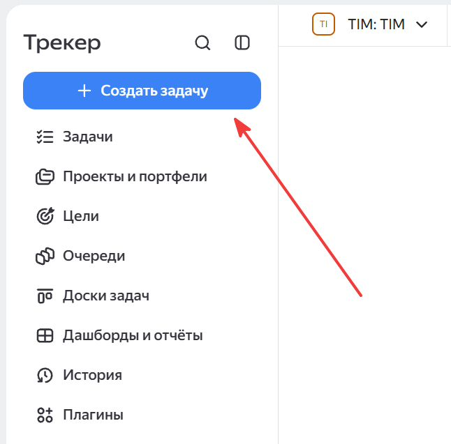

### Как создать задачу в Яндекс.Трекере

1\. Откройте Яндекс.Трекер и нажмите «Создать задачу».

<image src="./zadanie-na-semeystva.jpeg" crop="0,0,100,100" scale="363px" width="646px" height="637px" float="center"/>

2\. В поле «Очередь» выберите «ТИМ».

<image src="./zadanie-na-semeystva-3.jpeg" crop="0,0,100,100" scale="520px" width="1296px" height="744px" float="center"/>

3\. Выберите шаблон задачи:

-  «Семейства» -- для создания и редактирования семейств;

-  «Объект/Проект» -- для задач, связанных с работой в моделях;

-  «Плагины» -- для разработки и корректировки плагинов.

   {width=1334px height=337px}

   

4\. Заполните все поля формы.

<image src="./zadanie-na-semeystva-2.jpeg" crop="0,0,100,100" scale="439px" width="1008px" height="1911px" float="center"/>

5\. Нажмите «Отправить». Заявка автоматически преобразуется в задачу и система подставит ответственного.

<note>

Важно. Если заявку нужно оформить по согласованию с координатором (чтобы он был исполнителем), то после заполнение формы откройте раздел «Задачи», найдите созданную задачу и в поле «Исполнитель» укажите нужного координатора.

</note>