## 1\. Версия Revit для разработки семейств

-  Для разработки новых семейств принимается версия **Revit 2021**.

-  Корректировка имеющихся семейств, созданных в более старых версиях, производится в Revit 2021. Версия семейства обновляется до 2021.

-  Семейства на адаптацию, присланные в версии новее 2021, редактируются и сохраняются в текущей (присланной) версии.

## 2\. Наименование файлов семейств

### 2\.1. Основные семейства (родитель)

Схема наименования:

```
<1>_<2¹>_(<3>)_<4¹>_<5¹>
```

<table header="row">
<colgroup><col width="48"/><col width="260"/><col width="459"/></colgroup>
<tr>
<td align="center">

№

</td>
<td>

Поле

</td>
<td>

Описание

</td>
</tr>
<tr>
<td align="center">

1

</td>
<td>

Категория элемента

</td>
<td>

Указание на принадлежность элемента

</td>
</tr>
<tr>
<td align="center">

2

</td>
<td>

Описание¹

</td>
<td>

Дополнительная информация для более точного понимания категории элемента

</td>
</tr>
<tr>
<td align="center">

3

</td>
<td>

Производитель

</td>
<td>

Производитель, модель по каталогу производителя (при наличии); для универсального указываем «У»

</td>
</tr>
<tr>
<td align="center">

4

</td>
<td>

Комментарий¹

</td>
<td>

Опционально, заполняется при необходимости

</td>
</tr>
<tr>
<td align="center">

5

</td>
<td>

Основа¹

</td>
<td>

Указывается только для семейства, выполненного на основе. Пример: `ОснГрань`, `ОснПотолок`

</td>
</tr>
</table>

¹ -- указывается при необходимости.

<note>

Если значение в каком-либо поле состоит из нескольких слов, слова записываются через дефис.

</note>

**Пример:**

| Категория элемента | Описание¹ | Производитель | Комментарий¹ | Основа¹  |
|--------------------|-----------|---------------|--------------|----------|
| Щит                | Навесной  | У             | --           | ОснГрань |

**Таблица 1 -- Сокращения основ**

| Шаблон семейства                                           | Используемая основа |
|------------------------------------------------------------|---------------------|
| Метрическая система, типовая модель на основе грани        | ОснГрань            |
| Метрическая система, типовая модель на основе двух уровней | ОснУровень          |
| Метрическая система, типовая модель на основе крыши        | ОснКрыша            |
| Метрическая система, типовая модель на основе линий        | ОснЛиния            |
| Метрическая система, типовая модель на основе образца      | ОснОбразец          |
| Метрическая система, типовая модель на основе пола         | ОснПол              |
| Метрическая система, типовая модель на основе потолка      | ОснПотолок          |
| Метрическая система, типовая модель на основе стены        | ОснСтена            |

### 2\.2. Вложенные семейства

Схема наименования:

```
Влж_<2>_(<3¹>)_<4>_<5¹>
```

<table header="row">
<colgroup><col width="48"/><col width="260"/><col width="465"/></colgroup>
<tr>
<td align="center">

№

</td>
<td>

Поле

</td>
<td>

Описание

</td>
</tr>
<tr>
<td align="center">

1

</td>
<td>

Префикс

</td>
<td>

«Влж» -- означает, что семейство вложенное и не может использоваться в модели отдельно от родительского

</td>
</tr>
<tr>
<td align="center">

2

</td>
<td>

Описание

</td>
<td>

Описание элемента

</td>
</tr>
<tr>
<td align="center">

3

</td>
<td>

Производитель¹

</td>
<td>

Производитель, модель по каталогу (при наличии); для универсального -- «У». Заполняется только для вложенных семейств с принадлежностью «Общее»

</td>
</tr>
<tr>
<td align="center">

4

</td>
<td>

Принадлежность

</td>
<td>

Тип вложенного семейства (см. ниже)

</td>
</tr>
<tr>
<td align="center">

5

</td>
<td>

Комментарий¹

</td>
<td>

Опционально, заполняется при необходимости

</td>
</tr>
</table>

¹ -- указывается при необходимости.

Значения поля «Принадлежность»:

-  **Общее** -- для формирования спецификаций;

-  **Геометрия** -- геометрический элемент семейства;

-  **Аннотация** -- УГО, текст или другой аннотационный вывод информации;

-  **Типоразмер** -- выпадающие списки через «Типоразмеры из семейства».

**Пример:**

| Префикс | Описание | Производитель¹ | Принадлежность | Комментарий¹ |
|---------|----------|----------------|----------------|--------------|
| Влж     | Шаровой  | У              | Общее          | --           |

<note>

Если значение в каком-либо поле состоит из нескольких слов, слова записываются через дефис.

Исключение: при создании семейств для выпадающих списков (Типоразмеры из семейства) допускается свободная форма наименования.

</note>

## 3\. Параметры

### 3\.1. Организация

В работе следует использовать три типа параметров:

1. **Параметры пользователя** -- параметры, которые будет изменять проектировщик;

2. **Служебные параметры BIM-специалиста** -- вспомогательные параметры, создаваемые BIM-специалистом и необходимые для работы семейства;

3. **Параметры-разделители** -- служат для логической группировки и разделения параметров внутри системных групп.

#### 3\.1.1. Именование пользовательских и служебных параметров

Чтобы имена параметров были понятны проектировщику, придерживайтесь следующих правил:

-  не используйте в имени дефисы, лишние буквы или слова;

-  имя параметра состоит из логических блоков, задавайте имя по схеме;

-  каждый блок начинайте с заглавной буквы;

-  между блоками ставьте нижнее подчёркивание.

Порядок логических блоков (пример: `Рама полотна 1_Ширина_Слева`):

<table header="row">
<colgroup><col width="48"/><col width="260"/><col width="458"/></colgroup>
<tr>
<td align="center">

№

</td>
<td>

Блок

</td>
<td>

Описание

</td>
</tr>
<tr>
<td align="center">

1

</td>
<td>

Сущность

</td>
<td>

Конкретная часть/элемент семейства. Если в семействе всего один элемент, блок разрешается пропустить

</td>
</tr>
<tr>
<td align="center">

2

</td>
<td>

Основное свойство

</td>
<td>

Какая характеристика элемента будет меняться

</td>
</tr>
<tr>
<td align="center">

3

</td>
<td>

Уточняющее свойство

</td>
<td>

Уточнение основного свойства

</td>
</tr>
</table>

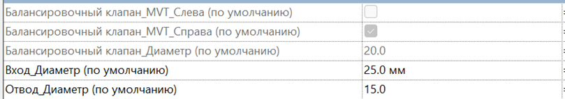{width=809px height=142px}

<note>

Исключение: при адаптации семейств разрешается не менять наименования служебных параметров, однако такие параметры должны располагаться в правильной вкладке.

</note>

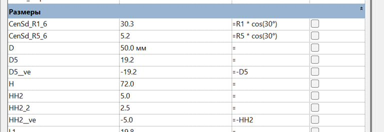{width=769px height=264px}

#### 3\.1.2. Организация параметров по вкладкам

<note type="danger">

Не используйте кнопки эти кнопки , иначе сортировка нарушится.

</note>

<image src="./reglament-razrabotki-semeystv-9.jpeg" title="Рисунок 3 - Не нажимать" crop="0,0,100,100" scale="356px" width="501px" height="159px" float="center"/>

В некоторых стандартных шаблонах семейств встречаются системные параметры, которые нельзя удалить. Создайте для них отдельную группу и задайте в формуле значение «0».

<image src="./reglament-razrabotki-semeystv-10.jpeg" title="Рисунок 4 -- Неиспользуемые параметры" crop="0,0,100,100" scale="320px" width="374px" height="223px" float="center"/>

При большом количестве параметров группируйте их не только по вкладкам, но и внутри вкладок -- с помощью текстовых параметров-разделителей со значением `------` и именем вида `------Каркас------`. Если в группе есть параметры «По типу» и «По экземпляру», создайте два таких параметра-разделителя -- «По типу» и «По экземпляру».

<image src="./reglament-razrabotki-semeystv-11.jpeg" title="Рисунок 5 -- Подгруппы для параметров" crop="0,0,100,100" scale="780px" width="994px" height="109px" float="center"/>

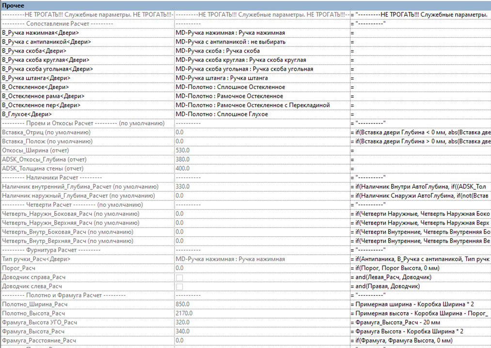{width=1013px height=719px}


### 3\.2. Группирование параметров

По умолчанию параметры распределяются по вкладкам:

-  **«Размеры»** -- обязательные размерные параметры, которые управляются пользователем или рассчитываются по формулам и необходимы для дальнейшего анализа и контроля;

-  **«Свойство модели»** -- опциональные второстепенные размерные параметры (используются для уточнения деталей), управляемые пользователем или рассчитываемые по формулам;

-  **«Прочее»** -- вспомогательные параметры, содержащие формулы и/или используемые в них. Вкладка предназначена исключительно для ТИМ-специалистов.

<note type="info">

Первые два параметра вкладки (по типу и по экземпляру) должны иметь имя и формулу (см. Рисунок 5): **\---------НЕ ТРОГАТЬ!!! Служебные параметры. НЕ ТРОГАТЬ!!!---------**;

</note>

-  **«Данные»** -- общие параметры, необходимые для спецификации (см. п. 3.3, «Параметры девятиграфки»);

-  **«Текст»** -- текстовые параметры, используемые в марках и УГО;

-  **«Материалы и отделка»** -- параметры, связанные с материалами;

-  **«Набор»** -- параметры видимости, влияющие на состав семейства, с последующей спецификацией вложенных элементов;

-  **«Графика»** -- параметры видимости объектов и условных обозначений.

<image src="./reglament-razrabotki-semeystv-13.jpeg" title="Рисунок 7 -- Пример группирования во вкладке «Набор»" crop="0,0,100,100" scale="409px" width="650px" height="88px" float="center"/>

<image src="./reglament-razrabotki-semeystv-14.jpeg" title="Рисунок 8 -- Пример группирования во вкладке «Графика»" crop="0,0,100,100" scale="326px" width="423px" height="142px" float="center"/>

<note>

В сложных семействах допустимо отклоняться от вышеизложенных указаний. 

Например, во вкладку «Размеры» можно помещать не только размеры, но и видимость объектов, выпадающие списки и т. д., чтобы собрать параметры, относящиеся к одному элементу, в одном месте.

</note>

<image src="./reglament-razrabotki-semeystv-15.jpeg" title="Рисунок 9 -- Пример" crop="0,0,100,100" scale="446px" width="643px" height="166px" float="center"/>


### 3\.3. Обязательные параметры

Добавьте в семейство следующие параметры.

**Габаритные параметры** (в зависимости от типа семейства):

-  `ADSK_Высота`, `ADSK_Ширина`, `ADSK_Длина`, `ADSK_Глубина`, `ADSK_Диаметр`.

<image src="./reglament-razrabotki-semeystv-16.jpeg" title="Рисунок 10 -- Оформление габаритных параметров (пример для пожарного шкафа)" crop="0,0,100,100" scale="391px" width="514px" height="129px" float="center"/>


Габаритные размеры соединителя должны быть привязаны к общим параметрам везде, где это возможно.

**Параметры для «девятиграфки»** (параметры спецификации, строго в указанном порядке):

1. `ADSK_Наименование`

2. `ADSK_Марка`

3. `ADSK_Код изделия`

4. `ADSK_Завод-изготовитель`

5. `ADSK_Единица измерения`

6. `ADSK_Масса_Текст`

7. `ADSK_Количество`

8. `ADSK_Примечание` (при необходимости)

Почти всегда: `ADSK_Количество` = «1».

<note>

Для параметра `ADSK_Единица измерения`, если нужно указать штуки, задайте значение в формате «шт.» -- всегда с маленькой буквы и с точкой в конце.

</note>

**Параметры версии и разработчика семейства** (размещаются в разделе «Идентификация»):

-  `ADSK_Версия Revit` -- пример: «2021»;

   <image src="./reglament-razrabotki-semeystv-17.jpeg" title="Рисунок 11 -- Окно Revit 2021" crop="0,0,100,100" scale="418px" width="501px" height="57px" float="center"/>

-  `G_Разработчик` -- пример: «Аксенова М.С.»;

-  `ADSK_Версия семейства` -- пример: «2.3.1», где:

   -  первое значение -- крупное обновление семейства (изменение логики работы; замена семейства старой версии на новую без проверки не допускается);

   -  второе значение -- базовое обновление (улучшение работы, некритичное добавление/расширение функционала);

   -  третье значение -- исправление ошибок в семействе;

-  `G_Лог Изменений` -- список изменений в новой версии семейства. Используется только в универсальных семействах. Пример:

```
1.0.0 – Создание семейства
1.0.1 – Добавлен выбор УГО
```

<image src="./reglament-razrabotki-semeystv-17.jpeg" title="Рисунок 12 -- Параметры идентификации" crop="0,0,100,100" scale="559px" width="915px" height="151px" float="center"/>


### 3\.4. Параметры BIM

Во вкладке «Прочее», со служебными параметрами, первые два параметра (по типу и по экземпляру) должны иметь имя и формулу (см. Рисунок 5):

```
---------НЕ ТРОГАТЬ!!! Служебные параметры. НЕ ТРОГАТЬ!!!---------
```

## 4\. Моделирование семейств

### 4\.1. Опорные плоскости

-  При создании изменяемых семейств используются опорные плоскости; вся геометрия и размеры привязываются именно к ним.

-  У вспомогательных опорных плоскостей задайте значение «Нет» параметру «Связь». Исключение -- конкретные требования постановщика задачи.

### 4\.2. Подкатегории

При необходимости используйте подкатегории в Revit.

#### 4\.2.1. АР/КР

Всем элементам семейства назначьте подкатегорию (объёмная геометрия и аннотации) для управления видимостью и графикой из проекта.

Если вы тестируете семейство в проекте и создаёте/удаляете подкатегории в семействе, после завершения работы проверьте проект и удалите лишние подкатегории, случайно занесённые в ходе тестов и проверок.

<note type="danger">

Запрещено создавать геометрию и элементы в корневой категории семейства.

</note>

<image src="./reglament-razrabotki-semeystv-18.jpeg" title="Рисунок 13 -- Подкатегории в семействе" crop="0,0,100,100" scale="610px" width="1017px" height="387px" float="center"/>

<image src="./reglament-razrabotki-semeystv-19.jpeg" title="Рисунок 14 -- Подкатегории в проекте, настройка видимости на виде" crop="0,0,100,100" scale="340px" width="445px" height="587px" float="center"/>


#### 4\.2.2. ИОС

-  У спринклеров зоне орошения всегда назначается отдельная подкатегория с названием «Зона орошения» категории «Спринклеры».

-  Зона обслуживания выполняется отдельным общим семейством категории «Обобщённые модели». Для зоны обслуживания используется единое семейство из библиотеки -- «ВИС_Зона обслуживания».

<image src="./reglament-razrabotki-semeystv-20.jpeg" title="Рисунок 15 -- Зона орошения" crop="0,0,100,100" scale="377px" width="538px" height="635px" float="center"/>

### 4\.3. Коннекторы

Соединители необходимо размещать на гранях вспомогательной линии.

<image src="./reglament-razrabotki-semeystv-21.jpeg" title="Рисунок 16 -- Размещение коннектора" crop="0,0,100,100" scale="529px" width="802px" height="420px" float="center"/>

Соединители семейств, которые вставляются в трубопровод/воздуховод, требуется размещать в плоскости уровня. Если у семейства соединители не сонаправлены, первичный соединитель необходимо размещать в плоскости уровня и точки вставки. Соединители одного потока, относящиеся к одной системе, необходимо связать.

#### 4\.3.1. Коннекторы ОВ1

Для элементов систем ОВ1 используйте настройки соединителей из таблицы ниже. Если напротив параметра на кнопке связывания стоит знак «=», данным параметрам необходимо назначить отдельные параметры для управления:

-  Расход жидкости -- `ADSK_Расход жидкости` (по экземпляру);

-  Диаметр -- `ADSK_Размер_Диаметр`.

**Таблица 2 -- Настройка соединителей ОВ1**

<table header="row">
<colgroup><col width="338"/><col width="445"/></colgroup>
<tr>
<td>

Категория элементов

</td>
<td>

Настройки соединителей

</td>
</tr>
<tr>
<td>

Арматура и фасонные элементы трубопроводов

</td>
<td>

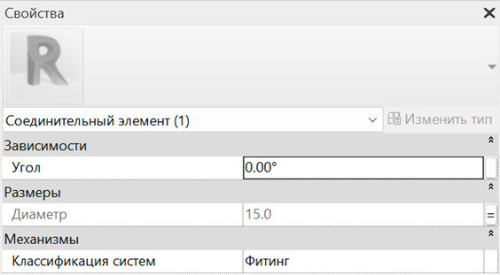{width=564px height=311px}

</td>
</tr>
<tr>
<td>

Соединитель обратной жидкости для радиатора и конвектора

</td>
<td>

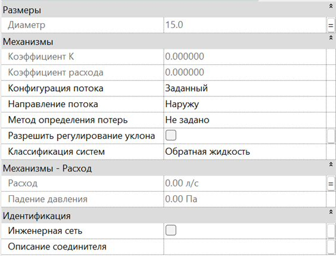{width=564px height=430px}

</td>
</tr>
<tr>
<td>

Соединитель приточной жидкости для радиатора и конвектора

</td>
<td>

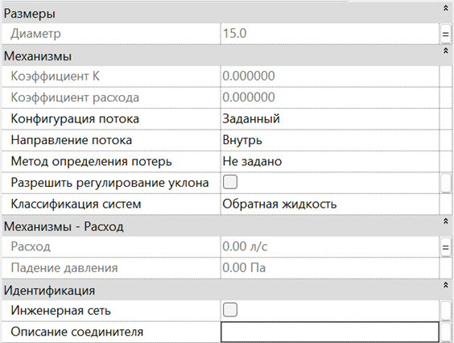{width=564px height=426px}

</td>
</tr>
<tr>
<td>

Блоки кондиционирования (внутренние и наружные)

</td>
<td>

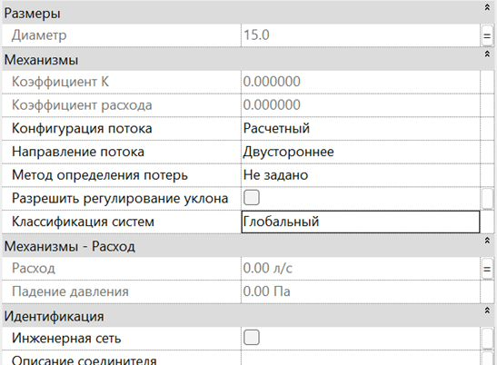{width=547px height=402px}

</td>
</tr>
</table>

#### 4\.3.2. Коннекторы ОВ2

Для элементов вентиляционных систем используйте настройки соединителей из таблицы ниже. Если напротив параметра на кнопке связывания стоит знак «=», данным параметрам необходимо назначить отдельные параметры для управления:

-  Падение давления -- `ADSK_Потеря давления воздуха` (по экземпляру);

-  Расход -- `ADSK_Расход воздуха`.

**Таблица 3 -- Настройка соединителей ОВ2**

<table header="row">
<colgroup><col width="305"/><col width="485"/></colgroup>
<tr>
<td>

Категория элементов

</td>
<td>

Настройки соединителей

</td>
</tr>
<tr>
<td>

Арматура воздуховодов (клапаны, стаканы, шумоглушители, вставки, фильтры и т. д.)

</td>
<td>

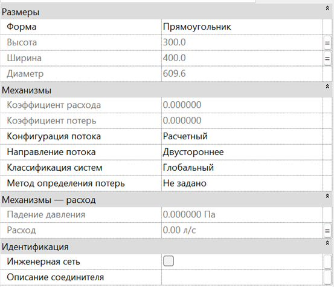{width=553px height=474px}

</td>
</tr>
<tr>
<td>

Соединительные детали воздуховодов

</td>
<td>

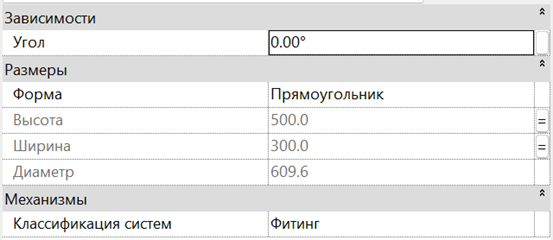{width=553px height=240px}

</td>
</tr>
<tr>
<td>

Вытяжные воздухораспределители

</td>
<td>

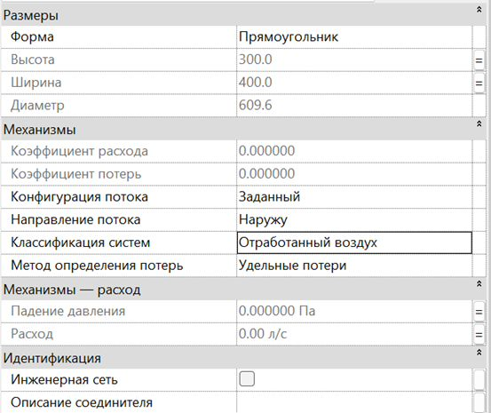{width=553px height=465px}

</td>
</tr>
<tr>
<td>

Приточные воздухораспределители

</td>
<td>

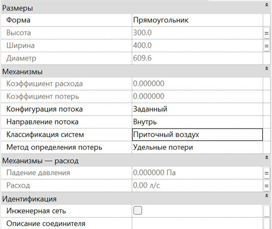{width=553px height=465px}

</td>
</tr>
<tr>
<td>

Канальный или радиальный вентилятор

</td>
<td>

Первый соединитель -- на входе 

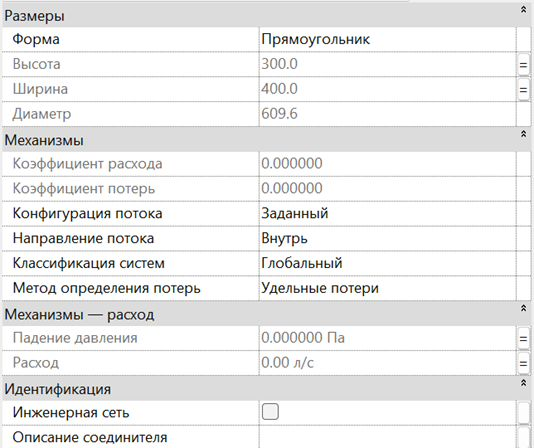{width=534px height=448px}

Второй соединитель -- на выходе

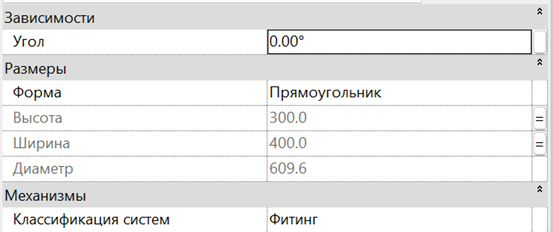{width=553px height=232px}

</td>
</tr>
<tr>
<td>

Крышный приточный вентилятор

</td>
<td>

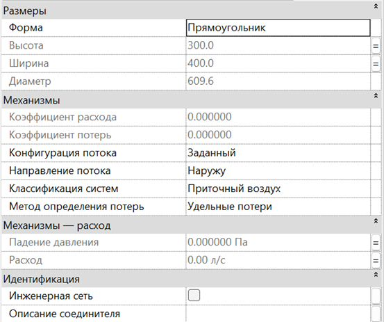{width=553px height=463px}

</td>
</tr>
<tr>
<td>

Крышный вытяжной вентилятор

</td>
<td>

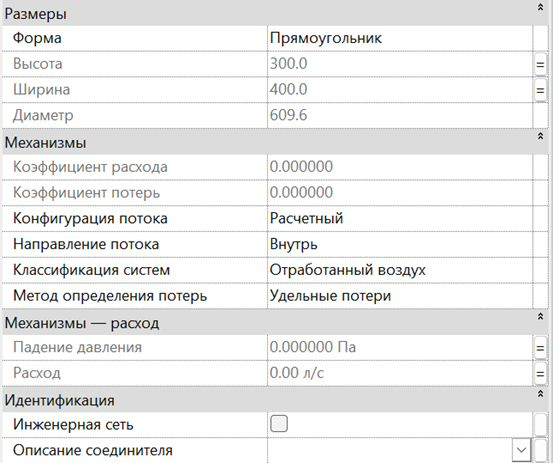{width=553px height=463px}

</td>
</tr>
</table>

#### 4\.3.3. Коннекторы ВК

Для элементов систем ВК используйте настройки соединителей из таблицы ниже. Если напротив параметра на кнопке связывания стоит знак «=», данным параметрам необходимо назначить отдельные параметры для управления:

-  Диаметр -- `ADSK_Размер_Диаметр`.

**Таблица 4 -- Настройка соединителей ВК**

<table header="row">
<colgroup><col width="295"/><col width="493"/></colgroup>
<tr>
<td>

Категория элементов

</td>
<td>

Настройки соединителей

</td>
</tr>
<tr>
<td>

Арматура и фасонные элементы трубопроводов

</td>
<td>

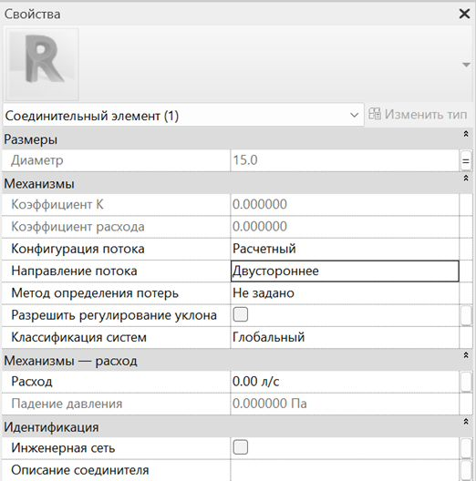{width=522px height=528px}

</td>
</tr>
<tr>
<td>

Соединительные детали трубопроводов

</td>
<td>

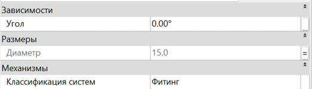{width=523px height=149px}

</td>
</tr>
<tr>
<td>

Оборудование (баки, насосы, установки повышения давления)

</td>
<td>

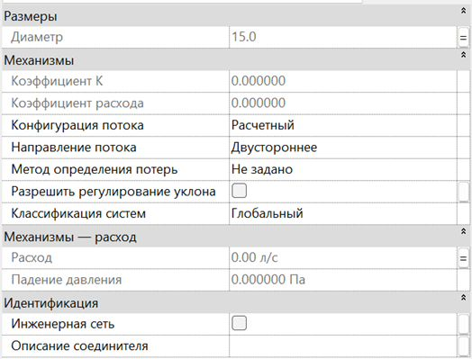{width=524px height=399px}

</td>
</tr>
</table>

#### 4\.3.4. Коннекторы электрические

Тип системы: Мощность -- Сбалансированная.

<image src="./reglament-razrabotki-semeystv-37.jpeg" title="Рисунок 17 -- Назначение параметров коннекторам" crop="0,0,100,100" scale="344px" width="630px" height="395px" float="center"/>

<table header="row">
<colgroup><col width="106"/><col width="390"/></colgroup>
<tr>
<td align="center">

№

</td>
<td>

Параметр

</td>
</tr>
<tr>
<td align="center">

1

</td>
<td>

`ADSK_Количество фаз`

</td>
</tr>
<tr>
<td align="center">

2

</td>
<td>

`ADSK_Классификация нагрузок`

</td>
</tr>
<tr>
<td align="center">

3

</td>
<td>

`ADSK_Напряжение`

</td>
</tr>
<tr>
<td align="center">

4

</td>
<td>

`ADSK_Полная мощность`

</td>
</tr>
<tr>
<td align="center">

5

</td>
<td>

`ADSK_Коэффициент мощности`

</td>
</tr>
</table>

Значения общих параметров в семействе либо заполняются пользователем, либо вычисляются формулами.

## 5\. Прочие данные

### 5\.1. Материалы

<note type="danger">

В семействах должны использоваться только материалы GARDA.

</note>

Очистите семейство от всех сторонних материалов и наборов характеристик материалов. Проведите очистку несколько раз: первый раз вручную удалите материалы во вкладке «Материалы» и в «Стилях объектов».

Ссылка на путь к материалам: *(указать путь к библиотеке материалов GARDA)*.

### 5\.2. Штриховки

*(Раздел в разработке -- указать требования к штриховкам.)*

### 5\.3. Образцы линий

*(Раздел в разработке -- указать требования к образцам линий.)*

## 6\. Сохранение семейства

Файл семейства сохраните в папку `C:\Nextcloud\Гарда - ТИМ – отдел\02_Семейства` и далее по пути в соответствии с назначением семейства.

Перед сохранением:

1. Очистите семейство от лишних элементов и материалов.

2. Настройте миниатюру.

### 6\.1. Миниатюра для 3D-семейств

После создания семейства создайте отдельный вид «Миниатюра», который настраивается для отображения элементов в виде крупных эскизов в проводнике. Порядок настройки:

1. Переименуйте «Вид 1» в «Миниатюра».

2. Включите опцию «Видимость просмотра включена».

3. Отключите видимость категории аннотаций .

4. Ориентируйте семейство в нижний правый угол монитора: выберите угол Видового куба, находящийся между сторонами «Спереди», «Слева», «Сверху». Допускается небольшой поворот в нижнюю и лицевую сторону 

5. Заблокируйте вид.

6. Настройте отображение графики -- «Тонированный».

7. Установите детализацию -- «Высокий».

8. Назначьте масштаб -- «1 : 20».

9. Скройте коннекторы: через «очки» выберите «Временное скрытие».

### 6\.2. Миниатюра для 2D-семейств

<image src="./reglament-razrabotki-semeystv-38.jpeg" title="Рисунок 18" crop="0,0,100,100" scale="418px" width="643px" height="639px" float="center"/>

Выключите видимость в «Категориях аннотаций» у «Опорных плоскостей» и «Размеров».

<image src="./reglament-razrabotki-semeystv-39.jpeg" title="Рисунок 19 -- Настройка вида для миниатюры" crop="0,0,100,100" scale="499px" width="747px" height="334px" float="center"/>


### 6\.3. Параметры сохранения

Настройте параметры сохранения следующим образом:

1. Укажите «1» для «Макс. кол-во резервных копий».

2. Выберите «Сжать файл».

3. Для «Миниатюры» укажите соответствующий вид (для 3D-семейства). Для 2D-семейства -- вид «-».

4. Установите галочку «Регенерировать…», чтобы обновить миниатюру.

   <image src="./reglament-razrabotki-semeystv-40.jpeg" title="Рисунок 20 -- Образец панели сохранения семейства" crop="0,0,100,100" scale="347px" width="492px" height="542px" float="center"/>

<note>

В процессе разработки семейства «Макс. кол-во резервных копий» рекомендуется оставлять не менее 3.

</note>

## 7\. Адаптация семейства

Правила адаптации семейств от сторонних производителей:

1. **Проверка геометрии.** Откройте семейство и проверьте корректность геометрии. Семейство не должно быть перегружено лишними элементами и сложными формами. При необходимости упростите геометрию (замените на более простой вариант).

2. **Проверка изменяемости.** Проверьте, работает ли изменение геометрии при изменении параметров и корректно ли переключаются типоразмеры.

3. **Проверка параметров:**

   -  наличие и заполнение обязательных параметров для спецификации (см. п. 3.3);

   -  параметры должны быть размещены в правильных группах (см. п. 3.2);

   -  удалите лишние параметры, а также параметры сторонних организаций. Допустимо использовать только: ADSK-параметры, параметры GARDA, параметры семейства.

4. **Материалы.** Назначьте материалы из библиотеки GARDA.

5. **Вложенные семейства.** Проверьте вложенные семейства по пунктам выше. Во вложенных семействах не должно быть коннекторов.

6. **Очистка.** Очистите семейство (включая вложенные) от неиспользуемых элементов, типов и параметров.

7. **Именование вложенных семейств.** Назовите вложенные семейства в соответствии с п. 2.2.

8. **Сохранение.** Сохраните семейство в библиотеку, задав ему правильное название (см. п. 2 и п. 6).

## 8\. Размерный стиль

### 8\.1. Засечка

Измените параметры засечки. Должен остаться один системный типоразмер, в котором необходимо изменить параметры и само название типоразмера в соответствии с рисунком ниже.

<image src="./reglament-razrabotki-semeystv-40.jpeg" title="Рисунок 21 -- Параметры засечки" crop="0,0,100,100" scale="506px" width="725px" height="515px" float="center"/>


### 8\.2. Размерные стили

В семействе у каждого размерного стиля должно быть по одному системному типоразмеру. Имена и параметры размерных стилей приведите в соответствие с рисунками ниже:

-  Линейный;

-  Угловой;

-  Радиальный;

-  Диаметр.

### 8\.3. Линейный

«Линейный» -- применяется для инструментов «Размер» -> «Параллельный размер» и «Размер длины дуги».

<image src="./reglament-razrabotki-semeystv-41.jpeg" title="Рисунок 22 -- Свойства типа размерного стиля «Линейный»" crop="0,0,100,100" scale="382px" width="528px" height="897px" float="center"/>

### 8\.4. Угловой

«Угловой» -- применяется для инструмента «Размер» -> «Угловой».

<image src="./reglament-razrabotki-semeystv-42.jpeg" title="Рисунок 23 -- Свойства типа размерного стиля «Угловой»" crop="0,0,100,100" scale="471px" width="804px" height="1271px" float="center"/>

### 8\.5. Радиальный

«Радиальный» -- применяется для инструмента «Размер» -> «Радиус».

<image src="./reglament-razrabotki-semeystv-43.jpeg" title="Рисунок 24 -- Свойства типа размерного стиля «Радиальный»" crop="0,0,100,100" scale="485px" width="944px" height="1234px" float="center"/>

### 8\.6. Диаметр

«Диаметр» -- применяется для инструмента «Размер» -> «Диаметр».

<image src="./reglament-razrabotki-semeystv-44.jpeg" title="Рисунок 25 -- Свойства типа размерного стиля «Диаметр»" crop="0,0,100,100" scale="488px" width="917px" height="1200px" float="center"/>