## Не удалось получить доступ к модели

При открытии, синхронизации или попытке внести изменения в модель появляется сообщение

<image src="./rasprostranennye-oshibki-v-revit-4.jpeg" crop="0,0,100,100" scale="594px" width="1038px" height="416px" float="center"/>

**Текст ошибки (rus)**

<note type="quote">

Не удалось получить доступ к модели. Невозможно выполнить запрошенную операцию, поскольку модель «имя файла».rvt в данный момент недоступна. Нажмите кнопку "Отмена", чтобы прервать текущую операцию.

</note>

**Текст ошибки (eng)**

<note type="quote">

Unable to Access the Model. The requested operation cannot be completed because the model \<filename>.rvt is not currently available. Click Cancel to stop the current operation.

</note>

**Причины**

1. Модель/рабочие наборы, или же какие-либо элементы заблокированы для редактирования другим пользователем, так как файл не разделен на рабочие наборы и происходит пересечение пользователей в одном рабочем наборе при работе.

2. Много пользователей работают в одном файле (оптимальное количество - 4 человека).

**Решение**

1. Данная проблема носит временный характер. Подождите некоторое время (до 5 минут) и повторите необходимые действия, синхронизируйте модель, откройте модель или внесите изменения в модель.

2. Разделите элементы в файле по рабочим наборам.

3. Если разделение элементов по рабочим наборам не решило проблему, то пересоздайте файл хранилище по инструкции: «Замена файла хранилища».

**Комментарии**

1. В случае, если модель слишком часто оказывается недоступной, увеличьте значение параметра «Частота обновлений при совместной работе» от 30 до 60 секунд (см. Рисунок 2).

2. Не рекомендуется выставлять значение «Обновление только вручную», при нём другие пользователи не смогут своевременно сообщить о заимствовании элементов или рабочих наборов (запрос на редактирование появится только после синхронизации).

<image src="./rasprostranennye-oshibki-v-revit-5.jpeg" crop="0,0,100,100" scale="536px" width="925px" height="1136px" float="center"/>

## Изменить элемент невозможно до тех пор, пока…

При попытке изменить элементы в файле появляется сообщение.

<image src="./rasprostranennye-oshibki-v-revit-6.jpeg" crop="0,0,100,100" scale="619px" width="1038px" height="464px" float="center"/>

**Текст ошибки (rus)**

<note type="quote">

Изменить элемент невозможно до тех пор, пока пользователь "..." не сохранит элемент в хранилище и не освободит его. После этого необходимо обновить файл из хранилища.

</note>

**Текст ошибки (eng)**

<note type="quote">

Can't edit the element until "..." resaves the element to central and relinquishes it and you Reload Latest.

</note>

**Причины**

При совместной работе пользователи занимают элементы и рабочие наборы. Когда нет возможности связаться с пользователем, занявшим рабочие наборы, используйте данное решение.

**Решение**

1. Освободите рабочие наборы, занятые другим пользователем.

2. Запустите параллельно еще один сеанс Revit.

3. Закройте главную страницу Revit.

4. Перейдите в «Файл» -> «Параметры» -> вкладка «Общие».

5. В поле «Имя пользователя» введите имя пользователя, который занял рабочий набор, нажмите «ОК» (см. Рисунок 4).

<image src="./rasprostranennye-oshibki-v-revit-7.jpeg" crop="0,0,100,100" scale="991px" width="1038px" height="530px" float="center"/>

## У вас нет прав на редактирование элемента

При попытке изменить элементы в файле появляется сообщение.

<image src="./rasprostranennye-oshibki-v-revit-8.jpeg" crop="0,0,100,100" scale="685px" width="1038px" height="464px" float="center"/>

**Текст ошибки (rus)**

<note type="quote">

У вас нет прав на редактирование элемента. Изменения окажутся временными и не будут сохранены.

</note>

**Текст ошибки (eng)**

<note type="quote">

You do not have permission to edit the element.

</note>

**Решение**

1. Необходимо, чтобы все пользователи последовательно синхронизировались с освобождением рабочих наборов.

2. Пользователь, у которого возникает ошибка, должен синхронизироваться последним.

<image src="./rasprostranennye-oshibki-v-revit-9.jpeg" crop="0,0,100,100" scale="510px" width="728px" height="559px" float="center"/>

## Просмотр координации для связанных файлов

При открытии, загрузке или повторной загрузке модели с отслеживаемыми элементами появляется предупреждение.

<image src="./rasprostranennye-oshibki-v-revit-10.jpeg" crop="0,0,100,100" scale="560px" width="1038px" height="863px" float="center"/>

**Текст предупреждения (rus):**

<note type="quote">

"Для экземпляра связи требуется просмотр координаций."

</note>

**Текст предупреждения (eng):**

<note type="quote">

"Instance of link needs Coordination Review."

</note>

**Причины**

Несоответствие текущей модели Revit со смежным разделом (со связанным файлом) из-за изменений в модели (оси, уровни, координаты и т.д.).

**Решение**

Для сохранения соответствия уровней, осей и координат между текущей моделью Revit и связанным файлом, проверьте связанную модель функцией «Просмотр координаций» со вкладки «Совместная работа» и исправьте все несоответствия.

Для этого:

1. Перейдите на один из видов в котором можно выделить связанный файл.

2. На вкладке «Совместная работа» \[1\] - выберите «Просмотр координаций» \[2\], а затем – «Выбрать связь» \[3\] (см. Рисунок 8).

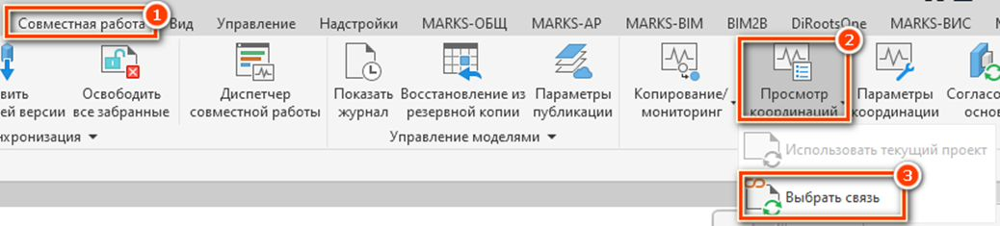{width=1038px height=235px}

1. Выберите экземпляр связи, для которого требуется просмотр координаций.

2. В появившемся окне Просмотра координаций, можно увидеть все изменения и выбрать одно из предложенных действий для применения или отказа от изменений.

**Предложенные действия:**

**«Отложить»** - не принимать изменения сейчас. Выберите это действие, если сейчас не готовы принимать решение по изменению. Это значение откладывает принятие решения по изменению на более позднее время.

**«Отказаться»** - не принимать изменения вообще. Выберите это действие, если считаете, что изменение связи и вашей модели под это изменение некорректно. А вместо вашей модели изменение должно быть внесено в соответствующий отслеживаемый элемент в связанной модели.

**«Принять разницу»** - принимать изменения. Выберите это действие, если считаете, что изменение корректно и вы принимаете изменения вашей модели.

**«Изменить»** - принимать изменения линий сетки или осевых линий стен (перемещение или изменение). Выберите это действие для изменения соответствующего элемента в вашей модели.

**«Перенести»** - принимать перемещение отслеживаемого элемента. Выберите это действие для перемещения соответствующего элемента в вашей модели.

## При проверке на пересечения в Revit возникает ошибка

При попытке сделать проверку на пересечения со связанным файлом возникает ошибка.

<image src="./rasprostranennye-oshibki-v-revit-12.jpeg" crop="0,0,100,100" scale="556px" width="1038px" height="703px" float="center"/>

**Текст ошибки (rus)**

<note type="quote">

Произошла серьезная ошибка. Текущая операция отменена. Перед продолжением настоятельно рекомендуется сохранить результаты работы в новом файле. Сохранить файл восстановления?

</note>

**Текст ошибки (eng)**

<note type="quote">

A serious error has occurred. The current action has been cancelled. It is strongly recommended that you save your work in a new file before continuing. Would you like to save a recovery file?

</note>

**Причины**

-  Связанный файл содержит в себе другой связанный файл с типом связи «Прикрепление».

-  В связанном файле отсутствуют элементы соответствующей категории, с которой осуществляется проверка. Например, «Стены».

**Решение**

**Вариант 1**

Откройте связанный файл, с которым необходимо произвести проверку.

На вкладке «Управление» в «Диспетчере связей» измените тип связи файла на «Наложение».

<image src="./rasprostranennye-oshibki-v-revit-13.jpeg" crop="0,0,100,100" scale="592px" width="800px" height="709px" float="center"/>

**Вариант 2**

Добавьте в связанный файл элементы соответствующей категории, с которой осуществляется проверка. Например, «Стены».

## Невозможно изменить элемент, так как он был удален в модели из хранилища

Не удается передвинуть элемент.

<image src="./rasprostranennye-oshibki-v-revit-14.jpeg" crop="0,0,100,100" scale="593px" width="1038px" height="464px" float="center"/>

**Текст ошибки (rus)**

<note type="quote">

Невозможно изменить элемент, так как он был удален в модели из хранилища.

</note>

**Текст ошибки (eng)**

<note type="quote">

Can't edit the element. It was deleted in the Central Model.

</note>

**Причины**

-  В проекте имеются поврежденные семейства.

**Решение**

**Вариант 1**

В случае, если с файлом работают более 1 проектировщика:

-  Синхронизируйтесь по очереди. Тот, у которого возникает ошибка синхронизируется последним.

-  Если ошибка не пропала см. Вариант 2.

**Вариант 2**

Замените файл хранилище.

В этом случае возможна потеря информации, если с файлом хранилища с момента последней синхронизации работали другие проектировщики. В случае одновременной работы нескольких сотрудников изменения сохранятся только из одного файла (того которым заменили файл хранилище). Изменения из других файлов необходимо будет перенести вручную из локальных копий. Для этого перед заменой всем участникам нужно синхронизироваться и закрыть локальные копии. Если синхронизации не проходят, то изменения из локальных файлов нужно будет перенести вручную.

Откройте файл, «отсоединив его от файла хранилища» \[1\] - и проверив \[2\] - \[3\].

Нажмите на выпадающий список \[4\] - выберите «Задать» \[5\] (какие рабочие наборы необходимо подгрузить), а затем «Открыть»:

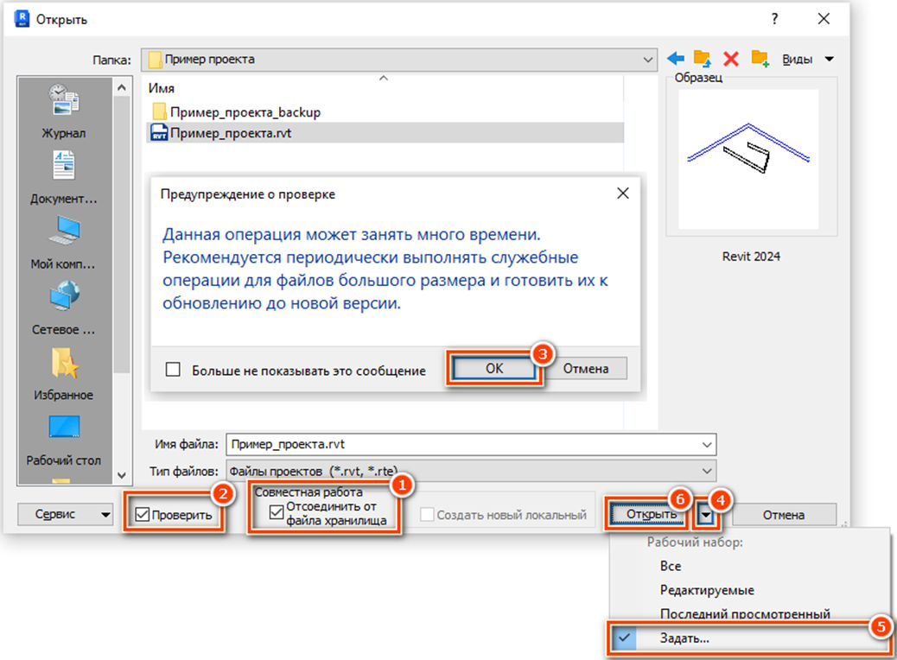{width=1038px height=764px}

Закройте все рабочие наборы, кроме того, в котором находятся общие уровни и сетки.

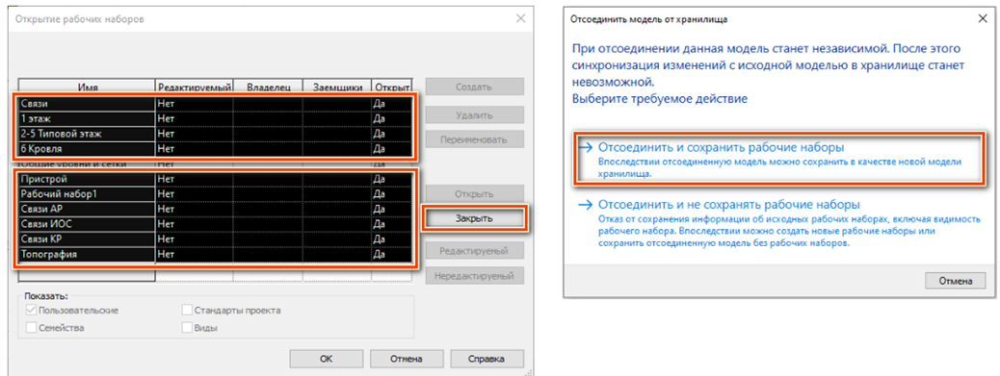{width=1038px height=391px}

Сохраните файл поверх файла хранилища через «Сохранить как» и выберите путь к модели. Может возникнуть предупреждение, в котором выберите «Да». После этого сохраненный вами файл будет считаться файлом хранилища.

<image src="./rasprostranennye-oshibki-v-revit-17.jpeg" crop="0,0,100,100" scale="497px" width="564px" height="322px" float="center"/>

Освободите все забранные рабочие наборы.

<image src="./rasprostranennye-oshibki-v-revit-18.jpeg" crop="0,0,100,100" scale="501px" width="566px" height="186px" float="center"/>

Синхронизируйте модель.

Закройте файл.

Создайте новый локальный файл и продолжите работу.

**Комментарии**

Узнать кто работает над текущим файлом:

1. Перейти на вкладку «Совместная работа».

2. Команда «Показать журнал».

3. Выбрать нужный файл.

## Произошла серьезная ошибка при работе с семействами

При работе с семействами (моделирование, изменение свойств).

<image src="./rasprostranennye-oshibki-v-revit-19.jpeg" crop="0,0,100,100" scale="554px" width="719px" height="314px" float="center"/>

**Текст ошибки (rus)**

<note type="quote">

Произошла серьезная ошибка. Настоятельно рекомендуется сохранить файл под другим именем, прежде чем продолжать".

</note>

**Текст ошибки (eng)**

<note type="quote">

A serious error has occurred. It is strongly recommended that you save your work in a new file before continuing".

</note>

**Причины**

В процессе работы произошел сбой Revit, в результате чего несколько семейств начали некорректно работать.

**Решение**

Необходимо узнать, какие семейства вызывают эту ошибку. Для этого нажмите в окне ошибки «Развернуть», экспортируйте ошибку через «Экспорт», после сохраните документ на рабочий стол.

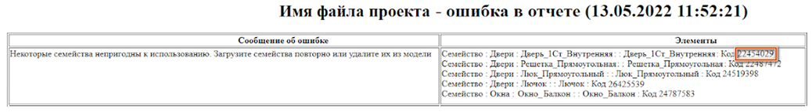{width=1038px height=145px}

В этом документе будут указаны проблемные семейства с их ID (коды, по которым можно найти семейства в проекте через «Управление» - «Выбрать по коду»). Данные семейства в проекте нужно обновить.

{width=845px height=203px}

**Вариант 1**

Обновите семейство в проекте (повторно загрузите семейство в проект).

В появившемся диалоговом окне «Семейство уже существует». Выбрать один из вариантов: «Заменить существующую версию» или «Заменить существующую версию и значения параметров».

**Вариант 2**

В случае, если семейство не обновилось в проекте (не появилось окно «Семейство уже существует»).

Открыть файл семейства через «Файл»-«Открыть»-«Семейство».

Внести в семейство небольшое изменение (немного подвинуть на виде или существующем разрезе/фасаде размерную линию), далее нажать «Загрузить в проект и закрыть», сохранять семейство не нужно.

<image src="./rasprostranennye-oshibki-v-revit-22.jpeg" crop="0,0,100,100" scale="641px" width="1036px" height="755px" float="center"/>

**Вариант 3**

Если предыдущие варианты не решили проблему, то повреждено само семейство и в проекте также возникают такие ошибки: «Некоторые семейства непригодны к использованию. Загрузите семейства повторно или удалите их из модели.» или «Семейство "...." повреждено, его редактирование невозможно. Выполните повторную загрузку семейства для исправления проекта.» при корректировках, замене, удалении и переименовании семейств. В данном случае решите проблему методом по инструкции «Семейство повреждено или непригодно к использованию».

## Не удалось внедрить выбранные связи

При внедрении связи появляется предупреждение.

<image src="./rasprostranennye-oshibki-v-revit-23.jpeg" crop="0,0,100,100" scale="666px" width="1038px" height="464px" float="center"/>

**Текст ошибки (rus)**

<note type="quote">

Не удалось внедрить выбранные связи.

</note>

**Текст ошибки (eng)**

<note type="quote">

Unable to blind the selected links.

</note>

**Причины**

Слишком большой вес и объем внедряемой связи.

Внутри внедряемой связи имеются поврежденные семейства.

Конфликт параметров из основного файла и файла связи по причине разных типов данных одноимённых параметров. Например, в основном файле один параметр имеет тип данных «Длина», а в файле связи тип «Денежная единица».

**Решение**

**Вариант 1 (если связь объемная)**

Не используйте функцию «Внедрить связь» для больших тяжелых связей, а используйте связывание файлов.

**Вариант 2 (если связь небольшая)**

Создайте копию связанного файла себе на ПК, для этого:

Откройте внедряемую связь с отсоединением и проверкой.

Выберите «Отсоединить и не сохранять рабочие наборы», чтобы все элементы были видимы.

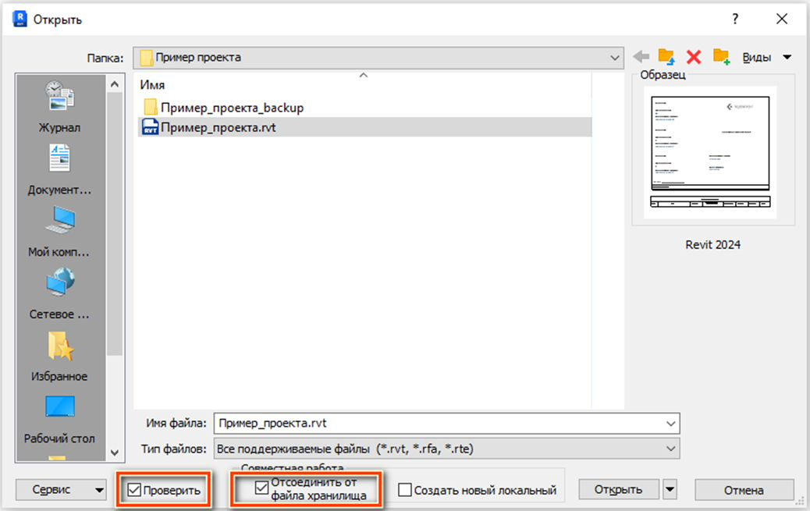{width=1038px height=655px}

Сохраните отсоединенный файл через «Сохранить как» себе на ПК.

Откройте этот файл и методом исключения найдите проблемные семейства: последовательно порциями удаляйте семейства, каждый раз синхронизируясь и внедряя данную связь в ваш проект.

После удаления поврежденных семейств, связь в одну из итераций внедрится, и вы поймете в каких семействах заключалась проблема.

Закройте копию файла. Откройте оригинал связанного файла и удалите там поврежденные семейства.

Внедрите связанный файл.

**Вариант 3 (если в варианте 2 удалены все семейства, а связь не внедряется)**

В данном случае - причиной является конфликт параметров из основного файла и файла связи по причине разных типов данных одноимённых параметров. Решите проблему с параметрами по инструкции: «Удаление параметров из проекта».

## Произошла ошибка при прорисовке этого окна (предупреждение при переходе на вид)

При переходе на вид/план/разрез/лист или редактировании групп/семейств, появляется предупреждение.

<image src="./rasprostranennye-oshibki-v-revit-25.jpeg" crop="0,0,100,100" scale="565px" width="729px" height="325px" float="center"/>

**Текст ошибки (rus)**

<note type="quote">

Произошла ошибка при прорисовке содержимого этого окна. Окно будет закрыто.

</note>

**Текст ошибки (eng)**

<note type="quote">

An error has occurred while drawing the contents of this window. This window shall be closed.

</note>

**Решение**

**Вариант 1**

Для предотвращения этой ошибки отключите аппаратное ускорение. Выполните следующие:

Перейдите в «Файл» \[1\] - «Параметры» \[2\] - вкладка «Интерфейс» \[3\].

Уберите отметку в чек-боксе «Использовать аппаратное ускорение» \[4\].

«Параметры» \[2\] - вкладка «Оборудование» \[5\] (в версиях Revit от 2024 года пункты 9.1.1.2-9.1.1.3 выполнять не требуется).

Уберите отметку в чек-боксе «Использовать аппаратное ускорение» \[6\].

Нажмите кнопку «ОК», чтобы закрыть диалоговое окно.

Перезапустите Revit.

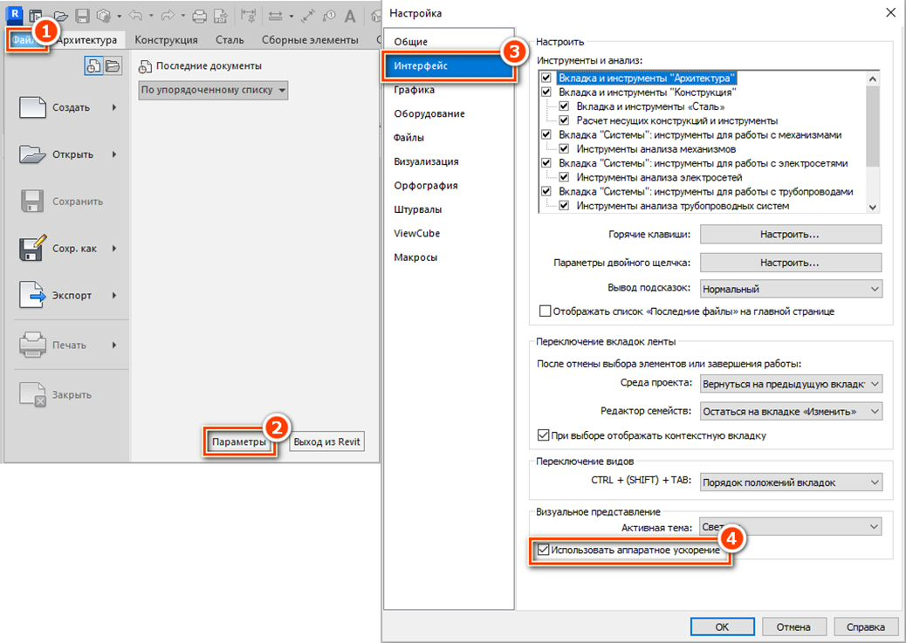{width=1038px height=737px}

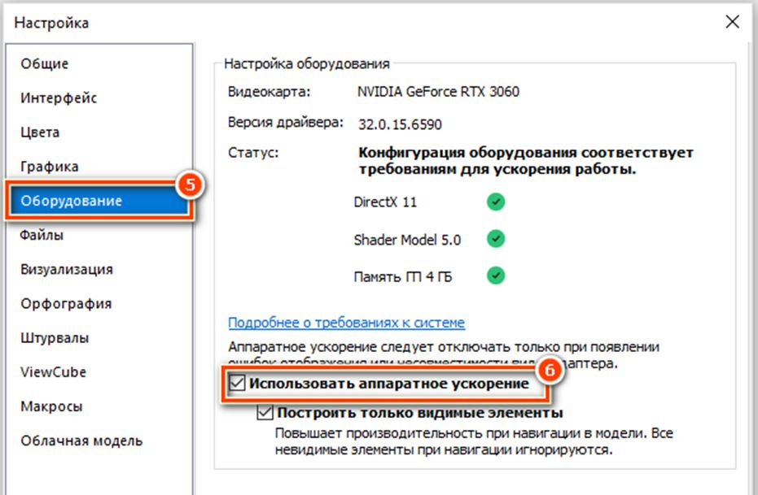{width=931px height=609px}

**Вариант 2**

Если не помогло отключение аппаратного ускорения необходимо проверить, проблема в файле или проблема в связанных файлах. Выгрузите из файла все связанные файлы (сначала нажмите «Для меня», если не поможет, то «Для всех пользователей»).

<image src="./rasprostranennye-oshibki-v-revit-28.jpeg" crop="0,0,100,100" scale="661px" width="877px" height="739px" float="center"/>

1. Синхронизируйте модель.

2. Закройте файл.

3. Откройте файл со всеми включенными рабочими наборами (кроме наборов, содержащих связанные файлы). Если ошибка сохранится, то проблема в файле.

4. Закройте файл и заново откройте его с проверкой.

**Вариант 3**

1. Замените файл хранилище. В этом случае возможна потеря информации, если с файлом хранилища с момента последней синхронизации работали другие проектировщики. В случае одновременной работы нескольких сотрудников изменения сохранятся только из одного файла (того которым заменили файл хранилище). Изменения из других файлов необходимо будет перенести вручную из локальных копий. Для этого перед заменой всем участникам нужно синхронизироваться и закрыть локальные копии. Если синхронизации не проходят, то изменения из локальных файлов нужно будет перенести вручную.

2. Откройте файл, с отсоединением от файла хранилища и проверкой.

3. При открытии выберите «Задать» (какие рабочие наборы необходимо подгрузить).

4. Закройте все рабочие наборы, кроме того, в котором находятся общие уровни и сетки.

5. Удалите файл из папки, где он располагается.

6. Сохраните открытый файл в ту же папку (где ранее располагался файл)

7. Освободите все забранные рабочие наборы.

8. Синхронизируйте модель.

9. Закройте файл.

10. Создайте новый локальный файл и продолжайте работу.

**Вариант 4**

1. Если проблема в связанном файле, то найдите этот проблемный файл, обновляя каждый по очереди:

2. Откройте проблемный файл с проверкой.

3. Если открытие файла с проверкой не помогло, то пересоздайте файла хранилище (см. «Вариант 3»).

**Вариант 5**

Если проблема не в файле, а в элементе модели.

В случае, когда описанные выше способы не дают решения проблемы, нужно определить элемент, из-за которого вид/лист не открывается. Для определения этого элемента откройте и прочитайте лог-файлы, находящиеся в папке %localappdata%\\Autodesk\\Revit\\Autodesk Revit \<version>\\Journals. Информация о предупреждении или ошибке будет иметь префикс DBG_INFO или DBG_WARN, после чего указывается элемент или процесс, приводящий к сбою в работе Revit. В лог-файле должен быть текст с приблизительно таким содержанием (номер элемента выделен цветом):

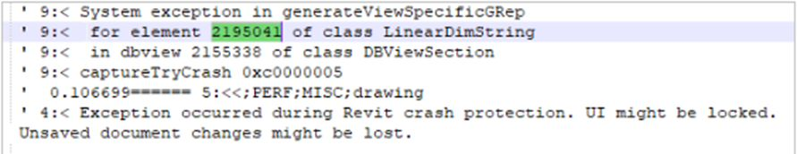{width=891px height=172px}

Выделите элемент с помощью инструмента «Выбрать по коду». Введите номер элемента, нажмите «ОК» и удалите элемент.

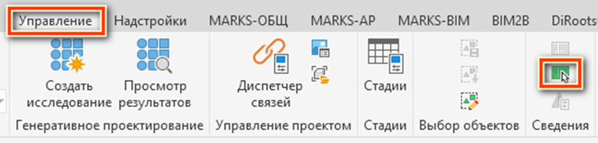{width=845px height=203px}

## Не найден связанный документ …..rvt. Связь не будет загружена

При добавлении/обновлении связи возникает ошибка.

<image src="./rasprostranennye-oshibki-v-revit-31.jpeg" crop="0,0,100,100" scale="580px" width="1038px" height="460px" float="center"/>

**Текст ошибки (rus)**

<note type="quote">

Не найден связанный документ...rvt. Связь не будет загружена.

</note>

**Текст ошибки (eng)**

<note type="quote">

Cannot open linked document....rvt. The link will be unloaded.

</note>

**Причины**

Связанный файл поврежден.

Не доступен сервер или папка, в которой расположен связанный файл.

Связанный файл отсутствует в папке проекта.

**Решение**

Откройте диспетчер связей, проверьте статус связанного файла.

Обновите связь, выбрав “Обновить из”, при отсутствии изменений.

Если **не** поможет:

Удалите связь из диспетчера.

Загрузите связь повторно.

## Не получается загрузить связь (Связь не может быть обновлена…)

При обновлении связей появляется сообщение.

<image src="./rasprostranennye-oshibki-v-revit-32.jpeg" crop="0,0,100,100" scale="524px" width="713px" height="316px" float="center"/>

**Текст ошибки (rus)**

<note type="quote">

Связь не может быть обновлена, поскольку она загружена в другом открытом документе.

</note>

**Текст ошибки (eng)**

<note type="quote">

The link cannot be updated because it is loaded in another open document.

</note>

**Причины**

В текущем окне Revit открыт ещё один файл, в котором уже загружена связь, которую нужно обновить.

**Решение**

**Вариант 1**

Переназначьте основу для семейств:

Закройте второй файл.

Откройте диспетчер связей и обновите связь \[1\]-\[2\].

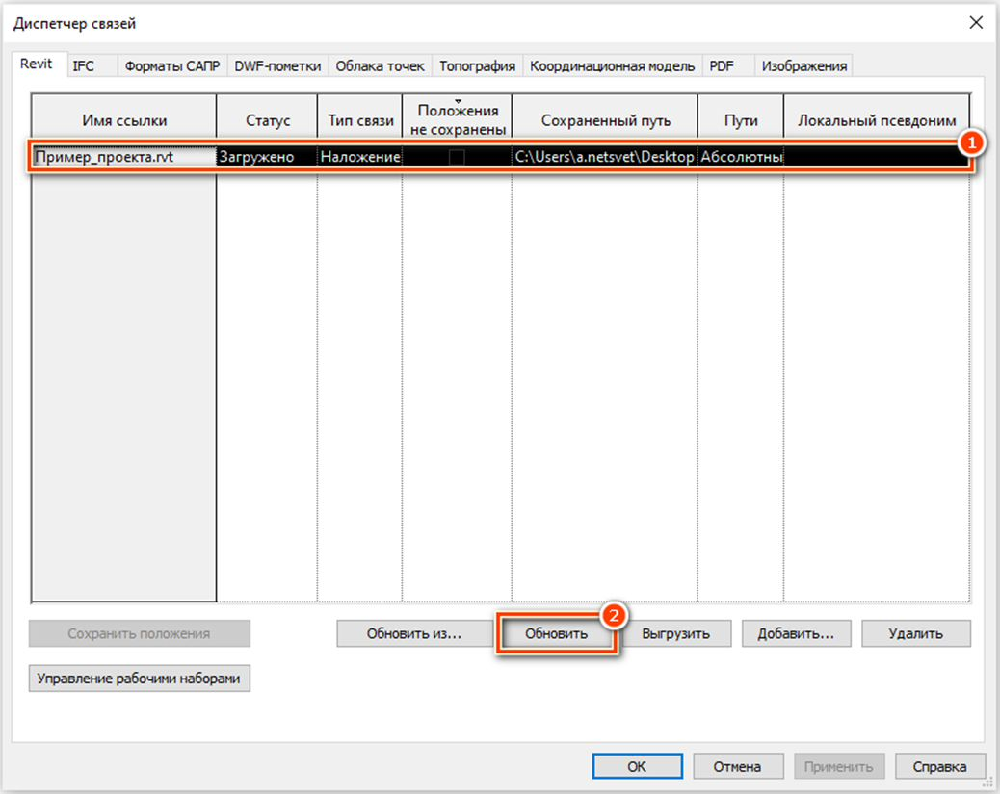{width=1038px height=825px}

**Вариант 2**

Если не предполагается копирование элементов между открытыми файлами.

Перейдите к активному виду во втором файле (Ctrl+Tab - последовательное переключение видов, Ctrl+Shift+Tab - переключение видов в обратном порядке).

Откройте диспетчер связей и выгрузите связанный файл «Для меня».

Перейдите к активному виду первого файла, откройте диспетчер связей и обновите связь.

<image src="./rasprostranennye-oshibki-v-revit-34.jpeg" crop="0,0,100,100" scale="644px" width="720px" height="234px" float="center"/>

## Начало экземпляра не лежит на грани основы

При попытке сгруппировать семейства появляется предупреждение.

<image src="./rasprostranennye-oshibki-v-revit-35.jpeg" crop="0,0,100,100" scale="637px" width="1038px" height="464px" float="center"/>

**Текст ошибки (rus)**

<note type="quote">

Начало экземпляра не лежит на грани основы. Будет разорвана связь экземпляра с основой.

</note>

**Текст ошибки (eng)**

<note type="quote">

Instance origin does not lie on host face. Instance will lose association to host.

</note>

**Причины**

При обновлении связи в Revit семейства на основе граней, такие как электрические компоненты, освещение и устройства безопасности и прочие, если были размещены по элементам связи, теряют свою основу, и смещаются.

**Решение**

Переназначьте основу для семейств:

Выберите семейство.

Выберите на ленте команду «Редактировать рабочую плоскость».

Переназначьте основу для семейства на уровни или иной системный элемент из вашего проекта.

<image src="./rasprostranennye-oshibki-v-revit-36.jpeg" crop="0,0,100,100" scale="574px" width="728px" height="493px" float="center"/>

Обновите связь.

## Удаление параметра из проекта

При копировании видов из другого проекта, при загрузке семейства возникает ошибка.

<image src="./rasprostranennye-oshibki-v-revit-37.jpeg" crop="0,0,100,100" scale="597px" width="1038px" height="464px" float="center"/>

**Причины**

Возникает конфликт разных типов данных у одного общего параметра.

Копирование семейств из старых проектов в новые.

Последствия изменения параметра в ФОП (Файле общих параметров).

**Решение**

Удалите проблемные параметры из проекта или связанного файла (в зависимости от того, где используются неактуальные параметры) и заново добавьте корректные параметры в проект или связанный файл.

**Вариант 1**

Удалите параметры стандартным способом через «Параметры проекта» со вкладки «Управление».

Перейдите на вкладку «Управление», выберите «Параметры проекта».

Найдите нужный параметр, выберите его и нажмите «Удалить».

**Вариант 2**

Если нужные параметры не отображаются в окне «Параметры проекта» или после удаления первым способом ошибка все равно появляется, то удалите параметры с помощью инструмента «Revit Lookup».

Установите надстройку «Revit Lookup», если она у вас отсутствует. https://github.com/jeremytammik/RevitLookup

Перейдите на вкладку «Надстройки» \[1\], в выпадающем списке «Revit Lookup» \[2\] выберите функцию «Snoop Database...» \[3\].

Найдите строчку «SharedParameterElement» \[4\] и раскройте выпадающий список.

Найдите наименование параметра \[5\], который вызывает ошибку и скопируйте его «ID» \[6\].

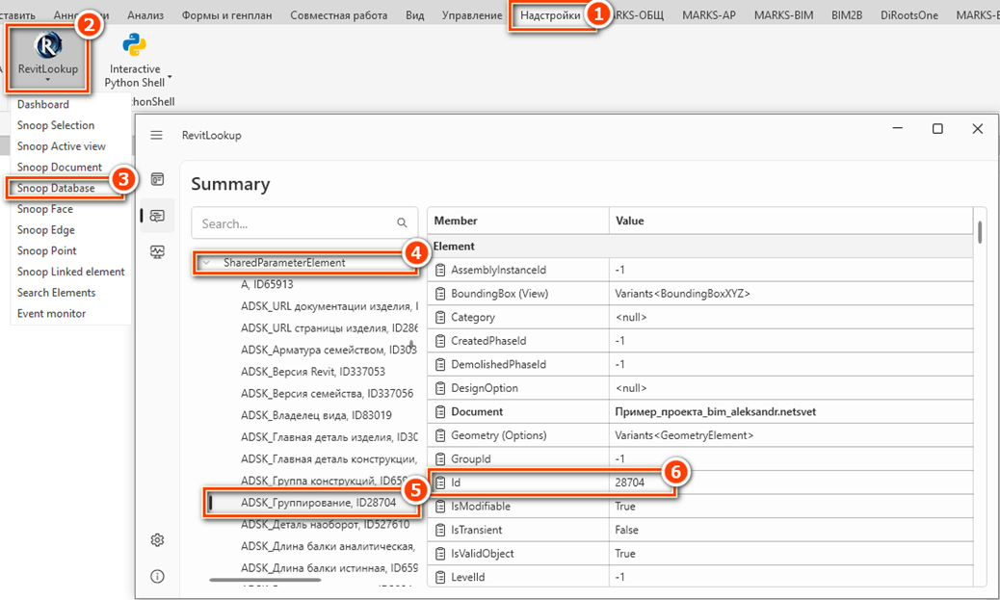{width=1038px height=623px}

Выберите данный параметр в проекте с помощью инструмента «Выбрать по коду» \[2\] со вкладки «Управление» \[1\]. Вставьте скопированный ранее ID в предложенное там окно, нажмите «ОК».

Убедитесь, что параметр выбран, удалите параметр.

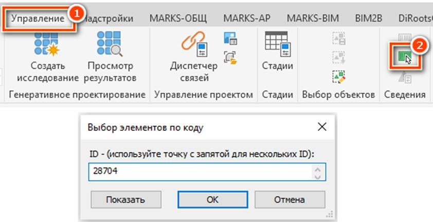{width=842px height=433px}

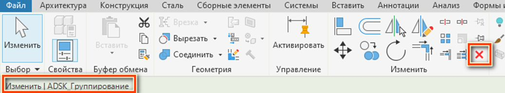{width=1038px height=192px}

Добавьте корректные параметры в проект заново через «Параметры проекта» со вкладки «Управление».

Для этого:

Перейдите на вкладку «Управление», выберите «Параметры проекта».

Добавьте необходимый «Общий параметр», проставив необходимые «Категории» для данного параметра.

## Ошибка экспорта из Revit в DWG

При экспорте в.dwg из Revit возникает ошибка.

<image src="./rasprostranennye-oshibki-v-revit-41.jpeg" crop="0,0,100,100" scale="540px" width="1038px" height="813px" float="center"/>

**Текст ошибки (rus)**

<note type="quote">

Не удалось создать....dwg, или файл уже используется. Закройте файл и нажмите "ОК".

</note>

**Текст ошибки (eng)**

<note type="quote">

Can't create....dwg, or the file is already in use. Please close file and press "OK".

</note>

**Причины**

Длинное название создаваемого DWG файла или его путь.

Отсутствие доступа к папкам на диске, куда производится сохранение файла.

**Решение**

**Вариант 1**

Сократите название файла.

При экспорте выберите «Автоматически - Короткое».

Если не поможет, экспортируйте на рабочий стол.

Перенесите в нужную папку.

<image src="./rasprostranennye-oshibki-v-revit-42.jpeg" crop="0,0,100,100" scale="701px" width="1038px" height="668px" float="center"/>

**Вариант 2**

Сохраните файл на другом диске. Для этого на этапе выбора пути сохранения файла нужно указать путь на нужный диск.

## Невозможно создать зависимости для связанных экземпляров

Появляется предупреждение о необходимости удаления элементов модели.

<image src="./rasprostranennye-oshibki-v-revit-43.jpeg" crop="0,0,100,100" scale="649px" width="1038px" height="863px" float="center"/>

**Текст ошибки (rus)**

<note type="quote">

Невозможно создать зависимости для связанных экземпляров с помощью общих площадок.

</note>

**Текст ошибки (eng)**

<note type="quote">

It is not possible to create dependencies for related instances using shared sites.

</note>

**Причины**

Сообщение появляется при попытке зафиксировать размерные линии, построенные между элементом открытой модели и элементом связанного файла, в который записаны общие координаты.

**Решение**

Сообщение можно проигнорировать, нажатием на кнопку «Ок», если требуется убрать это предупреждение, то есть два варианта решения:

Выбрать в диалоговом окне «Удалить зависимости», при этом удалятся элементы модели «зависимость», сами размерные линии останутся на месте.

Убрать общие координаты из связанного файла.

## Программа "Autodesk Revit" не работает

Появляется предупреждение о аварийном прекращении работы Autodesk Revit.

<image src="./rasprostranennye-oshibki-v-revit-44.jpeg" crop="0,0,100,100" scale="476px" width="1038px" height="703px" float="center"/>

**Текст ошибки (rus)**

<note type="quote">

Программа "Autodesk Revit" не работает. Возникшая проблема привела к прекращению работы программы. Windows закроет эту программу, а если есть известный способ устранения проблемы, уведомит вас об этом.

</note>

**Текст ошибки (eng)**

<note type="quote">

Autodesk Revit has stopped working. A problem caused the program to stop working correctly. Windows will close the program and notify you if a solution is available.

</note>

**Причины**

Наличие поврежденных элементов модели.

Накопившиеся ошибки модели.

Некорректно работающие плагины, надстройки.

**Решение**

**Вариант 1 (если файл не открывается)**

Откройте файл с проверкой.

<image src="./rasprostranennye-oshibki-v-revit-45.jpeg" crop="0,0,100,100" scale="682px" width="1038px" height="764px" float="center"/>

**Вариант 2 (если файл не открывается с проверкой)**

Закройте все рабочие наборы, кроме того, в котором находятся общие уровни и сетки.

{width=1038px height=612px}

После открытия файла вам необходимо через диспетчер связей выгрузить все связанные файлы, затем открыть все рабочие наборы, после чего поочередно обновить выгруженные связи.

Удалите связь, при обновлении которой возникают проблемы (ошибки).

Отдельно откройте с проверкой и закрытыми рабочими наборами файл удаленной связи и нажмите на синхронизацию, после чего закройте файл связи.

В рабочий файл заново добавьте эту связь.

Нажмите «Синхронизировать».

**Вариант 3 (если Revit закрывается при закрытии файла)**

-  Аварийное завершение Revit при закрытии файла может говорить о конфликте настроек или некорректной установке программы в целом.

-  Попробуйте:

Отключить плагины, которые пакетом устанавливаются при установке Revit: Перенесите из папки:

C:\\ProgramData\\Autodesk\\Revit\\Addins\<version>

Все файлы с расширением «.addin».

Когда проблема пропадет, переносите файлы обратно по одному и проверяйте, возникнет ли предупреждение. Как только предупреждение вновь появится, обновите файл с расширением «.addin», после переноса которого в Revit возникло предупреждение.

## Произошла непоправимая ошибка при открытии

Файл не открывается, появляется предупреждение и Revit аварийно закрывается.

<image src="./rasprostranennye-oshibki-v-revit-47.jpeg" crop="0,0,100,100" scale="554px" width="1038px" height="460px" float="center"/>

**Текст ошибки (rus)**

<note type="quote">

Произошла непоправимая ошибка. Программа будет закрыта. Все ваши данные недавно были сохранены, поэтому файлы для восстановления создавать не требуется.

</note>

**Текст ошибки (eng)**

<note type="quote">

An unrecoverable error has occurred. The program will now be terminated. All of your data has been recently saved, so there is no need to create recovery files.

</note>

<image src="./rasprostranennye-oshibki-v-revit-48.jpeg" crop="0,0,100,100" scale="551px" width="1038px" height="460px" float="center"/>

**Текст ошибки (rus)**

<note type="quote">

Произошла серьезная ошибка. Текущая операция прервана".

</note>

**Текст ошибки (eng)**

<note type="quote">

A serious error has occurred. The current action has been cancelled".

</note>

<image src="./rasprostranennye-oshibki-v-revit-49.jpeg" crop="0,0,100,100" scale="445px" width="1038px" height="1392px" float="center"/>

**Текст ошибки (rus)**

<note type="quote">

Ошибка программы привела к непредвиденному закрытию Revit...".

</note>

**Текст ошибки (eng)**

<note type="quote">

A software problem has caused Revit... to close unexpectedly".

</note>

**Причины**

Наличие поврежденных элементов модели.

Накопившиеся ошибки модели.

**Решение**

**Вариант 1**

Поставьте галку напротив «Проверить» \[1\]. В появившемся окне «Да» \[2\].

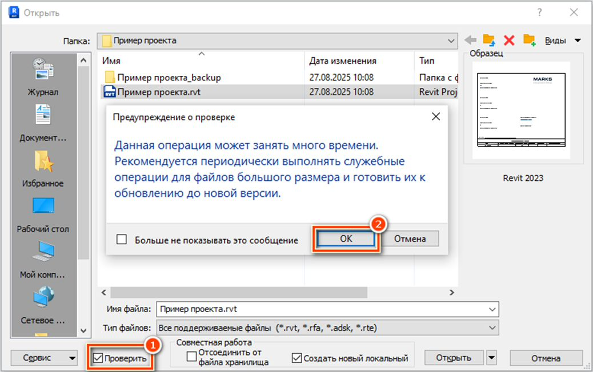{width=1038px height=652px}

**Вариант 2**

Если файл не открывается с проверкой, то откройте его с проверкой и закрытием рабочих наборов.

При открытии файла поставьте галку напротив «Проверить» \[1\]. Нажмите «Открыть» \[2\] и выберите «Задать» \[3\].

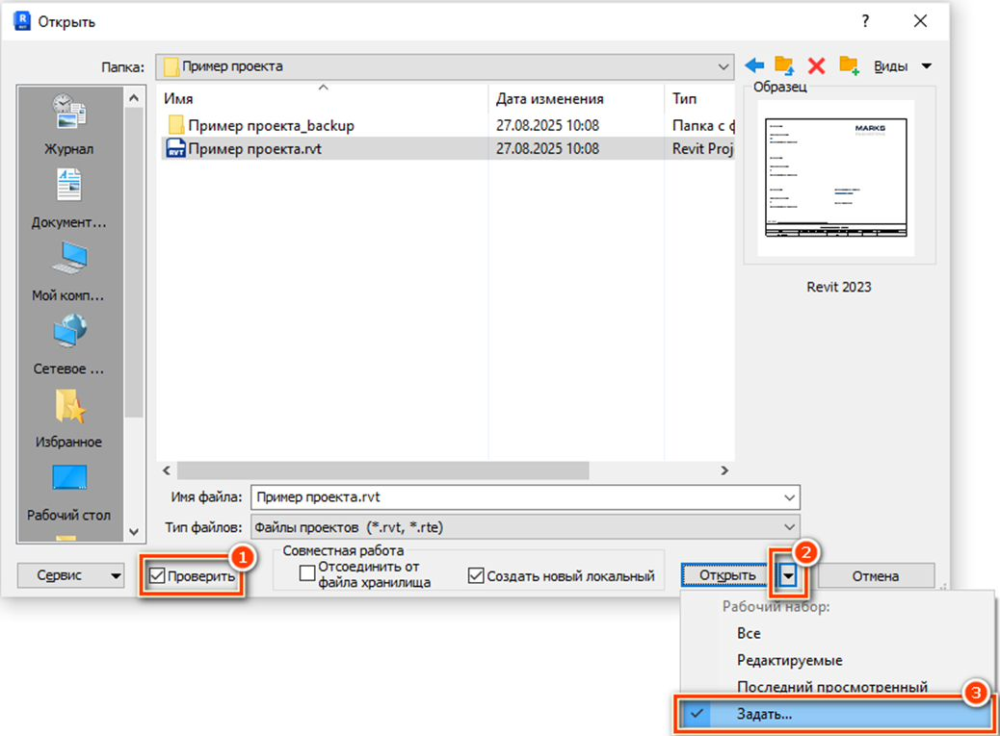{width=1038px height=765px}

Выделите \[1\] и Закройте \[2\] все рабочие наборы, кроме тех, в которых находятся общие уровни и сетки.

{width=1038px height=611px}

После открытия файла поочередно обновите выгруженные связи.

Удалите связь, при обновлении которой возникают проблемы (ошибки).

Отдельно откройте с проверкой и закрытыми рабочими наборами файл удаленной связи и синхронизируйтесь, после чего закройте файл связи.

В рабочий файл заново добавьте эту связь.

Синхронизируйтесь.

## Модель из хранилища отсутствует по указанному пути. Модель хранилища удалена или перенесена

При открытии файла возникает ошибка.

<image src="./rasprostranennye-oshibki-v-revit-53.jpeg" crop="0,0,100,100" scale="543px" width="1038px" height="707px" float="center"/>

**Текст ошибки (rus)**

<note type="quote">

Приложение Revit не может выполнить данную операцию, так как выполняется попытка доступа к файлам или папкам, которые не существуют или были перенесены.

</note>

**Текст ошибки (eng)**

<note type="quote">

Revit cannot perform this operation because it is trying to access files or folders that do not exist or have been migrated.

</note>

<image src="./rasprostranennye-oshibki-v-revit-54.jpeg" crop="0,0,100,100" scale="559px" width="1038px" height="461px" float="center"/>

**Текст ошибки (rus)**

<note type="quote">

Модель из хранилища отсутствует по указанному пути. Модель хранилища удалена или перенесена.

</note>

**Текст ошибки (eng)**

<note type="quote">

The model from the repository is missing at the specified path. The storage model has been removed or migrated.

</note>

**Причины**

Файл хранилище перенесен в другую папку (располагается на другом сервере).

Файл хранилище удален с сервера.

Если предыдущие варианты - не являются причиной ошибки, то настоящая причина неизвестна. Возможно, вы пользуетесь навигацией с помощью клавиатуры, а команды принимаются только от мыши, поэтому клавиша Enter не открывает директорию.

**Решение**

**Вариант 1**

Проверьте наличие файла хранилища на других серверах.

Выясните актуальный путь к файлу хранилища.

При необходимости (после согласования и готовности всех участников проекта) перенесите файл хранилище на нужный сервер.

**Вариант 2**

Воспользуйтесь двойным кликом левой клавиши мыши, а не Enter.

## Приложению Revit не удалось создать локальную копию на основе файла хранилища

Файл Revit не открывается, появляется предупреждение.

<image src="./rasprostranennye-oshibki-v-revit-55.jpeg" crop="0,0,100,100" scale="511px" width="1038px" height="704px" float="center"/>

**Текст ошибки (rus)**

<note type="quote">

Приложению Revit не удается создать локальный файл на основе файла хранилища...

</note>

**Текст ошибки (eng)**

<note type="quote">

Revit cannot create a local copy based on central file '.....'.

</note>

<image src="./rasprostranennye-oshibki-v-revit-56.jpeg" crop="0,0,100,100" scale="498px" width="1038px" height="704px" float="center"/>

**Текст ошибки (rus)**

<note type="quote">

Приложению Revit не удалось создать локальный файл на основе файла хранилища...

</note>

**Текст ошибки (eng)**

<note type="quote">

Revit could not create a local file from...

</note>

**Причины**

Проблема может быть вызвана нестабильной работой сервера, на котором располагается файл-хранилище. Повторите процедуру через некоторое время.

Запущен фоновый процесс Revit.exe.

Повреждение файла хранилища вследствие сбоя в работе серверного оборудования.

**Решение**

**Вариант 1**

Закройте все сеансы Revit.

Откройте Диспетчер задач, проверьте, чтобы все процессы Revit были завершены.

Нажмите «Подробнее», перейдите на вкладку «Подробности».

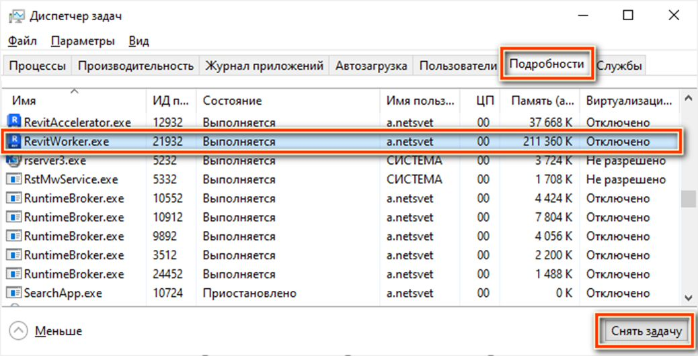{width=1038px height=530px}

Найдите в раскрывшимся списке процесс «Revitworker.exe», выберите его и снимите задачу.

Откройте файл.

**Вариант 2**

Замените файл хранилище.

В этом случае возможна потеря информации, если с файлом хранилища с момента последней синхронизации работали другие проектировщики. В случае одновременной работы нескольких сотрудников изменения сохранятся только из одного файла (того которым заменили файл хранилище). Изменения из других файлов необходимо будет перенести вручную из локальных копий.

Для этого перед заменой всем участникам нужно синхронизироваться и закрыть локальные копии. Если синхронизации не проходят, то изменения из локальных файлов нужно будет перенести вручную.

**Важно!** Для того, чтобы узнать кто работает над текущим файлом:

Перейдите на вкладку «Совместная работа».

Нажмите кнопку «Показать журнал».

Выберите нужный файл.

Откройте этот файл, с отсоединением от файла хранилища и проверкой.

Закройте все рабочие наборы.

Сохраните файл поверх файла хранилища через «Сохранить как» и выберите путь к модели. После этого сохраненный вами файл будет считаться файлом хранилища.

Освободите все забранные рабочие наборы.

Синхронизируйте модель.

Закройте файл.

Создайте новый локальный файл и продолжайте работу.

{width=1038px height=654px}

## Не удалось построить ленту. Ошибка при запуске Revit

При запуске Revit появляется ошибка.

<image src="./rasprostranennye-oshibki-v-revit-59.jpeg" crop="0,0,100,100" scale="518px" width="741px" height="611px" float="center"/>

**Текст ошибки (rus)**

<note type="quote">

... Не удалось построить ленту -> --- Конец трассировки внутреннего стека исключений.

</note>

**Текст ошибки (eng)**

<note type="quote">

... Failed to build tape -> --- End of exception internal stack trace.

</note>

**Причины**

Использовано максимально допустимое количество вкладок в Revit.

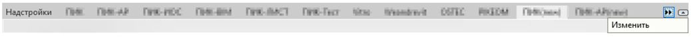{width=1038px height=57px}

**Решение**

-  Удалите лишние сторонние плагины Revit, которые формируют вкладки на ленте:

Через «Панель управления» - «Удаление программ»

Через удаление файлов плагинов из папки %programdata%\\Autodesk\\Revit\\Addins\<version>

Через удаление файлов плагинов из папки %appdata%\\Autodesk\\Revit\\Addins\<version>

-  Дополнительно проверьте:

C:\\ProgramData\\Autodesk\\ApplicationPlugins - эту папку можно использовать для надстроек, которые предназначены для нескольких программ или версий.

C:\\Program Files\\Autodesk\\Revit \<version>\\AddIns - эта папка используется для внутренних надстроек, но некоторые более ранние версии надстроек могут быть загружены в нее.

## Этот документ содержит макросы

При запуске Revit появляется ошибка.

<image src="./rasprostranennye-oshibki-v-revit-61.jpeg" crop="0,0,100,100" scale="487px" width="965px" height="805px" float="center"/>

**Текст ошибки (rus)**

<note type="quote">

Этот документ содержит макросы. Выберите одну из следующих возможностей.

</note>

**Текст ошибки (eng)**

<note type="quote">

This document contains macros. Select one of the following options.

</note>

**Причины**

В файле присутствуют макросы.

Макросы -- это некий программный код, который внедряется в проект, с помощью которого можно автоматизировать разные процессы в Revit.

В окне предупреждения можно выбрать:

«Отключить макросы данного документа» - макросы в данном документе запускаться не будут.

«Включить макросы данного документа» - макросы в данном документе можно будет запустить.

**Решение**

Выберите «Отключить макросы для данного документа», если вы не знаете разработчика этих макросов.

Выберите «Включить макросы данного документа», если вы знаете разработчика этих макросов, и он вам нужен для использования.

## Один или несколько требуемых внутренних параметров отсутствуют в модели

При запуске Revit появляется ошибка.

<image src="./rasprostranennye-oshibki-v-revit-62.jpeg" crop="0,0,100,100" scale="505px" width="1038px" height="737px" float="center"/>

**Текст ошибки (rus)**

<note type="quote">

Один или несколько требуемых внутренних параметров отсутствуют в модели. Какое действие необходимо выполнить?

</note>

**Текст ошибки (eng)**

<note type="quote">

One or more required internal settings are missing from the model. What do you want to do?

</note>

**Причины**

Отсутствуют необходимые внутренние параметры.

**Решение**

**Вариант 1**

Выберите «Исправить, синхронизировать и открыть". Появится окно результата операции. Если операция прошла успешно, Revit добавит необходимые внутренние параметры.

Синхронизируйте модель и продолжите работу.

**Вариант 2**

Если после проделанной операции появляется предупреждение, замените файл хранилище.

**Важно!** Для того, чтобы узнать кто работает над текущим файлом:

-  Перейдите на вкладку Совместная работа.

-  Нажмите кнопку Показать журнал.

-  Выберите нужный файл.

<image src="./rasprostranennye-oshibki-v-revit-63.jpeg" crop="0,0,100,100" scale="544px" width="993px" height="666px" float="center"/>

<note>

Перед заменой файла хранилища всем участникам нужно синхронизироваться и закрыть локальные копии. Если синхронизации не проходят, то изменения из локальных файлов нужно будет перенести вручную.

</note>

Откройте файл с отсоединением от файла хранилища и проверкой.

Сохраните файл поверх файла хранилища через «Сохранить как» и выберите путь к модели. После этого сохраненный вами файл будет считаться файлом хранилища.

Освободите все забранные рабочие наборы.

Синхронизируйтесь.

Закройте файл.

Создайте новый локальный файл и продолжайте работу.

## В модели отсутствует большое количество элементов

При открытии файла появляется ошибка.

<image src="./rasprostranennye-oshibki-v-revit-64.jpeg" crop="0,0,100,100" scale="585px" width="1020px" height="682px" float="center"/>

**Текст ошибки (rus)**

<note type="quote">

В модели....rvt отсутствует большое количество элементов, поэтому она не может быть открыта.

</note>

**Текст ошибки (eng)**

<note type="quote">

The file....rvt cannot be opened. There are too many elements missing in it. Please contact Autodesk Support.

</note>

**Причины**

Это сообщение показывает, что количество отсутствующих элементов больше, чем может игнорировать Revit. Если отсутствуют всего несколько элементов, Revit игнорирует их и пытается продолжить открытие модели.

**Решение**

**Вариант 1**

Поставьте галку напротив «Проверить» \[1\]. В появившемся окне «Да» \[2\].

{width=1038px height=653px}

**Вариант 2**

Если у кого-то из ваших коллег сейчас открыт локальный файл данного файла хранилища, или у вас на ПК имеется более ранний локальный файл, то создайте из необходимой версии новый файл хранилище (Узнать, кто работает в файле см. Комментарии).

Открытую модель сохраните через «Сохранить как» в любое другое место на ПК (например, на рабочем столе).

Закройте файл.

Откройте этот файл с ПК, с отсоединением от файла хранилища и проверкой.

Сохраните файл под другим именем на сервер. После этого сохраненный вами файл будет считаться файлом хранилищем.

Освободите все забранные рабочие наборы.

Синхронизируйте модель.

Закройте файл.

Создайте новый локальный файл (откройте с проверкой). Если предупреждение не появляется, продолжайте работу.

Предыдущий (поврежденный) файл хранилище удалите с сервера. При необходимости, переименуйте актуальный файл хранилище.

**Вариант 3**

Если рабочие локальные файлы (в которых не возникает ошибки) отсутствуют, то замените файл хранилище его резервной копией:

Восстановите резервную копию локального файла по инструкции: Восстановление файлов (раздел Восстановление файла хранилища из резервной копии локального файла). В окне версий резервных копий проекта выберите предпоследнюю версию файла.

Если в новом файле появляется ошибка об отсутствии большого количества элементов, восстановите более раннюю версию файла.

**Вариант 4**

Поиск отсутствующих элементов и их последующее восстановление:

Найдите отсутствующие элементы проекта с помощью файла-журнала:

Найдите последний (по дате/времени) файл журнала для модели и откройте его с помощью любого текстового редактора. Журналы находятся в папке: %LOCALAPPDATA%\\Autodesk\\Revit\\Autodesk Revit \<version>\\Journals

В файле журнала с помощью поиска (Ctrl+F) найдите текст "missing elem", который указывает на отсутствующие элементы. Найдите 8-значные коды элементов и скопируйте их в пустой текстовый документ.

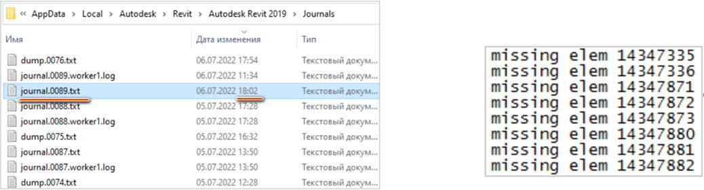{width=1038px height=281px}

Если модель открывается несмотря на ошибку, выполните следующие действия:

Найдите последний файл резервной копии, содержащий отсутствующие элементы.

Восстановите резервную копию локального файла по инструкции: Восстановление файлов (раздел Восстановление файла хранилища из резервной копии локального файла).

Откройте 3D-вид модели. Используйте инструмент «Выбрать по коду» на вкладке «Управление», в него вставьте коды отсутствующих элементов через точку с запятой.

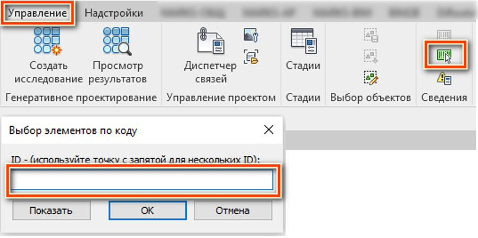{width=806px height=402px}

Откройте тот же 3D-вид в поврежденной модели.

Из резервной копии в основную модель вставьте элементы с помощью команд «Копировать в буфер» и «Вставить» «С выравниванием по тому же месту».

Сохраните и закройте поврежденную модель.

Откройте поврежденную модель с проверкой и убедитесь, что элементы на месте и корректно отображаются.

Если поврежденная модель не открывается из-за наличия ошибки, восстановите файла хранилище из резервной копии:

Найдите последний файл резервной копии, содержащий отсутствующие элементы. Восстановите резервную копию локального файла по инструкции: Восстановление файлов (раздел Восстановление файла хранилища из резервной копии локального файла).

Откройте резервную копию с проверкой.

Сохраните файл через "Сохранить как…" в другую папку.

Откройте восстановленный файл с проверкой в новом окне Revit, при отсутствии проблем замените поврежденный файл на сервере. Если в новом файле появляется ошибка об отсутствии большого количества элементов, восстановите более раннюю версию файла.

**Важно!** Для того, чтобы узнать кто работает над текущим файлом:

Перейдите на вкладку «Совместная работа».

Нажмите кнопку «Показать журнал».

Выберите нужный файл.

## Невозможно проверить разработчика этой надстройки

При открытии модели Revit для некоторых плагинов появляется предупреждение (Данное предупреждения появляется не для всех надстроек и плагинов).

<image src="./rasprostranennye-oshibki-v-revit-68.jpeg" crop="0,0,100,100" scale="535px" width="1038px" height="551px" float="center"/>

**Текст ошибки (rus)**

<note type="quote">

Невозможно проверить разработчика этой надстройки. Какое действие необходимо выполнить?

</note>

**Текст ошибки (eng)**

<note type="quote">

The publisher of this add-in could not be verified. What do you want to do?

</note>

**Причины**

При разработке модели были использованы элементы из приложения, указанного в предупреждении. Данное предупреждение говорит о загрузке файлов надстройки/плагина.

**Решение**

Если вы уверены в данной надстройке/плагине, то выбирайте «Всегда загружать», надстройка загрузится для использования в Revit. Если вы не уверены в данной надстройке/плагине, выберите «Не загружать» и удалите файл надстройки/плагина из папки, в которую было установлено приложение.

Наиболее распространенные папки для загрузки надстроек/плагинов:

%Appdata%\\Autodesk\\Revit\\Addins\[версия\]

C:\\ProgramData\\Autodesk\\Revit\\Addins\[версия\]

Дополнительно проверьте:

C:\\ProgramData\\Autodesk\\ApplicationPlugins - эту папку можно использовать для надстроек, которые предназначены для нескольких программ или версий.

C:\\Program Files\\Autodesk\\Revit \[версия\]\\AddIns - эта папка используется для внутренних надстроек, но некоторые более ранние версии надстроек могут быть загружены в нее.

## Произошла ошибка при прорисовке содержимого этого окна (Не открывается второй файл)

При открытии второго файла в одном сеансе Revit появляется предупреждение и программа закрывается.

<image src="./rasprostranennye-oshibki-v-revit-69.jpeg" crop="0,0,100,100" scale="543px" width="1038px" height="474px" float="center"/>

**Текст ошибки (rus)**

<note type="quote">

Произошла ошибка при прорисовке содержимого этого окна. Окно будет закрыто.

</note>

**Текст ошибки (eng)**

<note type="quote">

An error has occurred while drawing the contents of this window. This window shall be closed.

</note>

### Решение

Закройте Revit и другие открытые продукты Autodesk.

Очистите диск:

-  Очистите папку с резервными копиями файлов Revit

-  Очистите папку Temp, для этого:

-  Скопируйте в проводник %Temp% (либо C:\\USERS\\Имя пользователя\\AppData\\Local\\Temp)

-  Выберите все файлы внутри папки, удалите через комбинацию клавиш Shift+Delete (безвозвратное удаление, минуя корзину). Для некоторых файлов в появляющихся ошибках нажмите "Пропустить"

-  Очистите папку Journals C:\\USERS\\Имя пользователя\\AppData\\Local\\Autodesk\\Revit\\ Autodesk Revit \<version>\\Journals

Откройте файл с проверкой.

Поставьте галку напротив «Проверить» \[1\]. В появившемся окне «Да» \[2\], согласно. Если не помогло, то:

-  Воспользуйтесь инструкцией «Предупреждение при переходе на вид (Произошла ошибка при прорисовке содержимого этого окна)».

-  Проверьте файлы и очистите их от неиспользуемых связей, элементов и т. д.

{width=1038px height=656px}

## Произошла ошибка при прорисовке содержимого этого окна (Не открывается второй файл)

При открытии второго файла в одном сеансе Revit появляется предупреждение и программа закрывается.

<image src="./rasprostranennye-oshibki-v-revit-71.jpeg" crop="0,0,100,100" scale="385px" width="1038px" height="815px" float="center"/>

**Текст ошибки (rus)**

<note type="quote">

На диске D: недостаточно места для создания временных файлов, необходимых для Revit. Либо освободите пространство на этом диске, либо переопределите системную переменную TMP Windows, чтобы она указывала на папку другого диска, где есть свободное место.

</note>

**Текст ошибки (eng)**

<note type="quote">

There is not enough space on drive C: to create the temporary files that Revit needs. Either free up space on this drive, or redefine Windows user variable TMP to be a folder on another drive with more space.

</note>

<image src="./rasprostranennye-oshibki-v-revit-72.jpeg" crop="0,0,100,100" scale="374px" width="1038px" height="815px" float="center"/>

**Текст ошибки (rus)**

<note type="quote">

Объем памяти данного компьютера недостаточен для открытия файла......rvt в Autodesk Revit 2019. Увеличьте объем доступной памяти или свяжитесь с отделом технической поддержки Autodesk для получения дополнительной информации.

</note>

**Текст ошибки (eng)**

<note type="quote">

The amount of memory on this computer is insufficient to open the file ""....."" in Autodesk Revit 2019. Increase the amount of available memory or contact the Autodesk Technical Support department for more information.

</note>

<image src="./rasprostranennye-oshibki-v-revit-73.jpeg" crop="0,0,100,100" scale="478px" width="1038px" height="462px" float="center"/>

**Текст ошибки (rus)**

<note type="quote">

Недостаточно места на локальном диске. Данная операция не может быть завершена. Освободите место на диске и повторите попытку.

</note>

**Текст ошибки (eng)**

<note type="quote">

There is not enough space on the local disk. This operation cannot be completed. Free up disk space and try again.

</note>

**Причины**

Заполнился объем оперативной памяти или операционного диска.

**Решение**

Чтобы синхронизировать открытую модель, освободите место на диске «C:\\» «D:\\»:

Удалите локальные копии (кроме сегодняшней даты) из папки с резервными копиями файлов Revit.

Очистите от лишних файлов папки:

-  Загрузки

-  Рабочий стол

-  Корзину

-  Мои документы

Удалите все файлы журналов (кроме сегодняшней даты) из каталога:

localappdata%\\Autodesk\\Revit\\Autodesk Revit \<version>\\Journals

Синхронизируйте модель.

Если синхронизироваться не удалось, очистите папку «%Temp%» при открытом Revit по инструкции ниже.

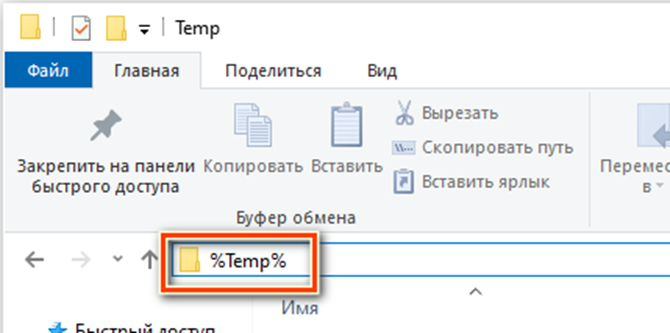{width=670px height=333px}

Чтобы устранить проблему:

Закройте Revit и другие продукты Autodesk

Очистить папку «Temp», для этого:

-  Скопируйте в проводник «%Temp%» (либо С:\\USERS\\Имя пользователя\\AppData\\Local\\Temp)

-  Выберите все файлы внутри папки, удалите через комбинацию клавиш Shift+Delete (безвозвратное удаление, минуя корзину). Для некоторых файлов в появляющихся ошибках нажмите «Пропустить».

Запустите программу Revit, откройте файл, при открытии закройте ненужные рабочие наборы.

Проводите чистку регулярно.

## Некоторые элементы утеряны при импорте. Предупреждение (ActiveX)

При открытии файла или подгрузке связей в Revit возникает ошибка.

<image src="./rasprostranennye-oshibki-v-revit-75.jpeg" crop="0,0,100,100" scale="430px" width="1038px" height="705px" float="center"/>

**Текст ошибки (rus)**

<note type="quote">

Некоторые элементы утеряны при импорте. ActiveX и некоторые патентованные компоненты не могут быть импортированы.

</note>

**Текст ошибки (eng)**

<note type="quote">

Some elements were lost during import. ActiveX and some proprietary components cannot be imported.

</note>

<image src="./rasprostranennye-oshibki-v-revit-76.jpeg" crop="0,0,100,100" scale="426px" width="1038px" height="527px" float="center"/>

**Текст ошибки (rus)**

<note type="quote">

При импорте не обнаружено подходящих элементов в пространстве модели. Импортировать их из пространства Бумага?

</note>

**Текст ошибки (eng)**

<note type="quote">

Import detected no valid elenets in the file's Paper space. Do you want to import from Model space?

</note>

**Причины**

В модель подгружена связь DWG, а сам файл DWG, был создан в более поздней версии Autocad или в нём присутствуют элементы PROXY (могли создаваться в сторонних приложениях).

На ПК установлена, но ни разу до этого не запускалась более поздняя версия AutoCAD.

**Решение**

Нажмите ESC (Предупреждение может появляться несколько раз подряд).

Запустите 1 раз AutoCAD последней установленной версии.

**Комментарии**

Предупреждение не критичное, его можно пропустить. Максимум, что может произойти - не отобразятся какие-то элементы связи DWG.

## Один или несколько опорных элементов сейчас некорректны

Появляется предупреждение при работе с группами, открытии файла, обновлении связи.

<image src="./rasprostranennye-oshibki-v-revit-77.jpeg" crop="0,0,100,100" scale="641px" width="1038px" height="474px" float="center"/>

**Текст ошибки (rus)**

<note type="quote">

Один или несколько опорных элементов размеров сейчас некорректны.

</note>

**Текст ошибки (rus)**

<note type="quote">

One or more dimension references are or have become invalid.

</note>

**Причины**

Ошибка может появиться:

Из-за удаления какого-либо элемента в группе, когда группа имеет несколько экземпляров в проекте и в каком-то экземпляре к удаляемому элементу привязаны размеры;

Если в обновляемом семействе поменялись габариты, геометрия или опорные плоскости, и к типоразмерам этого семейства привязаны размеры на виде;

Если перед синхронизацией в файле были удалены элементы, к которым привязаны размеры, то после синхронизации такое предупреждение может появиться у других проектировщиков, кто работает в этом файле;

Если в рабочем файле размеры привязаны к связанному файлу и в этом файле что-то сдвинулось/удалилось;

В общих рабочих файлах (сборках), где размеры привязаны к связанным файлам.

**Решение**

Разверните окно ошибки и выберите «Удаление опорных объектов». При необходимости проставьте удаленные размеры заново.

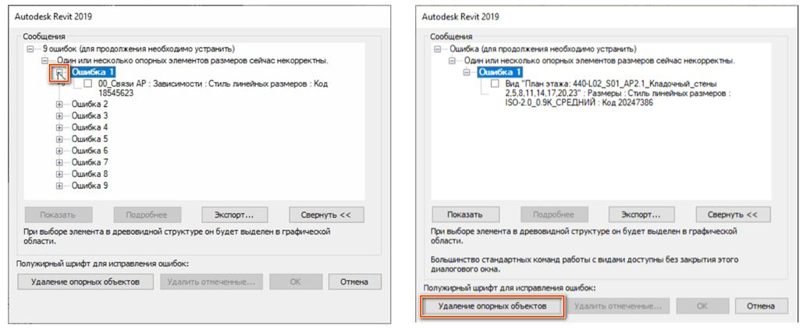{width=1038px height=427px}

**Комментарии**

При оформлении, к связям в проекте лучше не привязываться.

При обновлении связи, если в ней что-то изменилось, размеры могут удалиться с такой ошибкой. По возможности не стоит привязывать размеры к связям, чтобы они не слетали.

Если при оформлении элементов в общем файле (сборке) необходимо проставить размеры по элементам связанного файла (например, по кирпичам), то лучше ставить не одну размерную линию, а разбивать ее на несколько элементов.

## Приложению Revit не удалось запустить команду внешнее приложение

При запуске Revit появляется предупреждение.

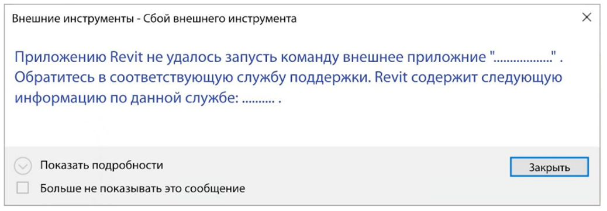{width=1038px height=363px}

**Текст ошибки (rus)**

<note type="quote">

Приложению Revit не удалось запустить команду внешнее приложение "...". Обратитесь в соответствующую службу поддержки. Revit содержит следующую информацию по данной службе:....

</note>

**Текст ошибки (eng)**

<note type="quote">

Revit Cannot run the external application "Collaborate". Contact the provider for assistance. Information they provided to Revit about their identity:....

</note>

**Решение**

Обновление настроек Revit:

Запустите диспетчер задач и завершите все процессы Revit.

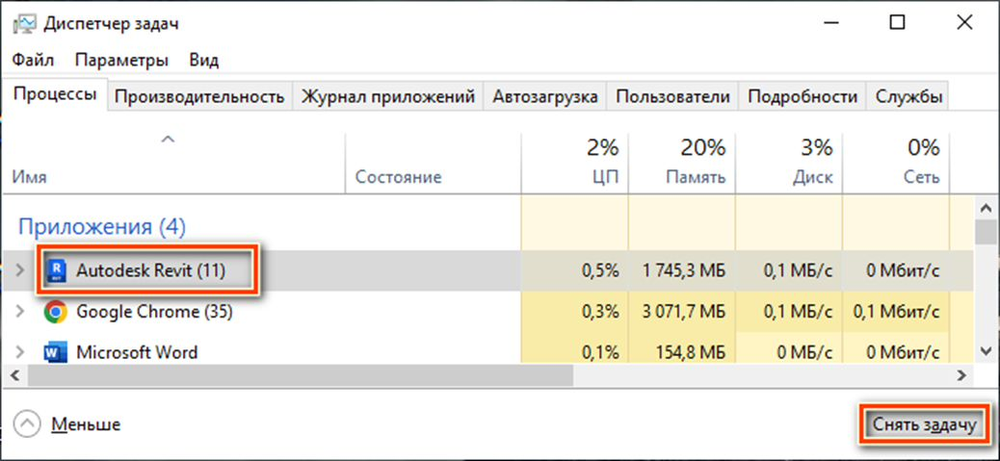{width=1038px height=479px}

Удалите лишние сторонние плагины Revit, которые формируют вкладки на ленте:

Через «Панель управления» - «Удаление программ»

-  Через удаление файлов плагинов из папки

-  %Appdata%\\Autodesk\\Revit\\Addins\[версия\]

-  Через удаление файлов плагинов из папки

C:\\ProgramData\\Autodesk\\Revit\\Addins\[версия\]

Дополнительно проверьте:

-  C:\\ProgramData\\Autodesk\\ApplicationPlugins - эту папку можно использовать для надстроек, которые предназначены для нескольких программ или версий.

-  C:\\Program Files\\Autodesk\\Revit \[версия\]\\AddIns - эта папка используется для внутренних надстроек, но некоторые более ранние версии надстроек могут быть загружены в нее.

После этого запустите Revit.

Может появиться окно, запрашивающее разрешение на загрузку внешнего приложения.

-  Если вы уверены в данной надстройке/плагине, то выберите «Всегда загружать» и надстройка загрузится для использования в Revit.

-  Если вы не уверены или загружать настройку/плагин не нужно, то выберите «Не загружать».

## Данные в файле повреждены и должны быть восстановлены вручную

При открытии модели появляется сообщение.

<image src="./rasprostranennye-oshibki-v-revit-81.jpeg" crop="0,0,100,100" scale="467px" width="974px" height="676px" float="center"/>

**Текст ошибки (rus)**

<note type="quote">

Данные в файле "....." повреждены и должны быть восстановлены вручную.

</note>

**Текст ошибки (eng)**

<note type="quote">

Data in file "….." is corrupt and needs to be manually recovered.

</note>

**Причины**

Повреждение элементов в модели происходит из-за:

Элементы переведены в состояние, в котором они имеют свойства или значения, которых у них быть не должно. Такое происходит при изменении соседних элементов, когда между ними существуют взаимосвязи (привязки).

Один или несколько элементов, на которые есть ссылки в модели, отсутствуют.

**Решение**

**Вариант 1**

Откройте повреждённый файл с проверкой: поставьте галку напротив «Проверить» \[1\]. В появившемся окне «Да» \[2\].

{width=1038px height=655px}

**Вариант 2**

Если у кого-то из ваших коллег сейчас открыт локальный файл данного файла хранилища, или у вас на ПК имеется более ранний локальный файл, то создайте из необходимой версии новый файл хранилище (Узнать, кто работает в файле см. Комментарии).

Открытую модель сохраните через «Сохранить как» в любое другое место на ПК (например, на рабочем столе).

Закройте файл.

Откройте этот файл с ПК, с отсоединением от файла хранилища и проверкой.

Сохраните файл под другим именем на сервер. После этого сохраненный вами файл будет считаться файлом хранилища.

Освободите все забранные рабочие наборы.

Синхронизируйте модель.

Закройте файл.

Создайте новый локальный файл (откройте с проверкой). Если предупреждение не появляется, продолжайте работу.

Предыдущий (поврежденный) файл хранилище удалите с сервера. При необходимости, переименуйте актуальный файл хранилище.

**Вариант 3**

Если рабочие локальные файлы (в которых не возникает ошибки) отсутствуют, то замените файл хранилище его резервной копией:

Восстановите резервную копию локального файла по инструкции: «Восстановление файлов (раздел Восстановление файла хранилища из резервной копии локального файла)». В окне версий резервных копий проекта выберите предпоследнюю версию файла.

Если в новом файле появляется ошибка, восстановите более раннюю версию файла.

**Комментарии**

Узнать кто работает над текущим файлом:

Перейдите на вкладку «Совместная работа».

Команда «Показать журнал».

Выберите нужный файл.

## Программа Autodesk Revit не работает

Файл не открывается, появляется предупреждение и Revit аварийно закрывается.

При закрытии файла постоянно появляется предупреждение и Revit закрывается.

<image src="./rasprostranennye-oshibki-v-revit-83.jpeg" crop="0,0,100,100" scale="430px" width="979px" height="662px" float="center"/>

**Текст ошибки (rus)**

<note type="quote">

Программа "Autodesk Revit" не работает. Возникшая проблема привела к прекращению работы программы. Windows закроет эту программу, а если есть известный способ устранения проблемы, уведомит вас об этом.

</note>

**Текст ошибки (eng)**

<note type="quote">

Autodesk Revit has stopped working. A problem caused the program to stop working correctly. Windows will close the program and notify you if a solution is available.

</note>

**Причины**

Наличие поврежденных элементов модели.

Накопившиеся ошибки модели.

Некорректно работающие плагины, надстройки.

**Решение**

**Вариант 1 (если файл не открывется)**

Откройте повреждённый файл с проверкой: поставьте галку напротив «Проверить» \[1\]. В появившемся окне «Да» \[2\].

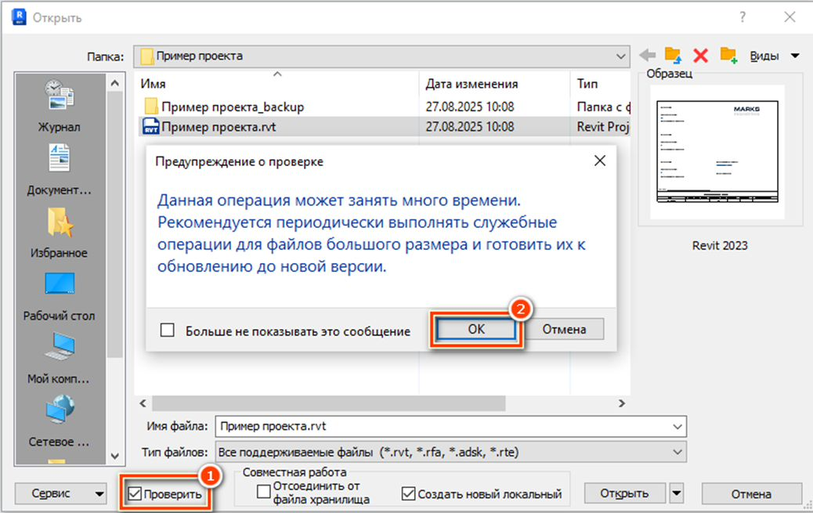{width=1038px height=655px}

**Вариант 2 (если файл открывается с проверкой)**

Закройте все рабочие наборы, кроме того, в котором находятся общие уровни и сетки.

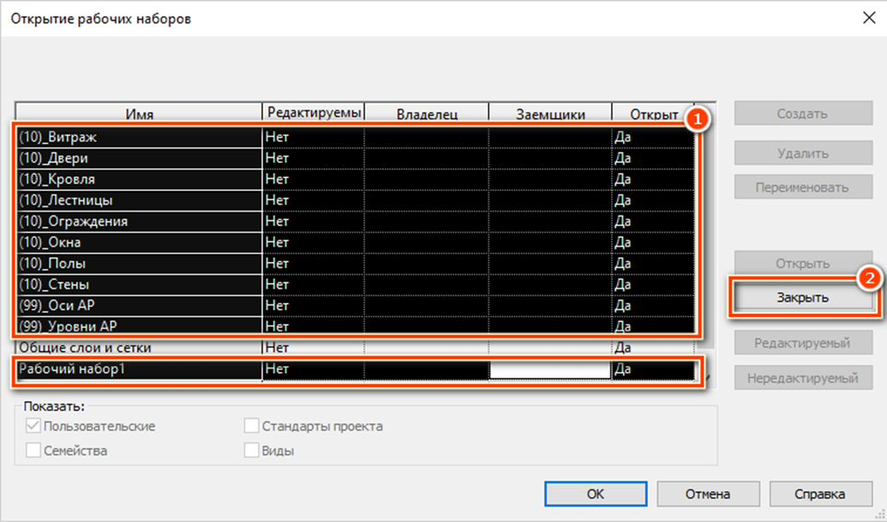{width=1038px height=612px}

После открытия файла вам необходимо через диспетчер связей выгрузить все связанные файлы, затем открыть все рабочие наборы, после чего поочередно обновить выгруженные связи.

Удалите связь, при обновлении которой возникают проблемы (ошибки).

Отдельно откройте с проверкой и закрытыми рабочими наборами файл удаленной связи и нажмите на синхронизацию, после чего закройте файл связи.

В рабочий файл заново добавьте эту связь.

Нажмите «Синхронизировать».

**Вариант 3 (если Revit закрывается при закрытии файла)**

Аварийное завершение Revit при закрытии файла может говорить о конфликте настроек или некорректной установке программы в целом.

Попробуйте:

Установить обновление для Revit (Например, если используете 2019 версию, установите update 2019.2.6)

Отключить плагины, которые пакетом устанавливаются при установке Revit):

Перенесите из папки C:\\ProgramData\\Autodesk\\Revit\\Addins\<version> все файлы с расширением «.addin». Когда проблема пропадет, переносите обратно по одному файлу и проверяйте, возникнет ли предупреждение. Как только предупреждение вновь появится, обновите файл «.addin», после переноса которого в Revit возникло предупреждение.

## Не удалось регенерировать проект

Файл не открывается, появляется предупреждение и Revit аварийно закрывается.

<image src="./rasprostranennye-oshibki-v-revit-86.jpeg" crop="0,0,100,100" scale="471px" width="969px" height="673px" float="center"/>

**Текст ошибки (rus)**

<note type="quote">

Не удалось регенерировать проект "" с последним сочетанием изменений. Вернитесь к предыдущей версии проекта или обратитесь в службу технической поддержки.

</note>

**Текст ошибки (eng)**

<note type="quote">

Project "" failed to regenerate with the latest combiation of changes. Please revert to a previous version of the project or contact your service provider for assistance.

</note>

**Причины**

Отсутствуют необходимые внутренние параметры в основном файле или файле связи.

**Решение**

Откройте файл с проверкой.

{width=1038px height=765px}

Закройте все рабочие наборы, кроме того, в котором находятся общие уровни и сетки (см. Рисунок 85).

{width=1038px height=612px}

После открытия файла появится диалоговое окно ошибки: «Один или несколько требуемых внутренних параметров отсутствуют в модели. Какое действие необходимо выбрать?». Выберите «Исправить и открыть» или «Исправить, синхронизировать и открыть».

<image src="./rasprostranennye-oshibki-v-revit-89.jpeg" crop="0,0,100,100" scale="493px" width="1038px" height="731px" float="center"/>

После появится окно результата операции. Если операция прошла успешно, Revit добавит необходимые внутренние параметры.

<image src="./rasprostranennye-oshibki-v-revit-90.jpeg" crop="0,0,100,100" scale="480px" width="1038px" height="709px" float="center"/>

Проверьте модель на наличие изменений, связанных с исправлением параметров:

-  Проверьте содержимое таблицы ключевых пометок.

-  Проверьте листы на наличие пустых ключевых пометок.

-  Проверьте листы на предмет правильной нумерации изменений в ведомостях изменений и марки изменений.

-  Проверьте листы на наличие пустых марок изменений.

Если обнаружите, что какие-то параметры отсутствуют, то:

-  Не закрывайте вашу модель Revit (которую открыли с проверкой)

-  В том же сеансе Revit откройте более раннюю версию модели

-  В вашей модели используйте инструмент «Копировать стандарты проекта» для копирования параметров из резервной копии в ваше модель.

## Семейство повреждено или непригодно к использованию

При работе с семействами или при открытии файла возникают ошибки.

<image src="./rasprostranennye-oshibki-v-revit-91.jpeg" crop="0,0,100,100" scale="628px" width="1038px" height="468px" float="center"/>

**Текст ошибки (rus)**

<note type="quote">

Некоторые семейства непригодны к использованию. Загрузите семейства повторно или удалите их из модели.

</note>

**Текст ошибки (eng)**

<note type="quote">

Some families have become unusable. Reload the families, or delete them from the model.

</note>

<image src="./rasprostranennye-oshibki-v-revit-92.jpeg" crop="0,0,100,100" scale="633px" width="1038px" height="468px" float="center"/>

**Текст ошибки (rus)**

<note type="quote">

Семейство "...." повреждено, его редактирование невозможно. Выполните повторную загрузку семейства для исправления проекта.

</note>

**Текст ошибки (eng)**

<note type="quote">

Family "..." is corrupt and cannot be updated. Please reload the family to repair the project.

</note>

<image src="./rasprostranennye-oshibki-v-revit-93.jpeg" crop="0,0,100,100" scale="390px" width="1038px" height="705px" float="center"/>

**Текст ошибки (rus)**

<note type="quote">

Семейство "...." повреждено, обновление его экземпляров невозможно. Выполните повторную загрузку семейства для исправления проекта.

</note>

**Текст ошибки (eng)**

<note type="quote">

Family "..." is corrupt and cannot be edited.. Please reload the family to repair the project.

</note>

**Причины**

При копировании семейств из проекта в проект, им добавляются числовые суффиксы 1, 2, 3 к имени самого семейства или типоразмера.

-  Такие семейства дубликаты попадают в трассировку трубопровода или воздуховода и это приводит к ошибке.

-  Семейства дубликаты, которые являются общими вложенными семействами, используются в множестве разных родительских семейств и это приводит к ошибке.

<image src="./rasprostranennye-oshibki-v-revit-94.jpeg" crop="0,0,100,100" scale="250px" width="694px" height="1194px" float="center"/>

**Решение**

**Вариант 1 (при отсутствии дубликатов в проекте)**

Обновите семейство, вызывающее ошибку. Загрузите рабочую версию данного семейства;

Проверьте, что экземпляры семейства не удалились.

**Вариант 2 (при отсутствии у поврежденного семейства вложенных семейств)**

Если при обычном обновлении семейства возникает ошибка, то:

Сохраните/скопируйте семейство себе на ПК с другим именем (Например, добавить "\_" в конец семейства);

Загрузитее переименованное семейство в проект;

Последовательно заменить все экземпляры поврежденного семейства и его дубликаты (семейства с суффиксами 1, 2, 3) на вновь загруженные (без цифр);

После замены удалите некорректные семейства (семейства с суффиксами 1, 2, 3);

Переименуйте в диспетчере проекта новое семейство обратно (убрать "\_" с конца семейства);

Для ИОС: Настройте трассировку трубопроводов/воздуховодов

**Вариант 3 (при наличии у поврежденного семейства вложенных семейств)**

Если при загрузке семейства снова возникает ошибка, то:

Сохраните/скопируйте семейство себе на ПК с другим именем (Например, добавить "\_" в конец семейства).

Переименуйте все общие вложенные семейства в редакторе родительского семейства из п.1 (Например, в родительском семействе добавьте "\_" в конец всех общих вложенных семейств).

Загрузите переименованное родительское семейство (из п. 33.2.3.1) (все типы) в проект;

Последовательно замените все экземпляры поврежденного родительского семейства и его дубликаты (семейства с суффиксами 1, 2, 3) на вновь загруженные (без цифр). Вложенные семейства заменятся автоматически при замене родительского.

После замены удалите некорректные родительские и вложенные семейства (через «Удалить неиспользуемые», и если все корректно заменено, после удаления неиспользуемых, в проекте должно остаться только вновь загруженное родительское и его вложенные семейства с припиской "\_" в конце семейства).

Переименуйте в диспетчере проекта новое родительское и его вложенные семейства обратно (убрать "\_" с конца семейства).

Для ИОС: Проверьте замененные семейства и настройте трассировку труб/воздуховодов.

## Протяженность геометрии в файле чертежа превышает 20 миль

При открытии файла появляется ошибка.

<image src="./rasprostranennye-oshibki-v-revit-95.jpeg" crop="0,0,100,100" scale="455px" width="955px" height="772px" float="center"/>

**Текст ошибки (rus)**

<note type="quote">

Протяженность геометрии в файле чертежа....dwg превышает 20 миль (33 км). Это может снизить надежность и вызвать некорректное отображение графики. нажмите кнопку "ОК" для продолжения процедуры или кнопку "Отмена" для прекращения импорта.

</note>

**Текст ошибки (eng)**

<note type="quote">

Geometry in the file....dwg has extents greater than 20 miles (33km). This may reduce reliability and result in undesirable graphic behavior. Click OK to continue, Cancel to exit import.

</note>

**Причины**

В модель загружен файл DWG, который содержит большой объем информации (внутри него элементы находятся на большом расстоянии).

**Решение**

Нажмите ОК.

Удалите лишние или уже не используемые DWG файлы.

Необходимые для работы DWG файлы очистите от лишней информации (можно в чистый файл скопировать нужные элементы) и подгрузите заново в модель Revit.

**Комментарии**

Подготовка DWG файла для импорта или связи с Revit:

Сделайте видимыми все слои.

Удалите всю лишнюю информацию. Если модель остается большой, то необходимо почистить блоки (расчлените и удалите лишние элементы).

Удалите все листы. AutoCAD автоматически создаст пустой лист, т.к. по крайней мере один лист должен быть.

У всех элементов координата Z или уровень (у разных элементов разные свойства) должны быть равны 0.

Воспользуйтесь утилитами «Проверить» и «Очистить».

Приведите в соответствие масштаб.

## Данная операция не может быть завершена

Проект не синхронизируется с файлом хранилища. При синхронизации появляется ошибка.

Проект не открывается. При открытии появляется ошибка.

<image src="./rasprostranennye-oshibki-v-revit-96.jpeg" crop="0,0,100,100" scale="430px" width="976px" height="764px" float="center"/>

**Текст ошибки (rus)**

<note type="quote">

Данная операция не может быть завершена. Повторите попытку.

</note>

**Текст ошибки (eng)**

<note type="quote">

This operation could not be completed. Please try again.

</note>

<image src="./rasprostranennye-oshibki-v-revit-97.jpeg" crop="0,0,100,100" scale="439px" width="966px" height="761px" float="center"/>

**Текст ошибки (rus)**

<note type="quote">

С момента открытия данного файла изменения в модели из хранилища....rvt сохранены другими пользователями.

</note>

**Текст ошибки (eng)**

<note type="quote">

Since the file was opened, changes in the model from the storage \<...>.rvt have been saved by other users.

</note>

<image src="./rasprostranennye-oshibki-v-revit-98.jpeg" crop="0,0,100,100" scale="502px" width="974px" height="445px" float="center"/>

**Текст ошибки (rus)**

<note type="quote">

Произошла неизвестная ошибка при обращении к....rvt".

</note>

**Текст ошибки (eng)**

<note type="quote">

An unknow error occurred while accesing....rvt".

</note>

**Причины**

Проблема может быть вызвана нестабильной работой сервера, на котором располагается файл хранилище. Повторите процедуру синхронизации/открытия через некоторое время.

В модели могут присутствовать элементы без принадлежности к какому-либо рабочему набору.

При редактировании элемента, элемент может находится в рабочем наборе, который уже кому-то принадлежит.

Длительные промежутки проведения синхронизации (более 30 минут).

**Решение**

-  Повторите процедуру открытия файла или синхронизации через некоторое время.

-  Если на сервере проблем нет, а файл не открывается с проверкой достаточно долгое время или не синхронизируется, то проблема в повреждении файла хранилища, приступите к вариантам решения, предложенным ниже.

-  При невозможности открыть файл - вариант решения 1.

-  При невозможности синхронизации варианты решения 2-6.

**Вариант 1 (При невозможности открыть файл)**

Замените файл хранилище.

В этом случае возможна потеря информации, если с файлом хранилища с момента последней синхронизации работали другие проектировщики. В случае одновременной работы нескольких сотрудников изменения сохранятся только из одного файла (того которым заменили файл хранилище). Изменения из других файлов необходимо будет перенести вручную из локальных копий.

Для этого перед заменой всем участникам нужно синхронизироваться и закрыть локальные копии. Если синхронизации не проходят, то изменения из локальных файлов нужно будет перенести вручную. (Узнать, кто работает в файле см. Комментарии).

Откройте файл хранилище с отсоединением и проверкой.

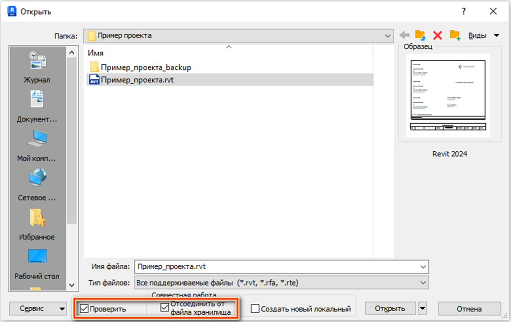{width=1038px height=654px}

Открытый файл хранилища сохраните на сервере через «Сохранить как» под другим именем. После этого сохраненный вами файл будет считаться файлом хранилища.

Освободите все забранные рабочие наборы.

Синхронизируйте модель.

Закройте файл.

Создайте новый локальный файл и продолжайте работу.

Сломанный файл удалите.

**Вариант 2 (При невозможности синхронизации)**

Открытую модель сохраните через «Cохранить как» в любое другое место на ПК (например, на рабочем столе).

Синхронизируйте модель.

Закройте файл, откройте его с сервера через создание нового локального файла.

**Вариант 3 (При невозможности синхронизации)**

Проверьте путь синхронизации, при необходимости, отредактируйте на корректный затем синхронизируйте модель.

**Вариант 4 (При невозможности синхронизации)**

Узнайте, кто является заемщиком рабочего набора. Откройте окно «Рабочие наборы» со вкладки «Совместная работа».

Заемщик должен освободить занятые рабочие наборы и синхронизироваться.

Синхронизируйте модель после синхронизации заемщика.

**Вариант 5 (При невозможности синхронизации)**

Если ни один из вариантов не устранил проблему, то с большей вероятностью синхронизировать файл не удастся.

Замените файл хранилище.

В этом случае возможна потеря информации, если с файлом хранилища с момента последней синхронизации работали другие проектировщики. В случае одновременной работы нескольких сотрудников изменения сохранятся только из одного файла (того которым заменили файл хранилище). Изменения из других файлов необходимо будет перенести вручную из локальных копий.

Для этого перед заменой всем участникам нужно синхронизироваться и закрыть локальные копии. Если синхронизации не проходят, то изменения из локальных файлов нужно будет перенести вручную. (Узнать, кто работает в файле см. Комментарии).

Открытую модель сохраните через «Сохранить как» в любое другое место на ПК (например, на рабочем столе).

Закройте файл.

Откройте этот файл с ПК, с отсоединением от файла хранилища и проверкой.

**Вариант 6 (При невозможности синхронизации)**

В случае, если после замены файла хранилища ошибка все равно появляется, необходимо вручную очистить модель от элементов, которые не принадлежат к какому-либо рабочему набору.

Найдите отсутствующие эти элементы с помощью файла-журнала:

Найдите последний (по дате/времени) файл журнала для модели и откройте его с помощью любого текстового редактора. Журналы находятся в папке: %LOCALAPPDATA%\\Autodesk\\Revit\\Autodesk Revit 2019\\Journals

В файле журнала с помощью поиска (Ctrl+F) найдите текст «DBG_WARN: Central permission origId», который указывает на эти элементы. Найдите 8-значные коды элементов и скопируйте их в пустой текстовый документ.

Откройте 3D-вид модели. Используйте инструмент «Выбрать по коду» на вкладке «Управление», в него вставьте коды этих элементов через точку с запятой.

Удалите из модели все отсутствующие элементы.

Синхронизируйтесь.

**Комментарии**

Узнать кто работает над текущим файлом:

Перейти на вкладку «Совместная работа».

Команда «Показать журнал».

Выбрать нужный файл.

## Файл изменен с применением стороннего средства обновления

При открытии проекта появляется диалоговое окно.

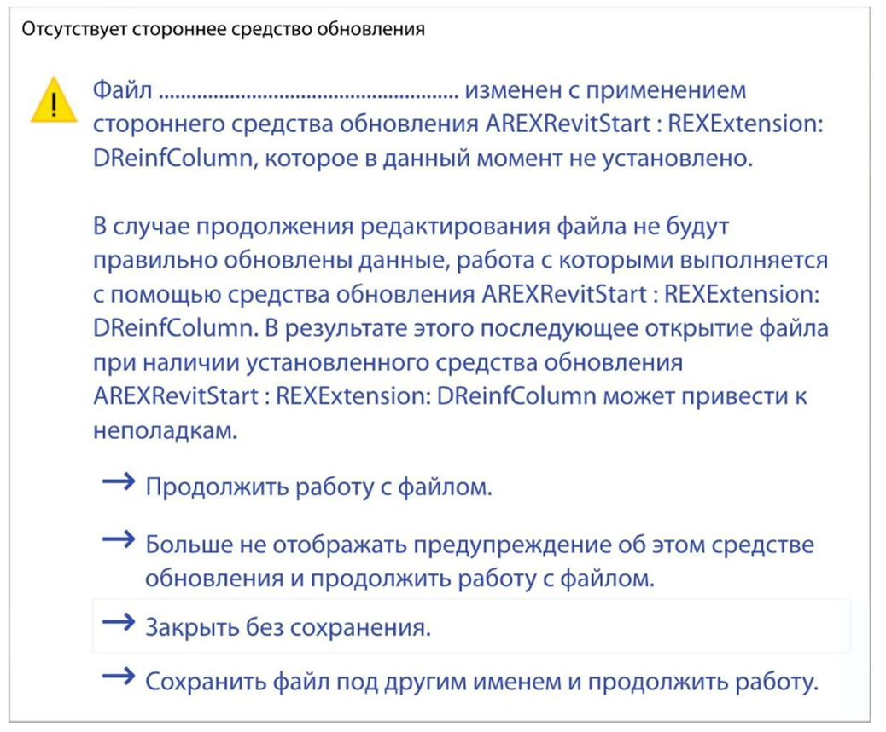{width=1038px height=859px}

**Текст ошибки (rus)**

<note type="quote">

Файл... изменен с применением стороннего средства обновления..., которое на данный момент не установлено. В случае продолжения редактирования файла не будут правильно обновлены данные, работа с которыми выполняется с помощью средства обновления.... В результате этого последующее открытие файла при наличии установленного средства обновления... может привести к неполадкам.

</note>

**Текст ошибки (eng)**

<note type="quote">

The file... was modified by the third-party updater... which is not currently installed. If you continue to edit the file, data maintained by... will not be updated properly. This, may create problems when... is later opened when... is present.

</note>

**Причины**

При работе с файлом был использован сторонний плагин, не установленный на Вашем устройстве

**Решение**

Выберите вариант ответа «Больше не отображать предупреждение и продолжить работу с файлом».

**Комментарии**

Предупреждение появляется при первом запуске файла, и больше не должно появляться.

## Невозможно завершить операцию из-за неизвестной ошибки

Файл не открывается, появляется предупреждение и Revit аварийно закрывается.

<image src="./rasprostranennye-oshibki-v-revit-101.jpeg" crop="0,0,100,100" scale="526px" width="982px" height="668px" float="center"/>

**Текст ошибки (rus)**

<note type="quote">

Ошибка операции. Невозможно завершить операцию из-за неизвестной ошибки. Если ошибка повторится, обратитесь в службу поддержки клиентов.

</note>

**Текст ошибки (eng)**

<note type="quote">

Operation Error An unknown error occurred and the operation could not be completed. If this error recurs, please contact customer support.

</note>

**Причины**

Наличие поврежденных элементов модели.

Накопившиеся ошибки модели.

**Решение**

**Вариант 1**

Откройте файл с проверкой.

Откройте повреждённый файл с проверкой: поставьте галку напротив «Проверить» \[1\]. В появившемся окне «Да» \[2\].

{width=1038px height=652px}

**Вариант 2**

Если файл не открывается с проверкой, то откройте его с проверкой \[1\] и закрытием рабочих наборов:

При открытии выберите «Задать» \[2\]-\[3\].

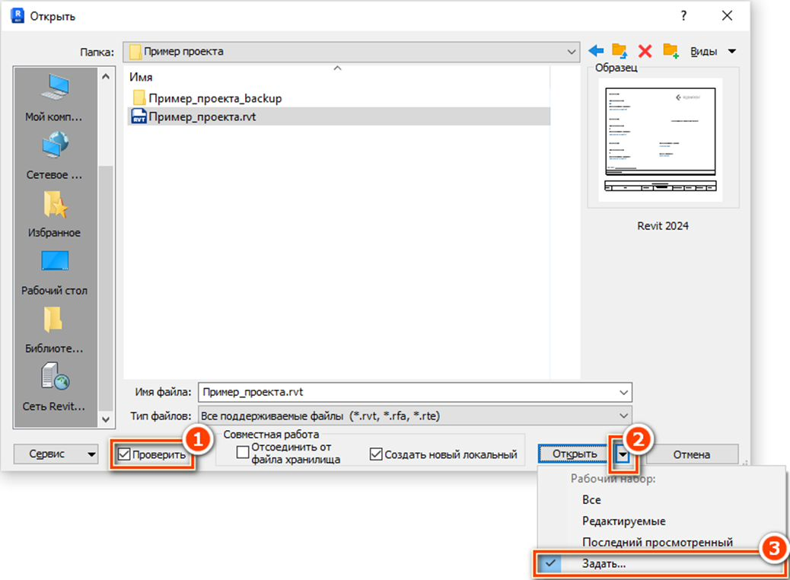{width=1038px height=762px}

Закройте все рабочие наборы, кроме того, в котором находятся общие уровни и сетки.

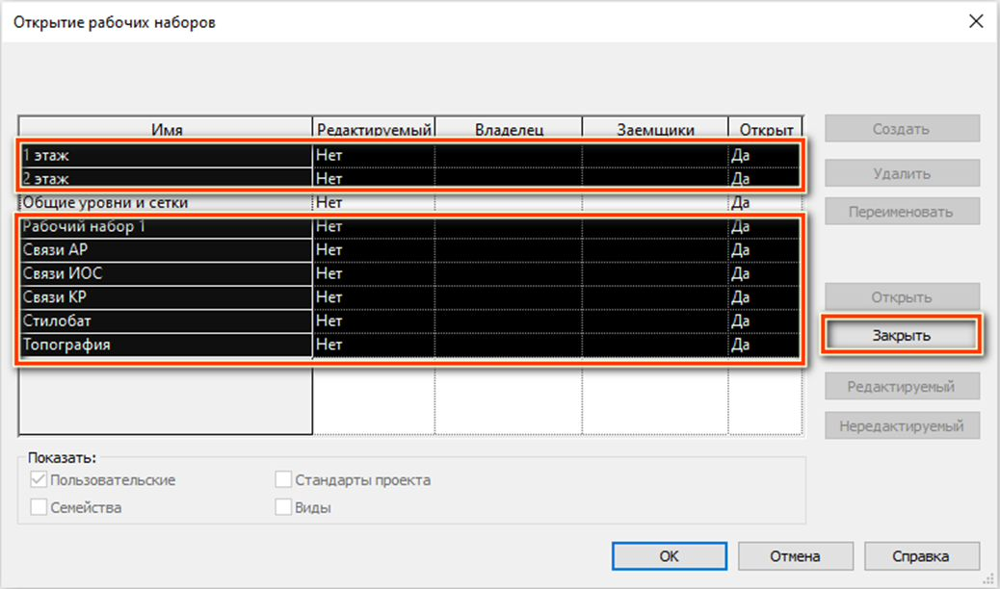{width=1038px height=612px}

После открытия файла вам необходимо через диспетчер связей выгрузить все связанные файлы, затем открыть все рабочие наборы, после чего поочередно обновить выгруженные связи.

Удалите связь, при обновлении которой возникают проблемы (ошибки).

Отдельно откройте с проверкой и закрытыми рабочими наборами файл удаленной связи и нажмите на синхронизацию, после чего закройте файл связи.

В рабочий файл заново добавьте эту связь.

Нажмите «Синхронизировать».

## Не удалось найти этот элемент. Его больше нет

При обновлении связи или открытии файла появляется одно из сообщений.

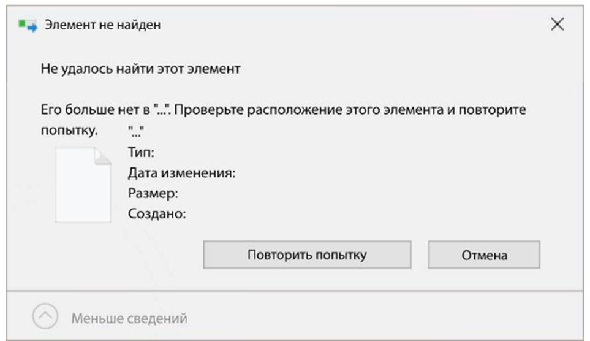{width=963px height=556px}

**Текст ошибки (rus)**

<note type="quote">

Не удалось найти этот элемент. Его больше нет в "...". Проверьте расположение этого элемента и повторите попытку.

</note>

<image src="./rasprostranennye-oshibki-v-revit-106.jpeg" crop="0,0,100,100" scale="496px" width="958px" height="441px" float="center"/>

**Текст ошибки (rus)**

<note type="quote">

Значение поля полное имя файла не может превышать 255 символов.

</note>

**Текст ошибки (eng)**

<note type="quote">

The full file name cannot be longer than 255 characters.

</note>

<image src="./rasprostranennye-oshibki-v-revit-107.jpeg" crop="0,0,100,100" scale="489px" width="960px" height="434px" float="center"/>

**Текст ошибки (rus)**

<note type="quote">

файл без имени содержит недопустимый путь.

</note>

**Текст ошибки (eng)**

<note type="quote">

an unnamed file contains an incorrect path.

</note>

**Причины**

Наличие в проекте при совместной работе связей DWG или RVT, загруженных в проект не с сетевых дисков (сервера), а с локальных дисков (собственный рабочий стол, диск D, диск C).

Наличие в проекте связей DWG, у которых длина полного пути с указанием названия файла (с расширением) превышает 255 символов (ограничение ОС Windows).

Наличие в проекте связей RVT, у которых длина полного пути с указанием названия файла (с расширением), сохраненного на Revit Server превышает 138 символов.

Наличие в проекте связей RVT, в которых, в свою очередь, имеются связи с вышеописанными проблемами.

**Решение**

**Вариант 1 (при невозможности обновлении связи)**

Для того, чтобы обновить связь:

Обновите связь через диспетчер связей или через диспетчер проекта с помощью функции «Обновить из...».

Если после обновления связи через «Обновить из...» ошибка при ее обновлении повторяется, то решите проблему в самой связи методом, описанным в разделе "Устранение проблемы" данной инструкции.

**Вариант 2 (при невозможности открыть рабочий набор)**

Для того, чтобы открыть рабочий набор, нужно понять, в какой из связей этого набора заключается проблема:

Выгрузите все связи данного рабочего набора через диспетчер связей или через диспетчер проекта.

Откройте необходимый рабочий набор, затем поочередно обновите выгруженные связи.

Связь, при обновлении которой возникает ошибка, обновите через диспетчер связей или через диспетчер проекта с помощью функции «Обновить из...».

Если после обновления связи через «Обновить из...» ошибка при открытии рабочего набора повторяется, то решите проблему в самой связи методом, описанным в разделе «Комментарии» данной инструкции.

**Вариант 3 (при невозможности синхронизации)**

Для того, чтобы синхронизировать файл:

Закройте все рабочие наборы.

Синхронизируйтесь.

**Вариант 4**

Если ошибка повторяется при дальнейшей работе в модели, проверьте модель на наличие связей RVT и DWG, о которых описано в причинах данной проблемы.

-  При наличии связей DWG или RVT с локальных дисков:

Удалите проблемную связь.

Пересохраните файл связи в папке с общим доступом (на сервере).

Загрузите связь в проект.

Если после устранения проблем со связями ошибка повторяется, перезапустите Revit.

-  При наличии связей DWG или RVT с длиной пути, превышающей 255 символов:

Удалите проблемную связь.

Уменьшите количество подпапок или сократите имя (папок/моделей), или перенесите файл на одну или несколько подпапок выше.

По итогу длина пути до исходного файла (с указанием имени файла и его расширением) не должна превышать 255 символов (в данную цифру входят и видимые и невидимые-системные символы Windows).

Если после устранения проблем со связями ошибка повторяется, перезапустите Revit.

-  Связи RVT с Revit Server с длиной пути, превышающие 138 символов:

Удалите проблемную связь.

Измените имя файла связи, таким образом, чтобы длина пути с указанием имени файла и его расширением не превышала 138 символов.

Если после устранения проблем со связями ошибка повторяется, перезапустите Revit.

-  Связи RVT, в которых, имеются проблемные связи:

Исправьте проблему в файле связи RVT по предложенным решениям выше.

Если после устранения проблем со связями ошибка повторяется, перезапустите Revit.

**Комментарии**

-  Данная ошибка запоминается самим Revit и может повторяться в разных проектах, если они были открыты в одном сеансе Revit, поэтому важно при появлении данной ошибки и после устранения потенциальных проблем, описанных выше, перезапускать программу.

Очистка папки «%Temp%» также помогает решить эту проблему, поэтому важно проводить чистку папки «%Temp%» регулярно. Для очистки папки «%Temp%»:

Закройте Revit.

Скопируйте в проводник «%Temp%», либо

C:\\USERS\\Имя пользователя\\AppData\\Local\\Temp

Выберите все файлы внутри папки, удалите через комбинацию клавиш Shift+Delete (безвозвратное удаление, минуя корзину). Для некоторых файлов в появляющихся ошибках нажмите «Пропустить»

## Файл Revit содержит неправильную схему

При синхронизации появляется ошибка.

<image src="./rasprostranennye-oshibki-v-revit-108.jpeg" crop="0,0,100,100" scale="467px" width="1038px" height="460px" float="center"/>

**Текст ошибки (rus)**

<note type="quote">

...........rvt содержит неправильную схему.

</note>

**Текст ошибки (eng)**

<note type="quote">

...........rvt contains an incorrect schema.

</note>

**Причины**

Часть файла повреждена из-за проблем с сетью или оборудованием.

Файл сохранен в более ранней сборке Revit. Например, сборка выпуска 2019 по сравнению с 2019.2.

**Решение**

**Вариант 1**

Открытую модель сохраните через «Cохранить как» в любое другое место на ПК (например на рабочем столе).

Синхронизируйте модель.

Закройте файл.

Откройте этот файл с ПК и при открытии поставьте галочку «Создать новый локальный файл».

**Вариант 2**

Перенесите (удалите) все локальные копии этого файла из папки с резервными копиями файлов Revit.

Синхронизируйте модель.

**Вариант 3**

Замените файл хранилище.

В этом случае возможна потеря информации, если с файлом хранилища с момента последней синхронизации работали другие проектировщики. В случае одновременной работы нескольких сотрудников изменения сохранятся только из одного файла (того которым заменили файл хранилище). Изменения из других файлов необходимо будет перенести вручную из локальных копий.

Для этого перед заменой всем участникам нужно синхронизироваться и закрыть локальные копии. Если синхронизации не проходят, то изменения из локальных файлов нужно будет перенести вручную. (Узнать, кто работает в файле см. Комментарии).

Откройте этот файл, с отсоединением от файла хранилища и проверкой.

Сохраните файл поверх файла хранилища через "Сохранить как" и выберите путь к модели. После этого сохраненный вами файл будет считаться файлом хранилища.

Освободите все забранные рабочие наборы.

Синхронизируйте модель.

Закройте файл.

Создайте новый локальный файл и продолжайте работу.

**Комментарии**

Узнать кто работает над текущим файлом:

Перейти на вкладку «Совместная работа».

Команда «Показать журнал».

Выбрать нужный файл.

## Невозможно сохранение локального файла

Проект не синхронизируется с файлом хранилища. При синхронизации появляется ошибка.

<image src="./rasprostranennye-oshibki-v-revit-109.jpeg" crop="0,0,100,100" scale="458px" width="1038px" height="703px" float="center"/>

**Текст ошибки (rus)**

<note type="quote">

Невозможно сохранение локального файла. Проект не может быть сохранен, так как используемое имя пользователя не совпадает с именем создателя локального файла. Для получения дополнительной информации откройте диалоговое окно "Рабочие наборы".

</note>

**Текст ошибки (eng)**

<note type="quote">

The project cannot be saved because the user name you are using is not the same as the user who created the local file. Open the Worksets dialog for more information".

</note>

<image src="./rasprostranennye-oshibki-v-revit-110.jpeg" crop="0,0,100,100" scale="462px" width="1038px" height="703px" float="center"/>

**Текст ошибки (rus)**

<note type="quote">

Локальный файл был сохранен пользователем '...', а текущий пользователь - '...'. Измените имя пользователя или прекратите работу с файлом".

</note>

**Текст ошибки (eng)**

<note type="quote">

The local file has been saved by user '...', current user is '...'. Please change your user name or stop working on this file".

</note>

**Причины**

Ошибка при создании совместной работы с файлом, переданным от другого лица. Также ошибка может появиться после изменения имени пользователя для учетной записи Autodesk.

**Решение**

Откройте файл с проверкой и отсоединением от файла хранилища.

Сохраните файл на ПК и закройте его.

Файл с ПК откройте с отсоединением от файла хранилища.

Включите совместную работу с помощью кнопки «Совместная работа» на вкладке «Совместная работа».

Выберите «Совместная работа в вашей сети» в появившемся окне.

Сохраните файл на ваш сервер или папку с общим доступом (этот пункт зависит от того, как организована работа над проектом: на основе сервера или на основе файла).

Синхронизируйте модель и закройте файл.

{width=1038px height=655px}

## Невозможно освободить элемент в локальном файле

Проект не синхронизируется с файлом хранилища. Появляется ошибка.

<image src="./rasprostranennye-oshibki-v-revit-112.jpeg" crop="0,0,100,100" scale="489px" width="1038px" height="703px" float="center"/>

**Текст ошибки (rus)**

<note type="quote">

Revit не может выполнить освобождение измененных элементов, поскольку проект не сохранен.

</note>

**Текст ошибки (eng)**

<note type="quote">

Revit cannot release changed items because the project has not been saved.

</note>

**Причина**

Недостаточно места на диске для синхронизации.

**Решение**

**Вариант 1**

Попробуйте:

Открытую модель сохраните через «Сохранить как» в любое другое место на ПК (например, на рабочем столе).

Синхронизируйте модель.

Закройте файл и создайте новый локальный.

**Вариант 2**

Чтобы синхронизировать открытую модель, освободите место на диске C:\\ (D:):

Удалите локальные копии (кроме сегодняшней даты) из папки с резервными копиями файлов Revit.

Очистите от лишних файлов папки:

-  Загрузки

-  Рабочий стол

-  Корзину

-  Мои документы

Удалите все файлы журналов (кроме сегодняшней даты) из каталога: %localappdata%\\Autodesk\\Revit\\Autodesk Revit \<version>\\Journals

Синхронизируйте файл.

Если синхронизироваться не удалось, очистите папку «%Temp%» при открытом Revit по инструкции ниже.

**Вариант 3**

Закройте Revit и другие продукты Autodesk

Очистить папку Temp, для этого:

-  Скопируйте в проводник «%Temp%» (либо С:\\USERS\\Имя пользователя\\AppData\\Local\\Temp)

-  Выберите все файлы внутри папки, удалите через комбинацию клавиш Shift+Delete (безвозвратное удаление, минуя корзину). Для некоторых файлов в появляющихся ошибках нажмите «Пропустить»

Запустите программу Revit, откройте файл, при открытии закройте ненужные рабочие наборы.

Проводите чистку регулярно.

## Локальный файл несовместим с моделью из хранилища

При синхронизации появляется предупреждение.

<image src="./rasprostranennye-oshibki-v-revit-113.jpeg" crop="0,0,100,100" scale="485px" width="1038px" height="703px" float="center"/>

**Текст ошибки (rus)**

<note type="quote">

Revit не может выполнить освобождение измененных элементов, поскольку проект не сохранен.

</note>

**Текст ошибки (eng)**

<note type="quote">

Revit cannot release changed items because the project has not been saved.

</note>

<image src="./rasprostranennye-oshibki-v-revit-114.jpeg" crop="0,0,100,100" scale="469px" width="1038px" height="703px" float="center"/>

**Текст ошибки (rus)**

<note type="quote">

Revit не удается устранить различия между локальным файлом и моделью из хранилища. Дополнительную информацию об ошибках можно найти в диалоговом окне "Рабочие наборы.

</note>

**Текст ошибки (eng)**

<note type="quote">

Revit cannot reconcile the differences between your local file and the central model. You can find more information about the errors in the Worksets dialog.

</note>

<image src="./rasprostranennye-oshibki-v-revit-115.jpeg" crop="0,0,100,100" scale="453px" width="1038px" height="813px" float="center"/>

**Текст ошибки (rus)**

<note type="quote">

Локальный файл несовместим с моделью из файла хранилища.

</note>

**Текст ошибки (eng)**

<note type="quote">

Your local file is not compatible with the central model.

</note>

**Причины**

Локальный файл продолжительное время не был синхронизирован с файлом хранилища.

Возможна проблема в настройках системы резервного копирования.

**Решение**

**Вариант 1**

Открытую модель сохраните через «Сохранить как» в любое другое место на ПК (например, на рабочем столе).

Закройте файл.

Откройте этот файл с ПК, с проверкой.

Освободите все забранные рабочие наборы.

Синхронизируйте модель.

**Вариант 2**

Проверьте не совпадает ли «Имя пользователя» в настройках программы с именем уже работающего над моделью пользователя.

Если совпадает, измените на исходное имя.

**Вариант 3**

Не закрывая проблемный файл, откройте файл хранилище с созданием новой локальной копии, выбрав 2-ой вариант создания локального файла: с добавлением штемпеля даты и времени.

Синхронизируйте модель.

Скопируйте из рабочего файла то, что было сделано за это время, в новый локальный файл (Ctrl+C из старого, Ctrl+V в новый).

Синхронизируйте модель после каждого такого копирования.

**Вариант 4**

Замените файл хранилище.

В этом случае возможна потеря информации, если с файлом хранилища с момента последней синхронизации работали другие проектировщики. В случае одновременной работы нескольких сотрудников изменения сохранятся только из одного файла (того которым заменили файл хранилище). Изменения из других файлов необходимо будет перенести вручную из локальных копий.

Для этого перед заменой всем участникам нужно синхронизироваться и закрыть локальные копии. Если синхронизации не проходят, то изменения из локальных файлов нужно будет перенести вручную. (Узнать, кто работает в файле см. Комментарии).

Откройте сохраненный локальный файл с отсоединением от файла хранилища и проверкой.

Сохраните файл поверх файла хранилища через «Сохранить как» и выберите путь к модели. После этого сохраненный вами файл будет считаться файлом хранилища.

Освободите все забранные рабочие наборы.

Синхронизируйте модель.

Закройте файл.

Создайте новый локальный файл и продолжайте работу.

Комментарии

Узнать кто работает над текущим файлом:

Перейти на вкладку «Совместная работа».

Команда «Показать журнал».

Выбрать нужный файл.

## Невозможно выполнить команду сохранить этот документ. Системные тома/Цветовая заливка

При синхронизации появляется ошибка.

<image src="./rasprostranennye-oshibki-v-revit-116.jpeg" crop="0,0,100,100" scale="429px" width="1038px" height="813px" float="center"/>

**Текст ошибки (rus)**

<note type="quote">

Невозможно выполнить команду сохранить этот документ,поскольку в данный момент выполняется расчёт Системные тома.

</note>

**Текст ошибки (eng)**

<note type="quote">

Cannot synchronize with central because System Volumes are calculating.

</note>

<image src="./rasprostranennye-oshibki-v-revit-117.jpeg" crop="0,0,100,100" scale="438px" width="1038px" height="813px" float="center"/>

**Текст ошибки (rus)**

<note type="quote">

Невозможно выполнить команду сохранить этот документ, поскольку в данный момент выполняется расчёт Цветовая заливка.

</note>

**Текст ошибки (eng)**

<note type="quote">

The command to save this document cannot be used because Color Fill is currently highly calculated.

</note>

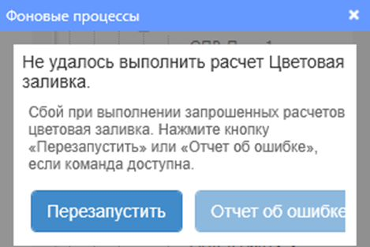{width=469px height=313px}

**Текст ошибки (rus)**

<note type="quote">

Не удалось выполнить расчет Цветовая заливка. Сбой при выполнении запрошенных расчетов цветовая заливка. Нажмите кнопку "Перезапустить" или "Отчет об ошибке", если команда доступна.

</note>

**Текст ошибки (eng)**

<note type="quote">

Failed to perform Color Fill calculation. Failed to perform the requested color fill calculations. Click ""Restart"" or ""Report a bug"" if the command is available.

</note>

**Причины**

Проблема появляется при зависании некоторых фоновых процессов Revit.

**Решение**

Необходимо завершить фоновые процессы Revit. Важно случайно не завершить основной процесс Revit.

-  Откройте Диспетчер задач (Ctrl+Shift+Esc).

-  Нажмите «Подробнее» \[1\].

-  Перейдите на вкладку «Подробности» \[2\].

-  Найдите в раскрывшимся окне процесс «Revitworker.exe» \[3\].

-  Выберите его и снимите задачу \[4\].

-  Повторите действие с моделью (например, синхронизируйтсь).

<image src="./rasprostranennye-oshibki-v-revit-119.jpeg" crop="0,0,100,100" scale="400px" width="577px" height="577px" float="center"/>

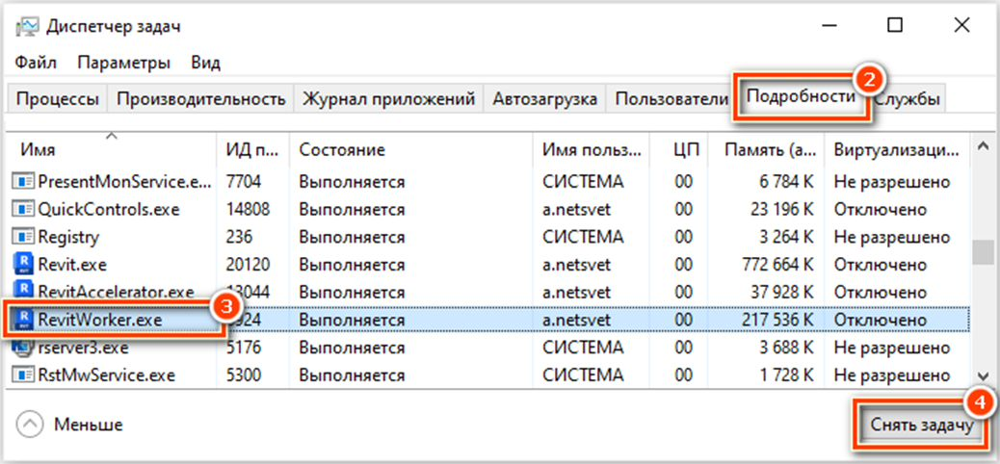{width=1038px height=482px}

**Комментарии**

Фоновые процессы позволяют выполнять расчеты в фоне, и их список можно посмотреть, выбрав в нижней панели значок:

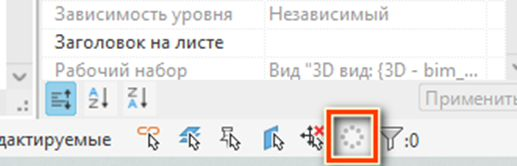{width=517px height=166px}

## Изменено положение в текущем файле

При проведении синхронизации возникает предупреждение.

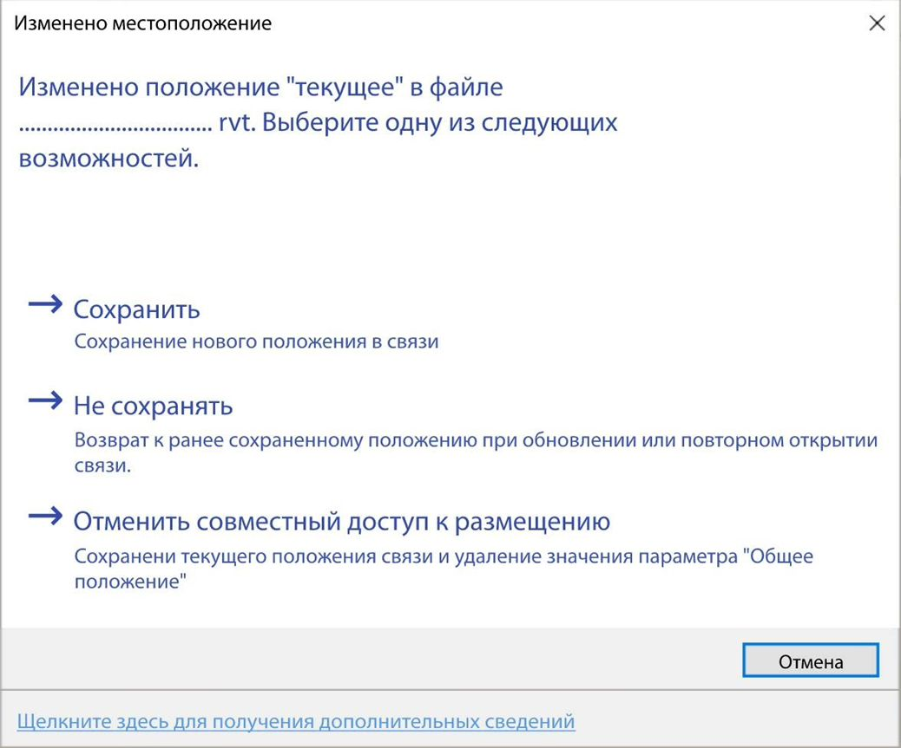{width=1038px height=863px}

**Текст ошибки (rus)**

<note type="quote">

Изменено положение "текущее" в файле...... rvt. Выберите одну из следующих" возможностей.

</note>

**Текст ошибки (eng)**

<note type="quote">

Changed position "current" in file "......rvt". Choose one of the following options.

</note>

**Причины**

Изменение положения экземпляра связи.

**Решение**

Подробный разбор предложенных вариантов:

-  Сохранить

Выполняется сохранение нового местоположения главной модели в связанной модели.

-  Не сохранять

Внесенные изменения в местоположение отменяются, а связанная модель при следующем обновлении или открытии возвращается к предыдущему сохраненному местоположению.

-  Отменить совместный доступ к размещению

Связанная модель остается в своем текущем местоположении. Общие координаты между связанной моделью и главной моделью отключаются. Для параметра «Общая площадка» в связанной модели задается значение «\<Не общедоступное>».

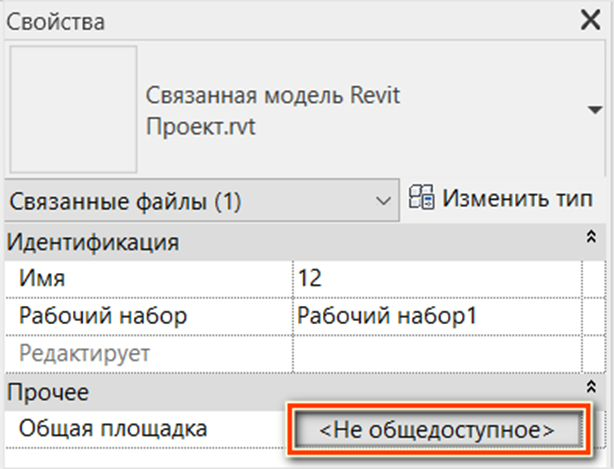{width=614px height=469px}

Вариант «Сохранить» выбираете в том случае, если действительно необходимо изменить положение связанного файла.

Вариант «Не сохранять» - когда случайно изменили положение связанного файла и необходимо отменить изменения.

Вариант «Отменить совместный доступ к размещению» следует выбрать, когда нужно выполнить отключение общих координат между связанной и главной моделью, при этом измененное положение связанного файла сохраняется.

## В локальном файле обнаружены экземпляры семейства с поврежденными идентификаторами элементов

Проект не синхронизируется с файлом хранилища. Появляется ошибка.

<image src="./rasprostranennye-oshibki-v-revit-124.jpeg" crop="0,0,100,100" scale="479px" width="1038px" height="813px" float="center"/>

**Текст ошибки (rus)**

<note type="quote">

В локальном файле обнаружены экземпляры семейства с поврежденными идентификаторами элементов!

</note>

**Текст ошибки (eng)**

<note type="quote">

Family instances with corrupted element IDs found in local file!

</note>

**Решение**

Замените файл хранилище. В этом случае возможна потеря информации, если с файлом хранилища с момента последней синхронизации работали другие проектировщики. В случае одновременной работы нескольких сотрудников изменения сохранятся только из одного файла (того которым заменили файл хранилище). Изменения из других файлов необходимо будет перенести вручную из локальных копий.

Для этого перед заменой всем участникам нужно синхронизироваться и закрыть локальные копии. Если синхронизации не проходят, то изменения из локальных файлов нужно будет перенести вручную. (Узнать, кто работает в файле см. Комментарии).

Открытую модель сохраните через «Сохранить как» в любое другое место на ПК (например, на рабочем столе).

Закройте файл.

Откройте этот файл с ПК, с отсоединением от файла хранилища и проверкой.

Закройте все рабочие наборы.

Сохраните файл поверх файла хранилища через «Сохранить как» и выберите путь к модели. После этого сохраненный вами файл будет считаться файлом хранилища.

Освободите все забранные рабочие наборы.

Синхронизируйте модель.

Закройте файл.

Создайте новый локальный файл и продолжайте работу.

**Комментарии**

Узнать кто работает над текущим файлом:

Перейдите на вкладку «Совместная работа».

Команда «Показать журнал».

Выберете нужный файл.

## Устранение ошибки циклической взаимосвязи

При проведении синхронизации появляется предупреждение об ошибке.

<image src="./rasprostranennye-oshibki-v-revit-125.jpeg" crop="0,0,100,100" scale="645px" width="1038px" height="464px" float="center"/>

**Причины**

Ошибка может возникать при излишних соединениях стен или появиться после возникновения запроса на редактирование группы, в которую входят стены.

**Решение**

Просмотрите полный текст предупреждения, для этого нужно в окне ошибки нажать «Развернуть».

Скопируйте код проблемных стен.

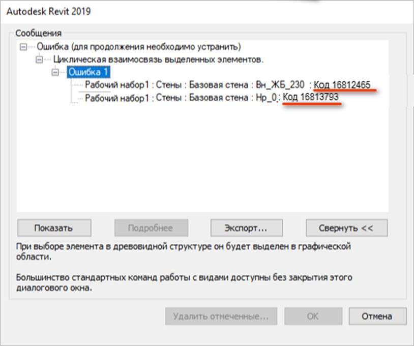{width=814px height=680px}

Найдите стены из ошибки по коду. Для этого перейдите в «Управление» - «Выбрать по коду».

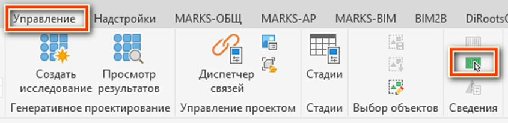{width=845px height=205px}

Чтобы наглядно увидеть стены, воспользуйтесь инструментом Рамка выбора, который располагается на вкладке «Изменить». При этом на 3D виде отобразится конкретная стена.

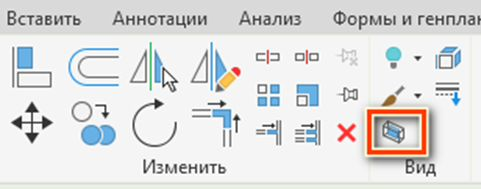{width=481px height=189px}

Нажмите на стену инструментом «Отсоединить».

Проведите все действия со второй стеной. Если при «Отсоединить» появится опять эта ошибка, то тогда сначала отсоедините вторую стену, которая появилась в ошибке, затем первую.

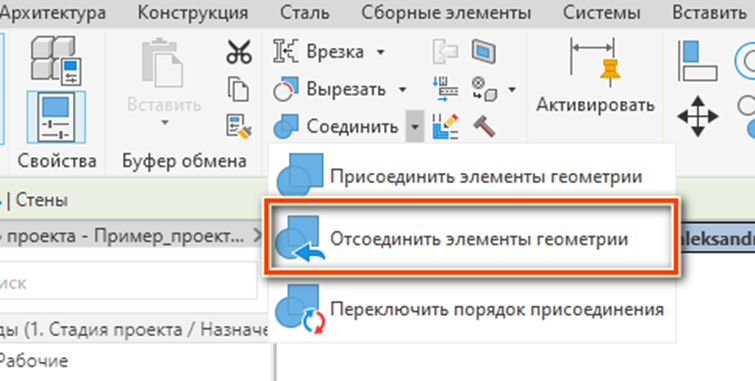{width=755px height=381px}

## Не удалось завершить операцию. Ссылки имеют одинаковые номера

Ошибка при синхронизации.

<image src="./rasprostranennye-oshibki-v-revit-130.jpeg" crop="0,0,100,100" scale="608px" width="1038px" height="464px" float="center"/>

**Текст ошибки (rus)**

<note type="quote">

Не удалось завершить операцию. Ссылки имеют одинаковые имена.

</note>

**Текст ошибки (eng)**

<note type="quote">

This operation could not be completed. Links have the same name.

</note>

**Причины**

В проекте находятся несколько связей DWG или RVT с одинаковым наименованием.

Пользователем 1 в проект была добавлена связь DWG и произведена синхронизация. Пользователь 2 после синхронизации Пользователя 1 не успел синхронизироваться и добавил эту же связь в этот же проект. Но синхронизация у Пользователя 2 не проходит, появляется ошибка, так как такая связь уже была загружена в проект ранее.

**Решение**

Разверните окно ошибки с помощью функции «Развернуть» в окне ошибки.

<image src="./rasprostranennye-oshibki-v-revit-131.jpeg" crop="0,0,100,100" scale="516px" width="680px" height="303px" float="center"/>

Посмотрите наименование проблемной связи DWG или RVT.

Удалите ее из проекта с помощью Диспетчера связей:

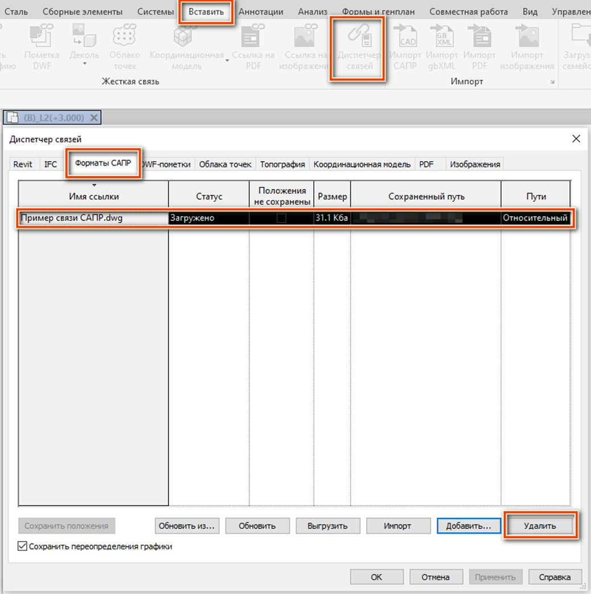{width=1038px height=1044px}

**Комментарии**

Если ошибка возникает у пользователя, который добавил эту же связь после того, как первый пользователь добавил ее в проект и синхронизировался, то необходимо удалить связь у второго пользователя, тогда ошибки при синхронизации не будет.