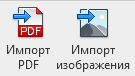
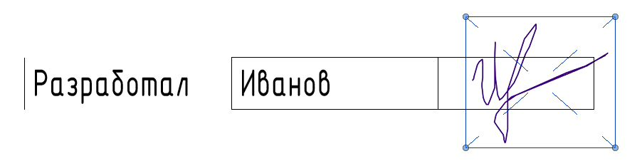
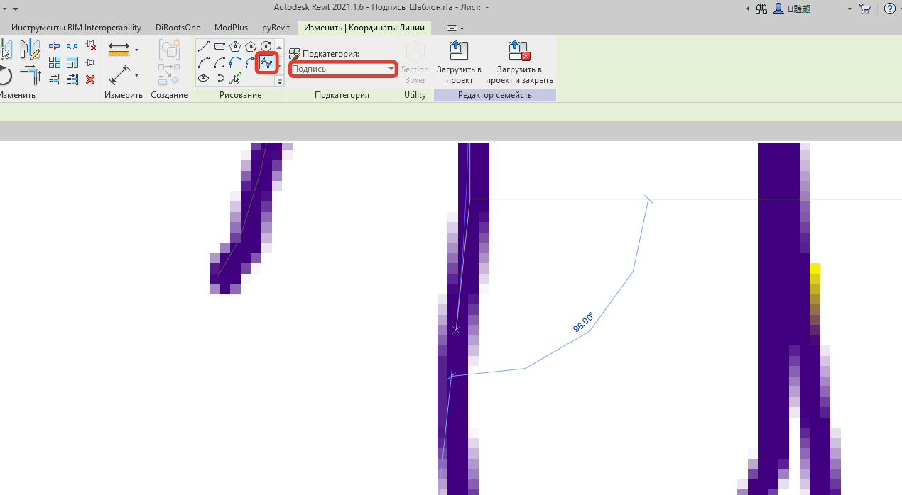
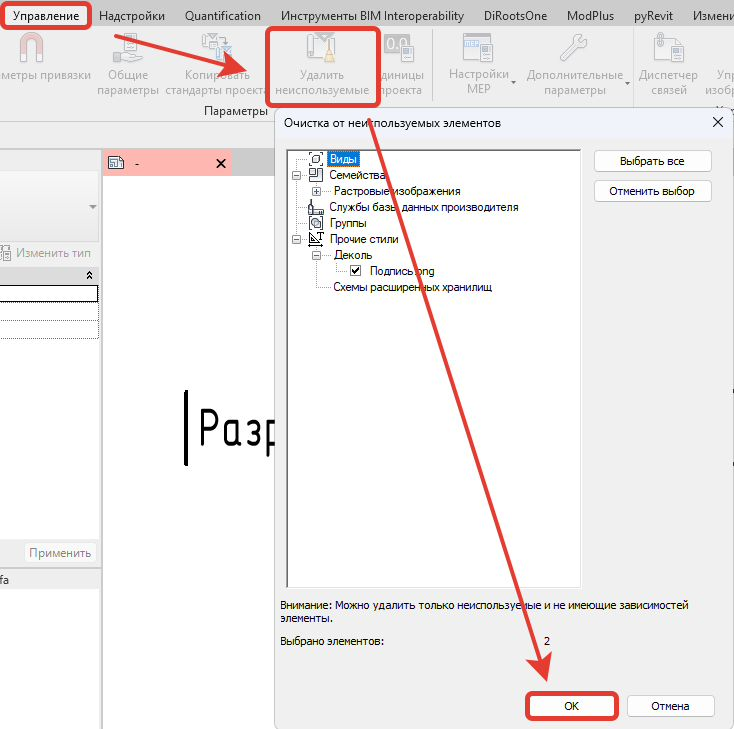
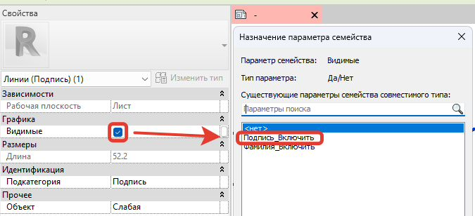
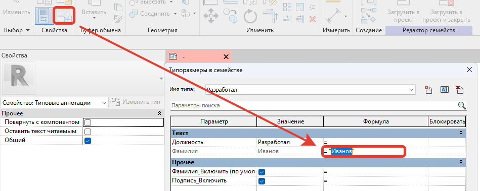

### 1\. Для создания новой подписи для штампа необходимо заранее создать скан подписи (формат PNG, PDF)

### 2\. Откройте файл шаблона подписи, расположенный по пути: Nextcloud2\\Гарда - ТИМ – отдел\\02_Семейства\\Общие\\Аннотации\\Подписи\\Подпись_Шаблон.rfa

### 3\. Импортируйте файл-изображение подписи в файл шаблона

Вкладка «Вставить» -> «Импорт изображения» («Импорт PDF»)

{width=135px height=76px}

### 4\. Отмасштабируйте изображение и разместите в области для расположения подписи:

{width=895px height=233px}

### 5\. Обведите подпись инструментом «Сплайн»

Вкладка «Создание» -> «Линейная» -> «Сплайн».

Для сплайна выберите подкатегорию «Попись»

{width=1270px height=698px}

### 6\. После обведения контуров подписи, удалите файл изображения с вида с последующей очисткой от неиспользуемых элементов:

{width=734px height=729px}

### 7\. В свойствах сплайна параметру «Видимые» назначьте атрибут  «Подпись_Включить»:

{width=675px height=308px}

### 8\. В свойствах типоразмера в параметре «Фамилия» записываем нужную фамилию:

{width=949px height=379px}

### 9\. Сохраняем семейство к себе в личную папку, название формируется по принципу: Подпись\_\<Фамилия>

### 10\. Перед использованием семейства необходимо направить его на согласование на почту Александру Родионову ([a.rodionov@gardapro.ru](mailto:a.rodionov@gardapro.ru))