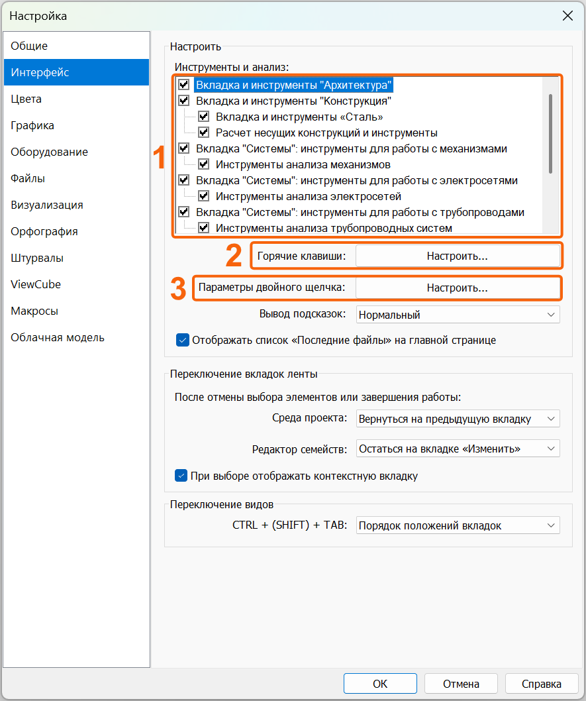
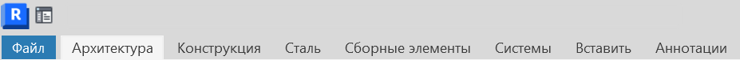
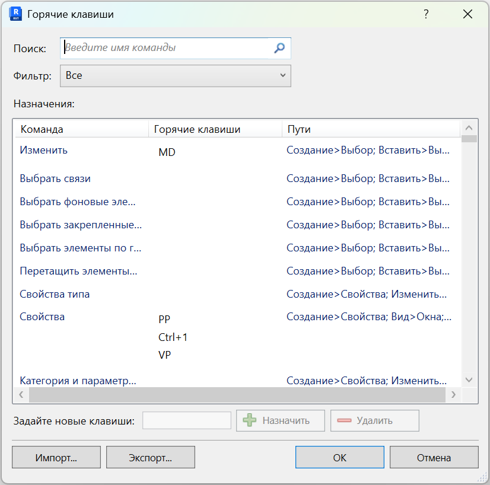
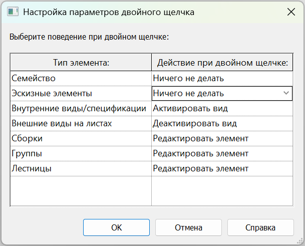
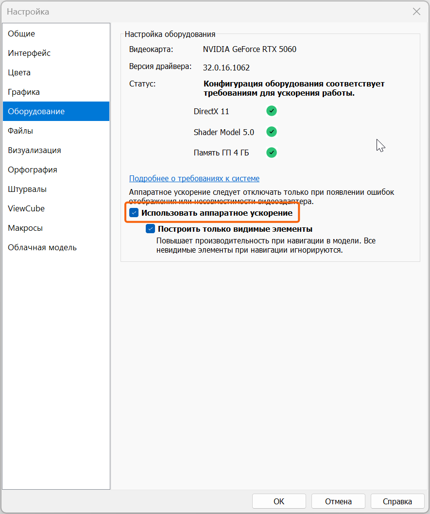
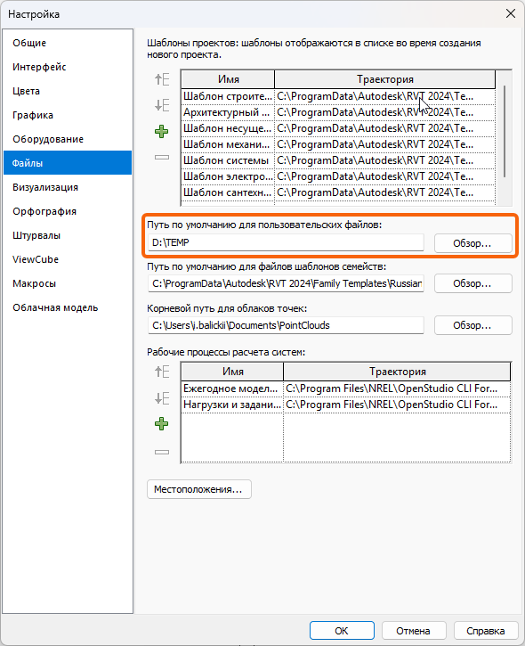
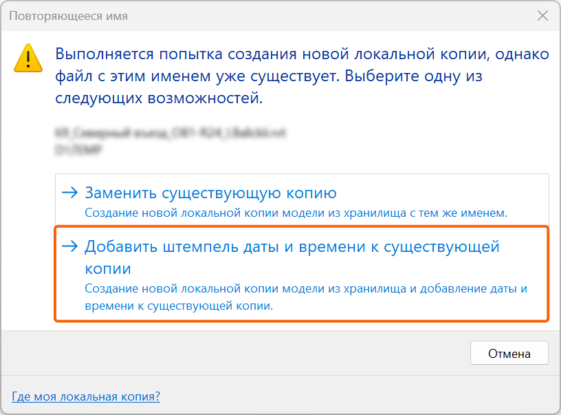

## Настройка Revit.

### Вкладка «Интерфейс»

#### Настройка вкладок

{width=885px height=1058px}

*1* - Здесь можно настроить какие вкладки будут доступны в верхней панели Revit.

{width=927px height=76px}

*2* - Настройка горячих клавиш

{width=826px height=818px}

Для всех команд (включая плагины) можно назначить горячие клавиши, это сильно повышает скорость и удобство работы.

Рекомендуем для самых частых выполняемый команд назначить горячие клавиши.

*3* - Параметры двойного щелчка:

Для удобства можете выбрать «Ничего не делать» для пунктов «Семейство» и «Эскизные элементы»

{width=609px height=491px}

### Вкладка «Оборудование»

#### Настройка аппаратного ускорения

{width=885px height=1058px}

Нажмите галочку «Использовать аппаратное ускорение»

### Вкладка «Файлы»

#### Пользовательские файлы

Рекомендуем не хранить локальные копии в общей папке «Документы», а создать отдельную папку на локальном диске для каждой версии Revit, например Revit 2021_Temp.

**•** уменьшается риск переполнения системного диска;

**•** локальные копии разных версий не смешиваются;

**•** проще найти нужную локальную копию.

{width=590px height=725px}

<note type="info">

Файл -> Параметры -> Файлы. Выделить «Путь по умолчанию для пользовательских файлов» и пример отдельной папки Revit \*\_Temp.

</note>

## Открытие модели и совместная работа

### Что такое ФХ и локальная копия

При совместной работе основная модель хранится на сервере и называется файлом-хранилищем (ФХ). Проектировщик работает в собственной локальной копии -- точной копии ФХ. Изменения попадают в ФХ при синхронизации.

**•** В исходном документе перечислены локальный сервер, Revit Server и BIM 360.

**•** Созданием и первичной настройкой ФХ занимается координатор.

Создание новой локальной копии

**1\.** Открыть Файл -> Открыть -> Проект (Ctrl+O).

**2\.** Выбрать нужный сервер и файл-хранилище.

**3\.** Включить «Создать новый локальный файл».

**4\.** В меню открытия рабочих наборов выбрать «Задать».

**5\.** При необходимости периодически включать «Проверить».

**6\.** Нажать «Открыть».

<image src="./welcome-bim-7.png" crop="0,0,100,100" scale="93" width="897px" height="673px" float="center"/>

<note type="info">

Диалог открытия модели. Отметить: выбранный RVT, «Создать новый локальный файл», «Задать», кнопку «Проверить» и «Открыть».

</note>

Повторяющаяся локальная копия

Если локальная копия с таким именем уже существует, рекомендуем выбрать вариант с добавлением штемпеля даты и времени к существующей копии.

{width=816px height=603px}

<note type="info">

Диалог Revit с двумя вариантами; выделить «Добавить штемпель даты и времени к существующей копии».

</note>

Открытие рабочих наборов

При открытии можно закрыть ненужные рабочие наборы, в том числе наборы со связями. Это сокращает время загрузки модели.

**Скриншот 3.3. Открытие рабочих наборов**

<table header="row">
<tr>
<td>

**МЕСТО ДЛЯ СКРИНШОТА**

Окно «Открытие рабочих наборов»; показать несколько закрытых связей и несколько открытых рабочих наборов.

</td>
</tr>
</table>

**Подсказка для подготовки скриншота:** Окно «Открытие рабочих наборов»; показать несколько закрытых связей и несколько открытых рабочих наборов.

Ознакомительное открытие модели другого раздела

<table header="row">
<tr>
<td>

**ВАЖНО:** Для ознакомления с моделью другого раздела исходная инструкция рекомендует открывать её с опцией «Отсоединить от файла хранилища» и сохранить рабочие наборы. Такая модель становится независимой, синхронизация недоступна.

</td>
</tr>
</table>

**Скриншот 3.4. Отсоединение от ФХ**

<table header="row">
<tr>
<td>

**МЕСТО ДЛЯ СКРИНШОТА**

Диалог открытия с флажком «Отсоединить от файла хранилища» и следующий диалог «Отсоединить и сохранить рабочие наборы».

</td>
</tr>
</table>

**Подсказка для подготовки скриншота:** Диалог открытия с флажком «Отсоединить от файла хранилища» и следующий диалог «Отсоединить и сохранить рабочие наборы».

Синхронизация

Синхронизация передаёт ваши изменения из локальной копии в файл-хранилище.

**•** Периодически можно включать сжатие модели из хранилища.

**•** При синхронизации отмечайте доступные пункты освобождения рабочих наборов и элементов.

**•** При необходимости добавляйте комментарий о выполненной работе.

**Скриншот 3.5. Синхронизация с файлом хранилища**

<table header="row">
<tr>
<td>

**МЕСТО ДЛЯ СКРИНШОТА**

Окно синхронизации. Выделить путь к ФХ, сжатие, блок освобождения рабочих наборов/элементов, комментарий и кнопку «ОК».

</td>
</tr>
</table>

**Подсказка для подготовки скриншота:** Окно синхронизации. Выделить путь к ФХ, сжатие, блок освобождения рабочих наборов/элементов, комментарий и кнопку «ОК».

Обновление до последней версии

Даже если вы не вносили изменений, а коллеги продолжают работу, регулярно выполняйте «Совместная работа -> Обновить до последней версии». Это поддерживает локальную копию в актуальном состоянии.

**Скриншот 3.6. Обновить до последней версии**

<table header="row">
<tr>
<td>

**МЕСТО ДЛЯ СКРИНШОТА**

Лента «Совместная работа» с выделенной кнопкой «Обновить до последней версии».

</td>
</tr>
</table>

**Подсказка для подготовки скриншота:** Лента «Совместная работа» с выделенной кнопкой «Обновить до последней версии».

## Рабочие наборы

### Назначение

Рабочие наборы используются для совместной работы и распределения элементов модели. Для элемента можно посмотреть принадлежность к рабочему набору в свойствах.

| **Тип**           | **Кто управляет** | **Примечание**                                                                         |
|-------------------|-------------------|----------------------------------------------------------------------------------------|
| Пользовательские  | Пользователь      | Можно создавать, удалять, переименовывать, открывать/закрывать, настраивать видимость. |
| Стандарты проекта | Revit             | Системный рабочий набор.                                                               |
| Семейства         | Revit             | Системный рабочий набор.                                                               |
| Виды              | Revit             | Системный рабочий набор.                                                               |

**Скриншот 4.1. Рабочий набор элемента**

<table header="row">
<tr>
<td>

**МЕСТО ДЛЯ СКРИНШОТА**

Выбранный элемент и панель свойств; выделить параметр «Рабочий набор».

</td>
</tr>
</table>

**Подсказка для подготовки скриншота:** Выбранный элемент и панель свойств; выделить параметр «Рабочий набор».

**Скриншот 4.2. Окно «Рабочие наборы»**

<table header="row">
<tr>
<td>

**МЕСТО ДЛЯ СКРИНШОТА**

Совместная работа -> Рабочие наборы. Показать столбцы «Редактируемый», «Владелец», «Заёмщик», «Открыт» и список пользовательских наборов.

</td>
</tr>
</table>

**Подсказка для подготовки скриншота:** Совместная работа -> Рабочие наборы. Показать столбцы «Редактируемый», «Владелец», «Заёмщик», «Открыт» и список пользовательских наборов.

Заём и освобождение

При взаимодействии с элементами пользователь становится заёмщиком. Пока элемент или набор занят, другие участники могут столкнуться с ограничением редактирования.

<table header="row">
<tr>
<td>

**ПЕРЕД ЗАВЕРШЕНИЕМ РАБОТЫ:** Используйте «Освободить всё забранное» и/или синхронизацию. В окне синхронизации включите доступные галочки освобождения.

</td>
</tr>
</table>

**Скриншот 4.3. Освободить всё забранное**

<table header="row">
<tr>
<td>

**МЕСТО ДЛЯ СКРИНШОТА**

Лента «Совместная работа» и окно синхронизации с отмеченными пунктами освобождения.

</td>
</tr>
</table>

**Подсказка для подготовки скриншота:** Лента «Совместная работа» и окно синхронизации с отмеченными пунктами освобождения.

## Связи Revit и прочие связи

### Что уже должно быть настроено

**•** модель создана на правильном шаблоне;

**•** созданы требуемые пользовательские рабочие наборы и настроена их видимость;

**•** настроены общие координаты и имя площадки;

**•** подгружена связь АР и, при наличии, координационный/базовый файл;

**•** оси и уровни скопированы, находятся на рабочих наборах (99)\_Оси… и (99)\_Уровни…, настроен мониторинг и закрепление.

Добавление RVT-связи

**1\.** Вставить -> Диспетчер связей -> Добавить.

**2\.** Выбрать необходимый RVT-файл.

**3\.** Способ размещения -- «Авто -- По общим координатам».

**4\.** Открыть файл и подтвердить добавление.

**5\.** В «Диспетчере связей» проверить тип связи -- «Наложение».

**6\.** Проверить параметр «Общая площадка».

**Скриншот 5.1. Добавление RVT-связи**

<table header="row">
<tr>
<td>

**МЕСТО ДЛЯ СКРИНШОТА**

Последовательность: вкладка «Вставить» -> «Диспетчер связей» -> «Добавить» -> выбор RVT -> «Авто -- По общим координатам».

</td>
</tr>
</table>

**Подсказка для подготовки скриншота:** Последовательность: вкладка «Вставить» -> «Диспетчер связей» -> «Добавить» -> выбор RVT -> «Авто -- По общим координатам».

<table header="row">
<tr>
<td>

**ТИП СВЯЗИ:** Для RVT-связей исходная инструкция требует использовать «Наложение».

</td>
</tr>
</table>

**Скриншот 5.2. Тип связи «Наложение»**

<table header="row">
<tr>
<td>

**МЕСТО ДЛЯ СКРИНШОТА**

Окно «Диспетчер связей» или свойства типа, где в столбце/параметре «Тип связи» указано «Наложение».

</td>
</tr>
</table>

**Подсказка для подготовки скриншота:** Окно «Диспетчер связей» или свойства типа, где в столбце/параметре «Тип связи» указано «Наложение».

Рабочий набор для каждой связи

Каждая связь помещается в отдельный рабочий набор. Это позволяет закрывать ненужные связи ещё на этапе открытия модели и ускорять загрузку.

<table header="row">
<tr>
<td>

**ПРАВИЛО ИМЕНОВАНИЯ:** (96)\_RVT_Имя_связи_без\_.rvt. Пример из источника: (96)\_RVT_MDL_AR_ME_R21_STLB.

</td>
</tr>
</table>

**Скриншот 5.3. Рабочий набор RVT-связи**

<table header="row">
<tr>
<td>

**МЕСТО ДЛЯ СКРИНШОТА**

Выбранная связь; в свойствах экземпляра показать назначенный рабочий набор (96)\_RVT\_… . Отдельно можно показать свойства типа с тем же рабочим набором.

</td>
</tr>
</table>

**Подсказка для подготовки скриншота:** Выбранная связь; в свойствах экземпляра показать назначенный рабочий набор (96)\_RVT\_… . Отдельно можно показать свойства типа с тем же рабочим набором.

Закрепление связи

После размещения в правильном рабочем наборе и проверки площадки связь необходимо закрепить. Это защищает её от случайного перемещения.

**Скриншот 5.4. Закрепление связи**

<table header="row">
<tr>
<td>

**МЕСТО ДЛЯ СКРИНШОТА**

Выбранная RVT-связь и активная команда «Прикрепить» (Pin).

</td>
</tr>
</table>

**Подсказка для подготовки скриншота:** Выбранная RVT-связь и активная команда «Прикрепить» (Pin).

NWC/NWD и другие внешние файлы

Исходный документ рассматривает DWG, IFC, NWC/NWD, изображения и другие связи. Для NWC/NWD используется «Вставить -> Координационная модель».

**1\.** Выбрать «Координационная модель».

**2\.** Выбрать способ размещения -- по общим координатам или совмещение начал.

**3\.** Добавить файл, открыть и подтвердить.

<table header="row">
<tr>
<td>

**ЗАПРЕЩЕНО:** Импорт внешних файлов запрещён. Используйте механизм связей.

</td>
</tr>
</table>

**Скриншот 5.5. Координационная модель**

<table header="row">
<tr>
<td>

**МЕСТО ДЛЯ СКРИНШОТА**

Вкладка «Вставить», команда «Координационная модель», окно добавления NWC/NWD и способ размещения.

</td>
</tr>
</table>

**Подсказка для подготовки скриншота:** Вкладка «Вставить», команда «Координационная модель», окно добавления NWC/NWD и способ размещения.

## Общая площадка и просмотр координации

### Общая площадка

«Общая площадка» -- параметр связанного файла, в котором хранится площадка с координатами модели. У всех подгруженных связей должна быть выставлена корректная площадка.

<table header="row">
<tr>
<td>

**ЕСЛИ СВЯЗЬ СМЕЩЕНА:** В первую очередь проверьте параметр «Общая площадка». Значение «Не общедоступное» может указывать на некорректное размещение связи.

</td>
</tr>
</table>

**1\.** Выделить связанную модель.

**2\.** В свойствах открыть параметр «Общая площадка».

**3\.** При значении «Не общедоступное» выбрать «Перенести экземпляр в:».

**4\.** Выбрать нужную площадку и нажать «ОК».

**Скриншот 6.1. Проверка общей площадки**

<table header="row">
<tr>
<td>

**МЕСТО ДЛЯ СКРИНШОТА**

Панель свойств выбранной RVT-связи с параметром «Общая площадка».

</td>
</tr>
</table>

**Подсказка для подготовки скриншота:** Панель свойств выбранной RVT-связи с параметром «Общая площадка».

**Скриншот 6.2. Перенос экземпляра на площадку**

<table header="row">
<tr>
<td>

**МЕСТО ДЛЯ СКРИНШОТА**

Диалог «Выбор площадки»: «Перенести экземпляр в:» и выпадающий список корректной площадки.

</td>
</tr>
</table>

**Подсказка для подготовки скриншота:** Диалог «Выбор площадки»: «Перенести экземпляр в:» и выпадающий список корректной площадки.

Копирование/Мониторинг и Просмотр координации

Эти инструменты используются для поддержания в актуальном состоянии общих элементов, прежде всего осей и уровней. Координатор настраивает мониторинг; инженер обрабатывает предупреждения о расхождениях.

**1\.** Перейти на координационный вид и убедиться, что связь размещена правильно.

**2\.** Проверить общую площадку связанной модели.

**3\.** Совместная работа -> Координация -> Просмотр координаций -> Выбрать связь.

**4\.** Выбрать связанную модель АР.

**5\.** В окне «Просмотр координаций» раскрыть сообщения до появления доступного действия.

**6\.** Назначить действие для каждого изменения и нажать «Применить».

**7\.** Проверить совпадение осей и уровней и синхронизировать модель.

| **Сообщение**                   | **Действие по источнику** |
|---------------------------------|---------------------------|
| Имя изменено                    | Переименование элемента … |
| Уровень перемещен пользователем | Перенос уровня …          |
| Элемент удалён                  | Удалить элемент           |
| Сетка перемещена                | Изменить сетку            |

**Скриншот 6.3. Просмотр координации**

<table header="row">
<tr>
<td>

**МЕСТО ДЛЯ СКРИНШОТА**

Лента «Совместная работа» с командой «Просмотр координаций» и выбранной опцией «Выбрать связь».

</td>
</tr>
</table>

**Подсказка для подготовки скриншота:** Лента «Совместная работа» с командой «Просмотр координаций» и выбранной опцией «Выбрать связь».

**Скриншот 6.4. Окно «Просмотр координаций»**

<table header="row">
<tr>
<td>

**МЕСТО ДЛЯ СКРИНШОТА**

Список предупреждений, раскрытые узлы «Сообщение» и столбец «Действие». Желательно показать один пример уровня и один пример оси.

</td>
</tr>
</table>

**Подсказка для подготовки скриншота:** Список предупреждений, раскрытые узлы «Сообщение» и столбец «Действие». Желательно показать один пример уровня и один пример оси.

<table header="row">
<tr>
<td>

**ЕСЛИ ПРОБЛЕМА НЕ УШЛА:** Если оси/уровни не совпадают после применения действий или предупреждение возвращается после синхронизации, исходная инструкция рекомендует обратиться к координатору.

</td>
</tr>
</table>

## Распространённые ошибки

### Ниже -- краткая памятка по ошибкам, описанным в исходном Welcome-BIM.

| **Ошибка**                                                   | **Что делать**                                                                                                                                                                |
|--------------------------------------------------------------|-------------------------------------------------------------------------------------------------------------------------------------------------------------------------------|
| «При инициализации надстройки произошёл сбой»                | Нажать «Закрыть».                                                                                                                                                             |
| «.rvt содержит неправильную схему»                           | Сохранить локальную копию через «Сохранить как» в другое место -> синхронизироваться -> закрыть -> заново открыть с сервера с созданием новой локальной копии.                |
| «Некоторые элементы утеряны при импорте…»                    | Нажать Esc (возможно несколько раз); один раз запустить AutoCAD последней установленной версии.                                                                               |
| «При импорте не обнаружено подходящих элементов…»            | Нажать «Да». В источнике предупреждение отмечено как некритичное.                                                                                                             |
| «Невозможно изменить элемент, так как он был удалён…»        | Если работает несколько пользователей -- синхронизироваться по очереди, пользователь с ошибкой последним. Если не помогло -- обратиться к координатору для пересохранения ФХ. |
| «Не удалось открыть документ» после смены имени пользователя | Сохранить локальную копию под новым именем или в другую папку и выполнить синхронизацию.                                                                                      |

**Скриншот 8.1. Пример типовой ошибки**

<table header="row">
<tr>
<td>

**МЕСТО ДЛЯ СКРИНШОТА**

Один из наиболее частых диалогов Revit из вашей практики. Красной рамкой выделить текст ошибки и рядом добавить краткое действие из таблицы.

</td>
</tr>
</table>

**Подсказка для подготовки скриншота:** Один из наиболее частых диалогов Revit из вашей практики. Красной рамкой выделить текст ошибки и рядом добавить краткое действие из таблицы.

## Ежедневный чек-лист

**☐** Открывать модель с созданием новой локальной копии.

**☐** На этапе открытия закрывать рабочие наборы ненужных связей.

**☐** Перед началом активной работы выполнить «Обновить до последней версии».

**☐** Проверять рабочий набор создаваемых/редактируемых элементов при необходимости.

**☐** При добавлении RVT-связи: общие координаты -> «Наложение» -> отдельный РН (96)\_RVT\_… -> корректная площадка -> закрепить.

**☐** Не использовать импорт внешних файлов.

**☐** Использовать только семейства из корпоративной библиотеки.

**☐** В течение дня регулярно обновляться и синхронизироваться.

**☐** Перед закрытием Revit: синхронизация + освобождение занятых рабочих наборов и элементов.